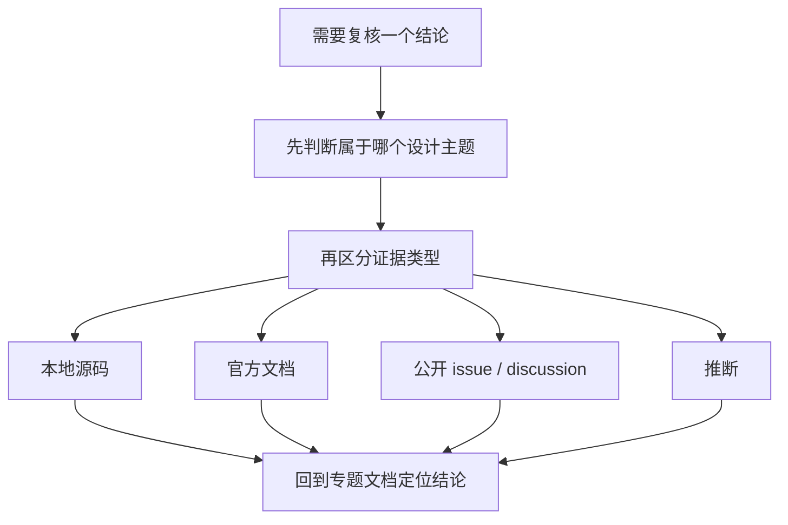

# AI 编码 Agent 统一证据页与源码索引

这一页现在服务整套专题，而不只服务旧的三篇材料。

你可以把它当成两个入口：

- `按设计问题找证据`：先看某个设计原则需要哪些本地源码、官方文档、公开讨论。
- `按系统找证据`：回到 `Claude Code`、`OpenCode`、`Codex` 的核心模块与外部资料。

检索日期：**2026-07-09**

## 怎么使用这页

证据优先级：

1. 本地源码
2. 官方文档
3. 公开 issue / discussion
4. 推断

推断只能建立在前面三类证据之上，不能替代它们。

## 一、按设计问题找证据

| 设计问题 | Claude Code | OpenCode | Codex |
|---|---|---|---|
| 工具协议与控制面 | `src/Tool.ts`、`src/QueryEngine.ts`、`src/bridge/bridgeMessaging.ts` | `packages/core/src/tool/registry.ts`、`src/permission.ts`、仓库内 `specs/v2/tools.md` | `app-server-protocol/src/protocol/v2/thread.rs`、`shared.rs`、`ext/goal/src/spec.rs` |
| bash/shell 工具与命令执行 | `src/tools/BashTool/BashTool.tsx`、`src/tools/BashTool/bashPermissions.ts`、`src/tools/BashTool/readOnlyValidation.ts`、`src/tools/BashTool/shouldUseSandbox.ts` | `packages/core/src/tool/bash.ts`、`src/cross-spawn-spawner.ts`、仓库内 `specs/v2/tools.md`、`specs/v2/todo.md` | `app-server-protocol/src/protocol/v2/command_exec.rs`、`process.rs`、`permissions.rs`、`thread.rs` |
| 规则注入与项目说明 | `src/bootstrap/state.ts`、`src/QueryEngine.ts` | `packages/core/src/instruction-context.ts`、`src/session/context-epoch.ts`、仓库内 `specs/v2/session.md` | `app-server-protocol/src/protocol/v2/thread.rs`、`docs/agents.md` |
| 上下文压缩与重建 | `src/compact.ts`、`src/QueryEngine.ts`、`src/utils/sessionRestore.ts` | `packages/core/src/session/compaction.ts`、`src/session/history.ts`、`src/session/runner/llm.ts` | `app-server-protocol/src/protocol/v2/thread_data.rs`、`ext/goal/src/runtime.rs` |
| 权限、审批、人工接管 | `src/Tool.ts`、`src/QueryEngine.ts`、官方 hooks 文档 | `packages/core/src/permission.ts`、`src/tool/AGENTS.md`、仓库内 `specs/v2/tools.md` | `app-server-protocol/src/protocol/v2/shared.rs`、`permissions.rs`、`codex/docs/sandbox.md` |
| 任务、Todo 与 Goal | `src/tools/TodoWriteTool/*`、`TaskCreateTool/*`、官方 `/goal` 文档 | `packages/core/src/session/todo.ts`、`src/tool/todowrite.ts`、仓库内 `specs/v2/todo.md` | `ext/goal/src/spec.rs`、`tool.rs`、`runtime.rs`、`accounting.rs` |
| 子代理与编排 | `src/tools/AgentTool/*`、`src/utils/forkedAgent.ts` | `packages/core/src/background-job.ts`、仓库内 `specs/v2/todo.md`、`specs/v2/session.md` | `agent-graph-store/src/store.rs`、`thread_data.rs`、`analytics/src/events.rs` |
| 中断、恢复、可追溯 | `src/utils/sessionRestore.ts`、`src/assistant/sessionHistory.ts`、官方 `/goal`/hooks | `packages/core/src/session/input.ts`、`src/session/history.ts`、仓库根 `TODO.md` | `app-server-protocol/src/protocol/v2/thread.rs`、`state/src/audit.rs`、`ext/goal/src/runtime.rs` |

- 证据类型：本地源码 + 官方文档。具体展开可回看 [设计原则主线](./design-principles/index.md) 与 [外部资料与公开讨论索引](./evidence/external-references-and-public-discussions.md)。

## 二、按系统找核心本地源码

### Claude Code

#### Runtime / State

- `claude-code-src/src/QueryEngine.ts`
- `claude-code-src/src/bootstrap/state.ts`
- `claude-code-src/src/utils/sessionRestore.ts`
- `claude-code-src/src/assistant/sessionHistory.ts`

#### Tool / Permission / Bridge

- `claude-code-src/src/Tool.ts`
- `claude-code-src/src/bridge/bridgeMessaging.ts`
- `claude-code-src/src/bridge/sessionRunner.ts`
- `claude-code-src/src/tools/BashTool/BashTool.tsx`
- `claude-code-src/src/tools/BashTool/bashPermissions.ts`
- `claude-code-src/src/tools/BashTool/readOnlyValidation.ts`
- `claude-code-src/src/tools/BashTool/shouldUseSandbox.ts`

#### Task / Goal / Subagent

- `claude-code-src/src/tools/TodoWriteTool/prompt.ts`
- `claude-code-src/src/tools/TodoWriteTool/TodoWriteTool.ts`
- `claude-code-src/src/tools/TaskCreateTool/prompt.ts`
- `claude-code-src/src/tools/TaskCreateTool/TaskCreateTool.ts`
- `claude-code-src/src/tools/TaskUpdateTool/prompt.ts`
- `claude-code-src/src/tools/TaskUpdateTool/TaskUpdateTool.ts`
- `claude-code-src/src/tools/AgentTool/prompt.ts`
- `claude-code-src/src/tools/AgentTool/forkSubagent.ts`
- `claude-code-src/src/utils/forkedAgent.ts`

### OpenCode

#### Runtime / Event / History

- `opencode/packages/core/src/session/input.ts`
- `opencode/packages/core/src/session/history.ts`
- `opencode/packages/core/src/session/context-epoch.ts`
- `opencode/packages/core/src/session/compaction.ts`
- `opencode/packages/core/src/session/runner/llm.ts`

#### Permission / Tool / Workspace

- `opencode/packages/core/src/permission.ts`
- `opencode/packages/core/src/tool/registry.ts`
- `opencode/packages/core/src/tool/AGENTS.md`
- `opencode/packages/core/src/tool/bash.ts`
- `opencode/packages/core/src/tool/todowrite.ts`
- `opencode/packages/core/src/cross-spawn-spawner.ts`
- `opencode/packages/opencode/src/control-plane/workspace.ts`

#### Todo / Background / Specs

- `opencode/packages/core/src/session/todo.ts`
- `opencode/packages/core/src/background-job.ts`
- `opencode/specs/v2/session.md`
- `opencode/specs/v2/tools.md`
- `opencode/specs/v2/todo.md`
- `opencode/TODO.md`

### Codex

#### Protocol / Thread / Permissions

- `codex/codex-rs/app-server-protocol/src/protocol/v2/thread.rs`
- `codex/codex-rs/app-server-protocol/src/protocol/v2/thread_data.rs`
- `codex/codex-rs/app-server-protocol/src/protocol/v2/shared.rs`
- `codex/codex-rs/app-server-protocol/src/protocol/v2/permissions.rs`
- `codex/codex-rs/app-server-protocol/src/protocol/v2/command_exec.rs`
- `codex/codex-rs/app-server-protocol/src/protocol/v2/process.rs`

#### Goal / Runtime / Accounting

- `codex/codex-rs/ext/goal/src/spec.rs`
- `codex/codex-rs/ext/goal/src/tool.rs`
- `codex/codex-rs/ext/goal/src/runtime.rs`
- `codex/codex-rs/ext/goal/src/steering.rs`
- `codex/codex-rs/ext/goal/src/accounting.rs`
- `codex/codex-rs/ext/goal/src/events.rs`

#### Audit / Subagent / SDK

- `codex/codex-rs/state/src/lib.rs`
- `codex/codex-rs/state/src/audit.rs`
- `codex/codex-rs/agent-graph-store/src/store.rs`
- `codex/codex-rs/analytics/src/events.rs`
- `codex/sdk/typescript/src/thread.ts`
- `codex/sdk/typescript/src/threadOptions.ts`

## 三、按系统找外部资料

### Claude Code

#### 官方文档

- `/goal`：<https://code.claude.com/docs/en/goal>
- Best practices：<https://code.claude.com/docs/en/best-practices>
- Hooks：<https://docs.anthropic.com/en/docs/claude-code/hooks>
- Hooks guide：<https://docs.anthropic.com/en/docs/claude-code/hooks-guide>
- What’s new：<https://code.claude.com/docs/en/whats-new>
- 2026 Week 20：<https://code.claude.com/docs/en/whats-new/2026-w20>

#### 公开 issue / discussion

- `/goal` cancel race：<https://github.com/anthropics/claude-code/issues/65099>
- Stop hook 格式问题：<https://github.com/anthropics/claude-code/issues/58558>
- Desktop Code tab 不支持 `/goal` 与 `/permissions`：<https://github.com/anthropics/claude-code/issues/59969>
- `/remote-control` denylist：<https://github.com/anthropics/claude-code/issues/63988>
- 529 过载中断长时 `/goal`：<https://github.com/anthropics/claude-code/issues/69975>

### OpenCode

#### 官方文档

- 主站 docs：<https://opencode.ai/docs/>
- V2 session spec：<https://github.com/sst/opencode/blob/dev/specs/v2/session.md>
- V2 tools spec：<https://github.com/sst/opencode/blob/dev/specs/v2/tools.md>
- V2 todo spec：<https://github.com/sst/opencode/blob/dev/specs/v2/todo.md>
- 仓库根 `TODO.md`：<https://github.com/sst/opencode/blob/dev/TODO.md>

#### 公开讨论

- 目前本专题更依赖 OpenCode 的公开规格与仓库内设计文档，而不是 issue 作为主要证据。  
  证据类型：推断。依据当前已使用材料中，公开规格对能力边界说明更直接。

### Codex

#### 官方文档

- Codex guide：<https://developers.openai.com/codex>
- Security guide：<https://developers.openai.com/codex/security>
- AGENTS guide：<https://developers.openai.com/codex/guides/agents-md>
- 本地跳转页：`codex/docs/sandbox.md`
- 本地跳转页：`codex/docs/agents_md.md`

#### 公开 issue / discussion

- `codex exec resume` 仍要求 prompt：<https://github.com/openai/codex/issues/24016>
- headless MCP approval/cancel：<https://github.com/openai/codex/issues/24135>
- resume 后 reviewer 丢失：<https://github.com/openai/codex/issues/23875>
- resume 后 sandbox/profile 不一致：<https://github.com/openai/codex/issues/25590>
- 线程恢复与环境继承问题：<https://github.com/openai/codex/issues/28296>
- usage limit 后 goal resume 卡住：<https://github.com/openai/codex/issues/28574>
- 自动化退回保守审批路径：<https://github.com/openai/codex/issues/29610>
- 非交互审批自动取消：<https://github.com/openai/codex/issues/29857>

## 四、这套文档最终收束的稳定判断

1. `Claude Code` 的主轴是会话任务管理、规则纪律和自动续跑控制面，不应误写成和 Codex 同层的线程级 goal runtime。  
   证据类型：本地源码 + 官方文档 + 公开 issue / discussion。见本页 Claude Code 条目。
2. `OpenCode` 的主轴是持久化 session runtime、permission lifecycle 与 tool registry 分责，不应把 todo/task 直接上升成 goal 状态机。  
   证据类型：本地源码 + 官方文档。见本页 OpenCode 条目。
3. `Codex` 的主轴是 thread/goal/protocol/state/audit，一等目标对象、预算与审批边界都是公开结构。  
   证据类型：本地源码 + 官方文档 + 公开 issue / discussion。见本页 Codex 条目。

如果你只需要一个外部资料入口，请直接去 [外部资料与公开讨论索引](./evidence/external-references-and-public-discussions.md)。  
如果你只需要源码入口，请回看本页“按系统找核心本地源码”。
