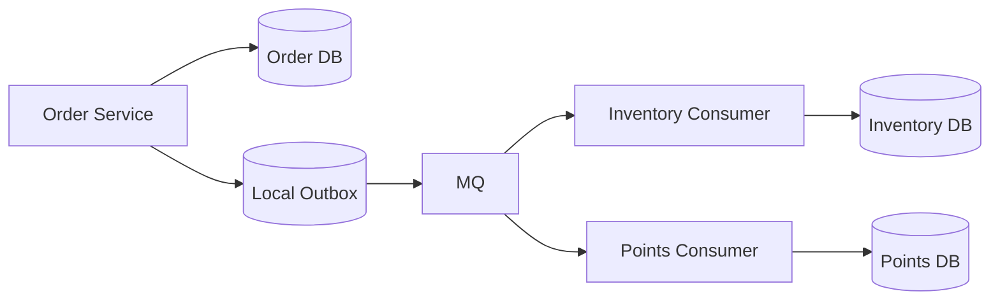

# 05. 消息队列与最终一致性

很多系统引入 MQ，真正难的不是异步本身，而是：

**数据库更新和消息发送，怎样尽量保持一致。**

## 一、什么叫最终一致性

最终一致性的意思是：

**系统允许短时间不一致，但经过重试、补偿、同步后，最终会对齐。**

例如：

1. 订单创建成功
2. 订单服务发出 `OrderCreated`
3. 库存服务稍后扣库存
4. 积分服务稍后发积分

这几个系统不会在同一毫秒同时一致，但最终应该一致。

## 二、为什么这里会难

最典型的问题是：

- 数据库事务提交成功了，但消息没发出去
- 消息发出去了，但本地事务回滚了

这就是经典“双写一致性”问题。

## 三、本地消息表方案

这是最常见、最务实的方案之一。

核心步骤：

1. 在本地事务里写业务数据
2. 在同一事务里写消息表
3. 事务提交后，后台任务扫描消息表
4. 把消息投递到 MQ
5. 投递成功后把消息表状态改成已发送

优点：

- 容易落地
- 和数据库事务结合自然
- 出问题后容易补偿和追查

缺点：

- 需要额外的扫描和清理机制
- 会增加一张消息表和一套任务系统

## 四、事务消息方案

部分 MQ 提供事务消息能力，例如常被拿来举例的 `RocketMQ`。

粗略流程：

1. 先发半消息
2. 执行业务本地事务
3. 根据事务结果提交或回滚消息
4. 如果状态不明，Broker 回查生产者事务状态

它的目标也是解决“业务事务”和“消息投递”之间的一致性问题。

## 五、哪种方案更常见

如果你的系统是普通业务系统，团队更容易掌握的是：

**本地消息表 + 重试补偿 + 幂等消费**

原因很现实：

- 更容易理解
- 更容易排查
- 对中间件能力依赖更小

事务消息不是不能用，而是它更依赖具体 MQ 产品能力和团队经验。

## 六、消费者侧为什么也要兜底

就算生产侧双写问题处理好了，消费侧还是可能失败：

- 下游数据库超时
- 外部接口失败
- 幂等校验异常

所以最终一致性从来不是“只靠生产者一次搞定”，而是整条链路都要可重试、可补偿、可追踪。

## 七、一个典型链路

这条链路里，真正的关键能力通常包括：

- Outbox 扫描重试
- 消费幂等
- 死信处理
- 业务补偿
- 全链路追踪

## 八、补偿不是“手工改库”

很多团队一提补偿，就是出问题后 DBA 或开发手工改数据。

这不能算成熟方案。

更合理的补偿思路应该包括：

- 自动重试
- 状态对账
- 死信重放
- 业务回滚或反向操作
- 后台人工介入工具

## 九、面试里怎么说双写一致性

比较稳的回答方式：

1. 先说明问题本质是“本地事务”和“消息发送”无法天然原子化。
2. 再给出常见方案：本地消息表、事务消息、定时补偿。
3. 最后补充消费端仍然需要幂等、重试、死信和对账。

如果能说到这里，通常已经不是只会背概念了。
