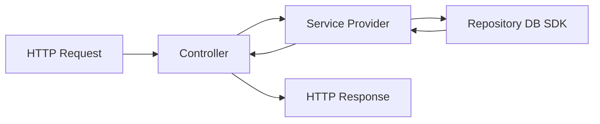

# 01. NestJS 快速上手

如果你是从前端转到 Node.js 后端，NestJS 最适合先建立的心智不是“它像不像 Spring”，而是：

> 它用 TypeScript class、decorator 和依赖注入，把路由、业务逻辑、模块边界组织清楚。

NestJS 官方的起步路线非常稳定：先生成项目，再理解 `main.ts`、`Controller`、`Provider`、`Module` 这四个最核心构件。

## 先用官方方式创建项目

NestJS 官方 first steps 当前给出的初始化命令是：

```bash
npm i -g @nestjs/cli
nest new project-name
```

如果你希望新项目默认使用更严格的 TypeScript 配置，官方还建议：

```bash
nest new project-name --strict
```

生成后的 `src/` 目录里，官方默认会先给你这些核心文件：

- `app.controller.ts`
- `app.controller.spec.ts`
- `app.module.ts`
- `app.service.ts`
- `main.ts`

这套结构本身就是 Nest 的入门地图。

## `main.ts` 是应用启动入口

官方 first steps 里的最小启动代码是：

```ts
import { NestFactory } from '@nestjs/core';
import { AppModule } from './app.module';

async function bootstrap() {
  const app = await NestFactory.create(AppModule);
  await app.listen(process.env.PORT ?? 3000);
}

bootstrap();
```

你可以把它理解成：

- `NestFactory.create(AppModule)`：把整个应用图构建出来
- `app.listen(...)`：启动 HTTP 服务

这里的关键不是 `listen`，而是 `AppModule`。Nest 不是“先写路由再想结构”，而是先围绕模块组织应用。

## `Controller` 负责接请求

Nest 官方对 controller 的定义非常直接：它负责处理传入请求并把响应返回给客户端。

最小示例：

```ts
import { Controller, Get } from '@nestjs/common';

@Controller('cats')
export class CatsController {
  @Get()
  findAll(): string {
    return 'This action returns all cats';
  }
}
```

这里最值得你先记住的是：

- `@Controller('cats')`：定义一组路由前缀
- `@Get()`：把某个方法映射为 GET 路由处理器

组合后，这个方法对应的就是：

```text
GET /cats
```

如果以后写：

```ts
@Get('detail')
```

那就是：

```text
GET /cats/detail
```

所以对前端同学来说，Nest 的 controller 可以先理解成“带元数据的类式路由定义”。

## `Provider` 放业务逻辑

官方 providers 文档的核心意思是：很多类都可以作为 provider，由 Nest 的 IoC 容器统一管理和注入。

一个最小 service 示例：

```ts
import { Injectable } from '@nestjs/common';

@Injectable()
export class CatsService {
  private readonly cats: string[] = [];

  create(cat: string) {
    this.cats.push(cat);
  }

  findAll(): string[] {
    return this.cats;
  }
}
```

先不要把 `@Injectable()` 想得太神秘。你可以先把它理解成：

- 这个类可以交给 Nest 容器管理
- 其他地方可以通过依赖注入拿到它

工程上最重要的一条边界是：

- `Controller` 处理 HTTP 输入输出
- `Service/Provider` 处理业务逻辑

不要把数据库操作、调用模型、参数拼装都堆进 controller。

## `Module` 负责组织边界

Nest 官方强调：每个应用至少有一个 root module，而且推荐按功能拆 feature module。

最小 feature module 示例：

```ts
import { Module } from '@nestjs/common';
import { CatsController } from './cats.controller';
import { CatsService } from './cats.service';

@Module({
  controllers: [CatsController],
  providers: [CatsService],
})
export class CatsModule {}
```

然后在根模块里导入：

```ts
import { Module } from '@nestjs/common';
import { CatsModule } from './cats/cats.module';

@Module({
  imports: [CatsModule],
})
export class AppModule {}
```

这就是 Nest 的基本组织方式：

- `controllers`：暴露入口
- `providers`：内部能力
- `imports`：依赖别的模块
- `exports`：把本模块里的 provider 暴露给外部模块

## 一个最小请求链路怎么流动

可以把 Nest 的一次请求先想成：



也就是说：

1. 路由命中 controller
2. controller 调 service
3. service 调数据库、缓存、外部 API 或模型
4. 结果再返回给 controller
5. controller 给出响应

如果以后你做 Agent 后端，这个 `service` 就很可能是：

- 调模型
- 调工具
- 查知识库
- 写 run 状态

## 推荐你一开始就按功能分目录

Nest 官方也提到，CLI 生成的结构鼓励每个模块放在自己的目录里。这个习惯非常重要。

一个更接近真实项目的结构可以先长这样：

```text
src/
  app.module.ts
  main.ts
  users/
    users.controller.ts
    users.service.ts
    users.module.ts
  runs/
    runs.controller.ts
    runs.service.ts
    runs.module.ts
```

如果你在做 Agent 服务，还可以继续拆：

- `agents/`
- `runs/`
- `messages/`
- `auth/`
- `llm/`

## CLI 为什么值得用

Nest 官方在 controller、module 等文档里都给了 CLI 生成方式，例如：

```bash
nest g controller cats
nest g module cats
```

这不是为了省几行代码，而是为了让目录和命名保持一致。对团队协作来说，这类一致性很值钱。

## 前端转 NestJS 最容易犯的错

### 1. 把 controller 写成“大一统文件”

结果就是：

- 参数校验在里面
- 数据库调用在里面
- 调外部 API 也在里面

后面很难测，也很难复用。

### 2. 不理解模块边界

Nest 不是把所有 service 全局乱注入。官方 modules 文档强调 provider 默认被模块封装，只有当前模块内部或被显式导出的 provider 才能被其他模块使用。

### 3. 滥用全局模块

官方明确提醒过，不要把所有东西都做成 global。早期看起来省事，后期会让依赖关系变得很模糊。

### 4. 把它只当成“装饰器语法糖”

Nest 真正的价值不是 decorator 本身，而是：

- 模块化
- 依赖注入
- 清晰的应用结构

## 跑通本地开发

官方 first steps 给出的开发命令是：

```bash
npm run start:dev
```

默认会监听 `src/main.ts` 里配置的端口，通常是：

```text
http://localhost:3000/
```

这时你先不用急着接数据库。第一步应该是确认：

- 应用能启动
- 你能加一个 controller
- 你能把逻辑抽到 service
- 你知道 module 怎么把它们组起来

## 一个很适合练手的最小任务

你可以直接做这个：

1. 新建 `runs` 模块。
2. 写一个 `RunsController`。
3. 提供 `GET /runs` 和 `POST /runs`。
4. 把数据先存在内存数组里。
5. 再把内存数组迁移到数据库。

这个练习能同时帮你熟悉：

- controller
- service
- module
- 依赖注入

## 这篇结束后你应该能回答

- `main.ts` 在 NestJS 里到底负责什么？
- 为什么业务逻辑应该优先放在 provider，而不是 controller？
- `Module` 的 `imports`、`providers`、`controllers`、`exports` 分别解决什么问题？
