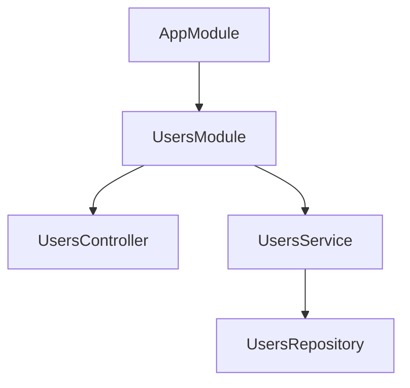
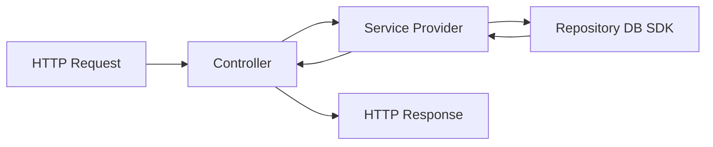
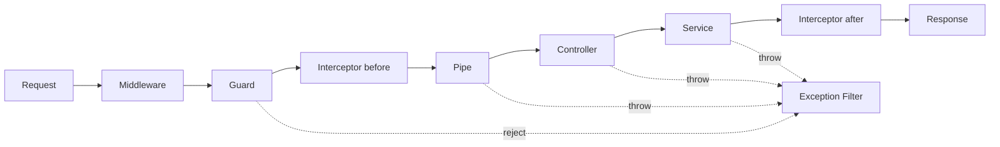

# 01. NestJS 快速上手

如果你是从前端转到 Node.js 后端，NestJS 最适合先建立的心智不是“它像不像 Spring”，而是：

> 它用 TypeScript class、decorator 和依赖注入，把路由、业务逻辑、模块边界、横切能力统一组织起来。

NestJS 官方的起步路线很稳定：先生成项目，再理解 `main.ts`、`Module`、`Controller`、`Provider`，然后再补上 `Pipe`、`Guard`、`Interceptor`、`Exception Filter` 这些请求链路能力。

如果只记一句话，可以先记这个：

- `Module` 组织功能边界
- `Controller` 接住请求
- `Service/Provider` 承担业务逻辑
- `Pipe/Guard/Interceptor/Filter` 处理通用流程能力

---

## NestJS 适合什么场景

NestJS 很适合下面这类项目：

- 需要明确分层和模块边界的中大型 Node.js 服务
- 团队成员多，希望代码组织方式统一
- 需要同时接 HTTP、消息队列、定时任务、WebSocket、微服务协议
- 希望用 TypeScript 做依赖注入、DTO、装饰器式路由和工程约束

如果你只是写一个非常轻量的单接口脚本，直接用 Express 或 Fastify 也许更省。但一旦项目开始变大，Nest 的模块化和依赖注入会明显降低混乱度。

---

## 先用官方方式创建项目

NestJS 官方 first steps 当前给出的初始化命令是：

```bash
npm i -g @nestjs/cli
nest new project-name
```

如果你希望新项目默认使用更严格的 TypeScript 配置，官方还建议：

```bash
nest new project-name --strict
```

官方 first steps 当前要求的 Node.js 版本基线是：

- Node.js `>= 20`

生成后的 `src/` 目录里，默认会先给你这些核心文件：

- `app.controller.ts`
- `app.controller.spec.ts`
- `app.module.ts`
- `app.service.ts`
- `main.ts`

这套结构本身就是 Nest 的入门地图。

---

## 先看懂应用是怎么启动的

`main.ts` 是应用启动入口。官方 first steps 的最小启动代码大致是：

```ts
import { NestFactory } from '@nestjs/core';
import { AppModule } from './app.module';

async function bootstrap() {
  const app = await NestFactory.create(AppModule);
  await app.listen(process.env.PORT ?? 3000);
}

bootstrap();
```

你可以把它理解成：

- `NestFactory.create(AppModule)`：让 Nest 扫描模块元数据，构建依赖图，初始化容器
- `app.listen(...)`：把这个应用真正跑成一个 HTTP 服务

这里最关键的不是 `listen`，而是 `AppModule`。Nest 不是“先写路由再想结构”，而是“先围绕模块把应用拼起来”。

很多工程初始化动作也会放在这里：

- 开启全局前缀，例如 `/api`
- 注册全局校验管道
- 开启 CORS
- 挂全局异常过滤器或日志中间件

例如：

```ts
import { ValidationPipe } from '@nestjs/common';
import { NestFactory } from '@nestjs/core';
import { AppModule } from './app.module';

async function bootstrap() {
  const app = await NestFactory.create(AppModule);
  app.setGlobalPrefix('api');
  app.useGlobalPipes(new ValidationPipe({ whitelist: true, transform: true }));
  await app.listen(process.env.PORT ?? 3000);
}

bootstrap();
```

这段代码背后的含义是：

- 所有接口路径都会带 `/api`
- 进入 controller 之前，请求参数会先做校验和类型转换

---

## `Module` 是 Nest 最核心的组织单位

Nest 官方强调：每个应用至少有一个 root module，而且推荐按功能拆 feature module。

最小 feature module 示例：

```ts
import { Module } from '@nestjs/common';
import { CatsController } from './cats.controller';
import { CatsService } from './cats.service';

@Module({
  controllers: [CatsController],
  providers: [CatsService],
})
export class CatsModule {}
```

然后在根模块里导入：

```ts
import { Module } from '@nestjs/common';
import { CatsModule } from './cats/cats.module';

@Module({
  imports: [CatsModule],
})
export class AppModule {}
```

这就是 Nest 的基本组织方式：

- `controllers`：暴露入口
- `providers`：内部能力
- `imports`：依赖别的模块
- `exports`：把本模块里的 provider 暴露给外部模块

你可以把模块理解成“业务边界 + 依赖边界”的容器，而不是单纯的目录。

### 为什么模块边界重要

如果没有模块边界，项目很快会出现这些问题：

- 所有 service 互相直接调用
- 谁依赖谁说不清
- 权限、用户、订单、任务这些领域混在一起
- 测试时很难替换依赖

Nest 的模块化，本质上是在逼你回答两个问题：

1. 这部分能力属于哪个业务域？
2. 它应该暴露给谁使用？

---

## `Controller` 负责接请求

Nest 官方对 controller 的定义很直接：它负责处理传入请求并把响应返回给客户端。

最小示例：

```ts
import { Controller, Get } from '@nestjs/common';

@Controller('cats')
export class CatsController {
  @Get()
  findAll(): string {
    return 'This action returns all cats';
  }
}
```

这里最值得你先记住的是：

- `@Controller('cats')`：定义一组路由前缀
- `@Get()`：把某个方法映射为 GET 路由处理器

组合后，这个方法对应的就是：

```text
GET /cats
```

如果以后写：

```ts
@Get('detail')
```

那就是：

```text
GET /cats/detail
```

所以对前端同学来说，Nest 的 controller 可以先理解成“带元数据的类式路由定义”。

### Controller 里通常放什么

Controller 里通常只放这些内容：

- 路由定义
- 请求参数提取
- 调用 service
- 返回响应对象或结果

例如：

```ts
import { Body, Controller, Get, Param, Post } from '@nestjs/common';
import { UsersService } from './users.service';
import { CreateUserDto } from './dto/create-user.dto';

@Controller('users')
export class UsersController {
  constructor(private readonly usersService: UsersService) {}

  @Get(':id')
  findOne(@Param('id') id: string) {
    return this.usersService.findOne(Number(id));
  }

  @Post()
  create(@Body() body: CreateUserDto) {
    return this.usersService.create(body);
  }
}
```

你可以注意到：

- `@Param()` 取路径参数
- `@Body()` 取请求体
- controller 自己不直接做数据库读写

---

## `Provider` 放业务逻辑

官方 providers 文档的核心意思是：很多类都可以作为 provider，由 Nest 的 IoC 容器统一管理和注入。

一个最小 service 示例：

```ts
import { Injectable } from '@nestjs/common';

@Injectable()
export class CatsService {
  private readonly cats: string[] = [];

  create(cat: string) {
    this.cats.push(cat);
  }

  findAll(): string[] {
    return this.cats;
  }
}
```

先不要把 `@Injectable()` 想得太神秘。你可以先把它理解成：

- 这个类可以交给 Nest 容器管理
- 其他地方可以通过依赖注入拿到它

工程上最重要的一条边界是：

- `Controller` 处理 HTTP 输入输出
- `Service/Provider` 处理业务逻辑

不要把数据库操作、调用模型、参数拼装都堆进 controller。

---

## 依赖注入到底解决什么问题

很多人第一次接触 Nest，会把依赖注入只理解成“构造函数自动 new 对象”。这不够。

依赖注入真正解决的是：

- 创建对象的责任不再散落在业务代码里
- 依赖关系可以由框架统一管理
- 测试时更容易替换 mock 实现
- 生命周期、单例、作用域等能力可以统一控制

例如：

```ts
@Controller('users')
export class UsersController {
  constructor(private readonly usersService: UsersService) {}
}
```

这里不是 controller 自己去 `new UsersService()`，而是 Nest 容器根据模块配置，把 `UsersService` 注入进来。

这带来的工程收益很直接：

- controller 不需要关心 service 怎么构建
- service 以后再依赖 repository、config、logger，也能继续被注入
- 测试 controller 时可以替换掉真实的 service

### 一个依赖注入的最小脑图



意思是：

- `UsersModule` 声明了 controller 和 provider
- controller 依赖 service
- service 依赖 repository
- 这些依赖由 Nest 容器统一拼装

---

## DTO、校验与“输入边界”

Nest 新手很容易忽略一个重点：后端最先要守住的是输入边界。

常见做法是：

1. 用 DTO 描述输入结构
2. 用 `class-validator` 写规则
3. 用 `ValidationPipe` 在进入 controller 前完成校验

一个最小 DTO 示例：

```ts
import { IsEmail, IsString, MinLength } from 'class-validator';

export class CreateUserDto {
  @IsEmail()
  email: string;

  @IsString()
  @MinLength(6)
  password: string;
}
```

然后在 controller 中接收：

```ts
@Post()
create(@Body() body: CreateUserDto) {
  return this.usersService.create(body);
}
```

如果你在 `main.ts` 中开启了全局校验管道：

```ts
app.useGlobalPipes(new ValidationPipe({ whitelist: true, transform: true }));
```

那么请求进来时会先发生这些事：

- 字段结构按 DTO 校验
- 非 DTO 中声明的字段可以被剔除
- 一些基础类型可以尝试自动转换

这件事非常重要，因为很多线上 bug 都不是“业务不会写”，而是“输入没有收住”。

---

## 一个最小请求链路怎么流动

最简单的理解方式是：



也就是说：

1. 路由命中 controller
2. controller 调 service
3. service 调数据库、缓存、外部 API 或模型
4. 结果再返回给 controller
5. controller 给出响应

如果以后你做 Agent 后端，这个 `service` 很可能就是：

- 调模型
- 调工具
- 查知识库
- 写 run 状态

但这还只是“业务主链路”。Nest 真正完整的请求处理流程，通常还会穿过一层横切能力。

---

## 你需要知道的完整请求生命周期

Nest 官方有比较明确的 request lifecycle 概念。你可以先把常见 HTTP 请求理解成下面这个顺序：



可以这样记：

- `Middleware`：更靠近底层 HTTP 层，适合做日志、原始 request 扩展、通用预处理
- `Guard`：决定这次请求能不能继续，一般用于认证和授权
- `Pipe`：做参数解析、转换、校验
- `Interceptor`：包住整个调用过程，适合做响应包装、耗时统计、缓存、统一日志
- `Exception Filter`：统一接住异常并格式化响应

### 每个角色各自解决什么问题

#### 1. Middleware

适合：

- 打访问日志
- 给 request 挂 traceId
- 做一些和业务无关的原始预处理

不适合：

- 做复杂鉴权决策
- 做 DTO 级别参数校验

#### 2. Guard

适合：

- 判断用户是否登录
- 判断用户是否有某个角色
- 判断接口权限是否允许访问

一句话理解：guard 决定“放不放行”。

#### 3. Pipe

适合：

- 校验参数格式
- 把字符串 id 转成 number
- 拒绝非法输入

一句话理解：pipe 决定“输入是不是合法、需不需要变形”。

#### 4. Interceptor

适合：

- 统一响应结构
- 记录执行时间
- 做缓存包装
- 在方法执行前后插入逻辑

一句话理解：interceptor 决定“怎么包裹这次调用”。

#### 5. Exception Filter

适合：

- 统一错误响应格式
- 区分业务异常和系统异常
- 做异常日志落盘或上报

一句话理解：filter 决定“出了错怎么返回”。

---

## 一段代码串起来看

如果把最常见的 Nest 代码放在一起，你会更容易理解整套流程：

```ts
import { Body, Controller, Get, Param, Post } from '@nestjs/common';
import { Injectable, Module } from '@nestjs/common';

export class CreateUserDto {
  email: string;
  password: string;
}

@Injectable()
export class UsersService {
  findOne(id: number) {
    return { id, name: 'alice' };
  }

  create(dto: CreateUserDto) {
    return { id: 1, ...dto };
  }
}

@Controller('users')
export class UsersController {
  constructor(private readonly usersService: UsersService) {}

  @Get(':id')
  findOne(@Param('id') id: string) {
    return this.usersService.findOne(Number(id));
  }

  @Post()
  create(@Body() dto: CreateUserDto) {
    return this.usersService.create(dto);
  }
}

@Module({
  controllers: [UsersController],
  providers: [UsersService],
})
export class UsersModule {}
```

你可以用一句很工程化的话来总结：

- `Module` 把一组能力收拢在一起
- `Controller` 暴露 HTTP 接口
- `Service` 承担业务逻辑
- DTO 描述输入

---

## 推荐你一开始就按功能分目录

Nest 官方鼓励每个模块放在自己的目录里。这个习惯非常重要。

一个更接近真实项目的结构可以先长这样：

```text
src/
  main.ts
  app.module.ts
  common/
    filters/
    guards/
    interceptors/
    pipes/
  users/
    dto/
      create-user.dto.ts
    users.controller.ts
    users.service.ts
    users.module.ts
  auth/
    auth.controller.ts
    auth.service.ts
    auth.module.ts
```

如果你在做 Agent 服务，还可以继续拆：

- `agents/`
- `runs/`
- `messages/`
- `auth/`
- `llm/`
- `knowledge/`

这里的原则不是“按技术层切得越细越好”，而是：

- 优先按业务域拆模块
- 通用能力再沉到 `common/`

---

## CLI 为什么值得用

Nest 官方在 controller、module、service 等文档里都给了 CLI 生成方式，例如：

```bash
nest g module users
nest g controller users
nest g service users
```

它的价值不是省几行代码，而是：

- 让目录结构保持一致
- 让命名保持一致
- 降低团队成员自己随意起结构的概率

对多人协作项目来说，这种一致性非常值钱。

---

## 本地开发时最常用的命令

创建项目后，最常见的启动方式通常是：

```bash
npm run start:dev
```

常见脚本你可以先记这些：

- `npm run start`：普通启动
- `npm run start:dev`：开发模式，监听文件变化
- `npm run build`：编译项目
- `npm run start:prod`：运行编译后的产物
- `npm run test`：跑单元测试

对初学者来说，推荐节奏是：

1. `nest new`
2. `npm run start:dev`
3. 改 controller 和 service
4. 用浏览器或 `curl` 验证接口
5. 再补 DTO、校验、测试

---

## 从 0 到 1 写一个接口，推荐流程是什么

如果你现在要新增一个“用户创建接口”，可以按下面的顺序想：

1. 先确定这个能力属于哪个模块，例如 `users`
2. 写 DTO，定义输入结构
3. 写 controller，定义路由和参数位置
4. 写 service，承接业务逻辑
5. 如果需要数据库，再引入 repository 或 ORM 层
6. 在 `main.ts` 开启全局校验和统一前缀
7. 最后补测试

这个顺序的本质是：

- 先定边界
- 再定输入
- 再写业务

而不是直接在一个 controller 方法里把所有逻辑写完。

---

## 前端转 NestJS 最容易犯的错

### 1. 把 controller 写成“大一统文件”

结果就是：

- 参数校验在里面
- 数据库调用在里面
- 调外部 API 也在里面
- 错误处理也在里面

后面很难测，也很难复用。

### 2. 不理解模块边界

Nest 不是把所有 service 全局乱注入。官方 modules 文档强调，provider 默认被模块封装，只有当前模块内部或被显式导出的 provider 才能被其他模块使用。

### 3. 滥用全局模块

官方明确提醒过，不要把所有东西都做成 global。早期看起来省事，后期会让依赖关系变得很模糊。

### 4. 把它只当成“装饰器语法糖”

如果你只看到 `@Get()`、`@Post()` 这些装饰器，很容易误判 Nest 的价值。

Nest 真正的价值在于：

- 模块化组织
- 依赖注入
- 请求生命周期扩展点
- 一套统一的工程约束

### 5. 过早把所有能力都接进来

很多人刚开始就想同时接：

- JWT
- ORM
- Redis
- Swagger
- MQ
- 微服务

这样很容易把学习曲线拉陡。更好的顺序是：

1. 先懂模块、controller、service
2. 再懂 DTO 和校验
3. 再懂 guard、interceptor、filter
4. 最后再接数据库、鉴权、缓存、消息队列

---

## 你可以怎么继续学

如果这篇看完，你下一步最值得继续补的内容通常是：

1. `Controllers`：掌握路由参数、query、body、status code、response 处理
2. `Providers`：掌握依赖注入、custom providers、作用域
3. `Modules`：掌握导入、导出、动态模块、全局模块
4. `Pipes`：掌握 DTO 校验和类型转换
5. `Guards`：掌握认证与授权
6. `Interceptors`：掌握日志、响应包装、耗时统计
7. `Exception Filters`：掌握统一错误处理

你可以把 Nest 的学习路线压缩成这一条：

> 先学结构，再学请求链路，最后学工程化扩展。

---

## 一句话总结

NestJS 不是“Node.js 版注解框架”这么简单。它更像是一套把后端服务组织方式规范化的工程框架。

你入门时最该先掌握的不是所有高级特性，而是下面这套最小心智：

- 用 `Module` 划清边界
- 用 `Controller` 接请求
- 用 `Provider` 放业务
- 用 DTO 和 `Pipe` 守住输入
- 用 `Guard`、`Interceptor`、`Filter` 处理横切逻辑

一旦这套骨架立住，后面的数据库、鉴权、缓存、队列、微服务接入都会自然很多。
