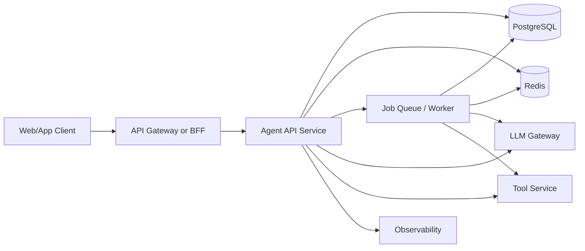
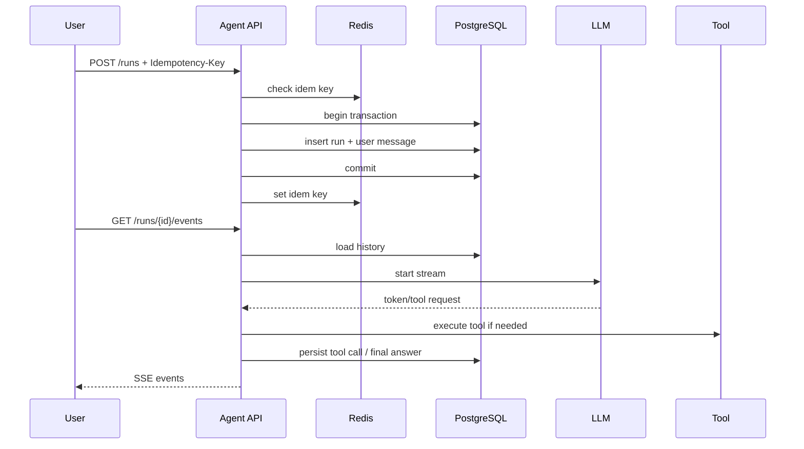
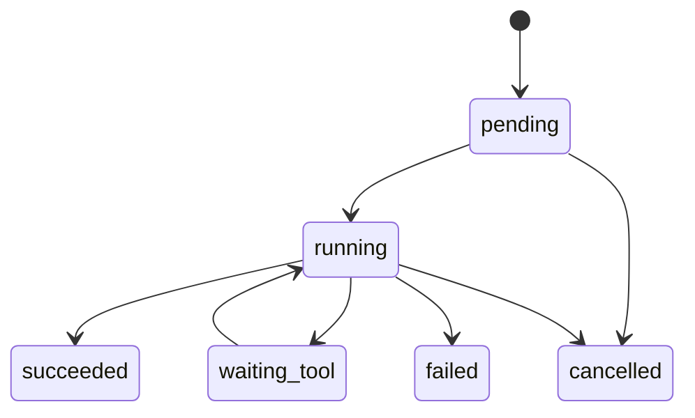
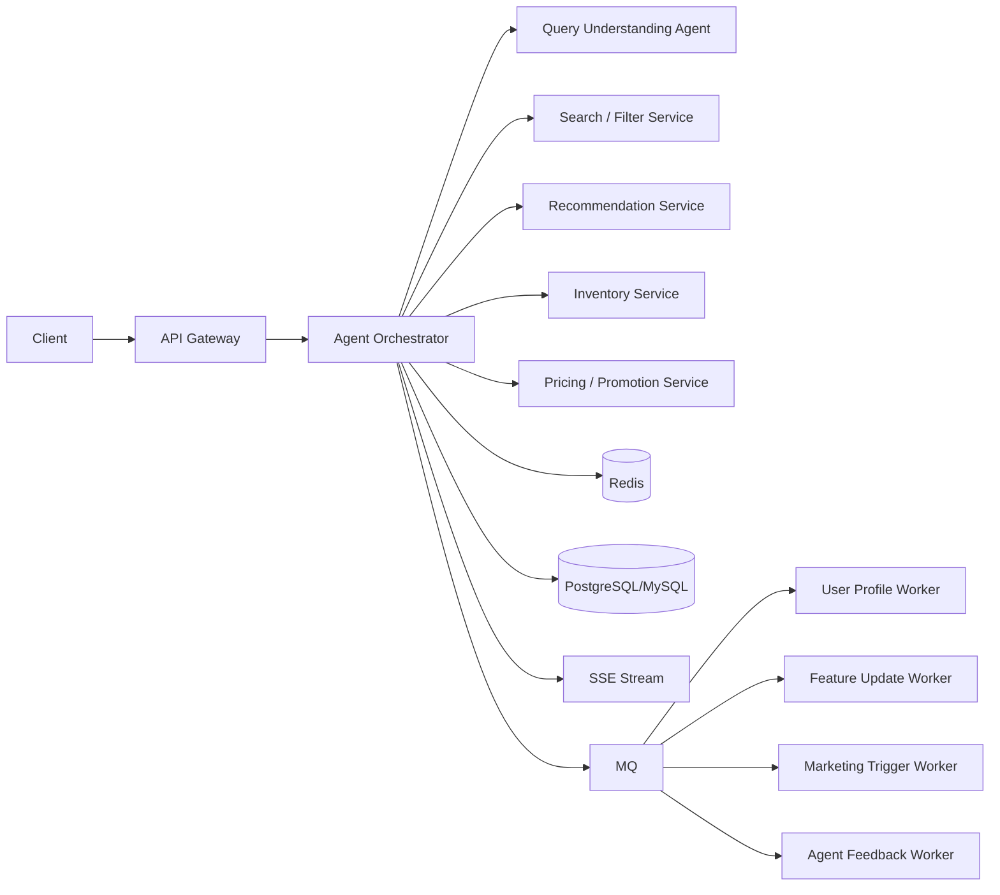
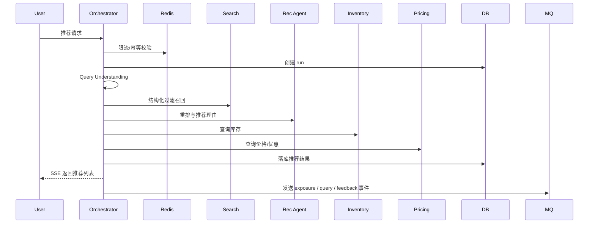
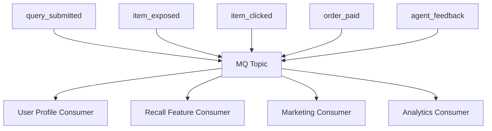

# TS 前端开发者转向 Agent 开发的后端系统设计示例方案（面试向）

这篇文档面向已经熟悉 TypeScript、React/Vue、Node.js 工程化，但后端系统设计经验还不够扎实的开发者。目标不是把你训练成传统 Java 八股选手，而是给你一套 **Agent 后端面试能讲、项目里能落地** 的系统设计样板。

文档思路参考了：

- JavaGuide 的后端面试路线、数据库、Redis、分布式与高性能知识体系。
- 小林 coding 的 HTTP/TCP、MySQL、Redis、操作系统与后端面试题写法。

如果你是前端出身，最关键的心智切换是：

- 前端常把“发请求”当作动作起点，后端要把“请求生命周期”当作系统起点。
- 前端常把状态放组件或内存里，后端要先想状态是否可持久化、可恢复、可审计。
- 前端关心交互正确，后端还要关心并发、重试、幂等、超时、降级、成本和排障。

## 一句话项目题

设计一个“团队知识库 Agent 平台”后端：

- 支持用户发起对话，请求以 SSE 流式返回。
- 支持文档上传、切分、Embedding、检索增强生成。
- 支持工具调用审计、任务重试、限流、幂等和可观测性。
- 目标是能支撑中小团队内部问答与自动化流程。

这类题非常适合面试，因为它能同时覆盖：

- HTTP/SSE
- 数据库设计
- Redis
- 队列
- 事务与并发控制
- 缓存一致性
- 可观测性
- Agent 特有的 Tool Call、RAG、长链路状态管理

## 面试里的标准回答框架

面试官问系统设计题时，建议按这个顺序讲：

1. 需求和边界
2. 核心接口
3. 核心数据模型
4. 主链路时序
5. 异步链路与状态机
6. 一致性与并发问题
7. 性能与扩展
8. 稳定性与可观测性
9. 安全与成本控制

对于前端开发者，这个框架的价值很大，因为它能避免答案只停留在“接口怎么调”。

## 需求拆解

### 功能需求

- 用户创建 Agent，配置模型、Prompt、工具权限。
- 用户上传文档，系统异步切分并建立索引。
- 用户发起会话，Agent 基于历史消息和检索内容作答。
- 答案通过 SSE 流式返回。
- Agent 可能发起工具调用，例如检索知识库、读取组织内 API、执行工作流。
- 系统记录 run、message、tool call、retrieval trace，便于审计与回放。

### 非功能需求

- 请求不能重复创建 run。
- 文档处理是异步的，失败可重试。
- 模型调用慢或失败时系统可降级。
- 单用户和单 workspace 要有限流。
- 用户看到流式响应，研发可以定位全链路问题。

## 高层架构

## 为什么这样拆

- `Agent API Service` 负责同步请求入口、鉴权、幂等、SSE 推流和主编排。
- `PostgreSQL` 负责可靠状态，保存会话、消息、run、tool_call、document 等核心数据。
- `Redis` 负责短期状态、限流、幂等键、热点缓存。
- `Worker` 负责文档解析、Embedding、重试任务、长耗时工具调用。
- `LLM Gateway` 用于模型路由、超时、重试、配额和统一日志。

这个拆法贴近 JavaGuide 强调的“先清楚核心链路，再谈高并发高可用”，也符合小林 coding 常见的“先把主流程讲明白，再展开瓶颈”。

## 核心接口设计

### 对话相关

- `POST /api/agents/:agentId/runs`
  - 创建一次 run
  - Header 带 `Idempotency-Key`
- `GET /api/runs/:runId/events`
  - SSE 订阅 token、tool_call、tool_result、done、error
- `GET /api/runs/:runId`
  - 查询最终状态

### 文档相关

- `POST /api/knowledge/documents`
  - 上传文档并创建文档记录
- `POST /api/knowledge/documents/:id/index`
  - 提交异步索引任务
- `GET /api/knowledge/documents/:id`
  - 查询索引状态和失败原因

### 为什么不是一个接口全做完

因为面试官会追问：

- SSE 断了怎么办？
- 创建成功但流断了怎么办？
- HTTP 超时了任务还要不要跑？

把“创建 run”和“订阅事件”拆开，才能自然回答：

- run 是可靠状态，进数据库。
- SSE 是传输通道，断了可以重连。
- 最终状态以 `GET /runs/:id` 为准。

## 核心表设计

以 PostgreSQL 为主线。

### `agents`

- `id`
- `workspace_id`
- `name`
- `model`
- `system_prompt`
- `tool_policy`
- `created_at`

### `conversations`

- `id`
- `workspace_id`
- `agent_id`
- `user_id`
- `title`
- `created_at`

### `messages`

- `id`
- `conversation_id`
- `run_id`
- `role`
- `content`
- `token_count`
- `created_at`

索引建议：

- `(conversation_id, created_at)`

### `runs`

- `id`
- `conversation_id`
- `agent_id`
- `user_id`
- `status`
- `idempotency_key`
- `error_code`
- `started_at`
- `ended_at`

索引建议：

- `UNIQUE (user_id, idempotency_key)`
- `(conversation_id, started_at DESC)`

### `tool_calls`

- `id`
- `run_id`
- `tool_name`
- `input_json`
- `output_json`
- `status`
- `latency_ms`
- `error_message`
- `created_at`

### `documents`

- `id`
- `workspace_id`
- `source_uri`
- `status`
- `version`
- `checksum`
- `created_at`

### `chunks`

- `id`
- `document_id`
- `chunk_no`
- `content`
- `embedding_id`
- `metadata_json`

## 为什么 PostgreSQL 是主存储

这里是一个典型面试点。

建议回答：

- Agent run、message、tool_call、document status 都是业务真相，必须持久化。
- Redis 更适合临时状态和缓存，不适合作为唯一可靠存储。
- PostgreSQL 同时能处理事务、索引、JSONB、全文检索，早期还可以配合 `pgvector` 收敛基础设施复杂度。

这类回答契合 JavaGuide 对数据库主链路的强调，也符合小林 coding 关于“缓存不是数据源”的实践思路。

## 主链路时序

## 一次 run 的状态机

这个状态机是面试加分点，因为它表明你在按“可恢复系统”思考，而不是按“单次函数调用”思考。

## 常见面试场景 1：SSE 流式问答

### 面试官常问

- 为什么选 SSE，不选 WebSocket？
- SSE 断开后怎么办？
- 用户关闭页面了，后端任务要继续吗？

### 推荐回答

- 对于单向输出的 token stream，SSE 比 WebSocket 简单，浏览器原生支持，落地成本低。
- SSE 只是传输层，run 状态要落库，所以断线后可以重连或轮询最终状态。
- 如果任务纯服务用户当前会话，客户端断开后可尝试取消模型调用；如果该任务还承担审计或异步产物生成，则要看业务决定是否继续。

### 实现要点

- `run` 和 `message` 先入库，再开始流式输出。
- SSE 事件要带类型，不要只返回纯文本。
- 每条日志带 `requestId`、`runId`。

## 常见面试场景 2：重复提交与幂等

### 面试官常问

- 用户连点两次“发送”怎么办？
- 网络超时后前端重试，怎么避免重复 run？

### 推荐回答

- 写操作必须设计幂等键。
- 以 `(user_id, idempotency_key)` 建唯一索引，数据库兜底比只靠 Redis 锁更可靠。
- Redis 可以作为第一层快速判重，但最终一致性以数据库唯一约束为准。

### 为什么这题很重要

前端开发者容易先想到“按钮 disabled”，但面试官想听的是后端兜底方案。

## 常见面试场景 3：RAG 文档索引

### 面试官常问

- 为什么文档索引要异步？
- 文档重复上传怎么办？
- 检索结果怎么审计？

### 推荐回答

- 文档解析、切分、Embedding、索引写入都很耗时，放在 HTTP 请求里会拖垮入口服务。
- 用 `checksum + version` 去重，避免同一内容重复索引。
- 保存 retrieval trace，包括 query、召回 chunk id、分数、最终选用片段。

### 最小异步链路

1. 上传文档，写入 `documents` 表，状态 `uploaded`
2. 投递 `index_document` 任务
3. Worker 解析文档并切分
4. 生成 embedding 并写入 `chunks`
5. 更新 `documents.status = ready`

## 常见面试场景 4：缓存与热点 Agent 配置

### 面试官常问

- 为什么要缓存 Agent 配置？
- 缓存失效时怎么避免击穿？

### 推荐回答

- Agent 配置、工具白名单、模型路由规则读多写少，适合缓存。
- 使用旁路缓存，先查 Redis，未命中回源 PostgreSQL。
- 热点 key 失效时通过单飞或互斥重建减少并发回源。

### 追问时可以补

- 不把 Redis 当真相源。
- 更新配置时优先写库，再删缓存。
- 如果配置变更对一致性要求高，可以增加版本号校验。

## 常见面试场景 5：队列、重试与死信

### 面试官常问

- Worker 执行失败怎么办？
- 重试会不会产生重复副作用？

### 推荐回答

- 任务必须幂等，例如同一个 `document_id + version` 的索引任务重复执行也不会重复写入有效数据。
- 使用有限重试和指数退避，超过阈值进入死信队列。
- 死信不是结束，而是为了人工排查与二次补偿。

### 适合举的技术例子

- Node.js 生态里可以用 `BullMQ`、`pg-boss`、`Temporal`
- 早期项目可以先用 PostgreSQL 队列表，规模上来再拆 MQ

## 常见面试场景 6：数据库事务与并发

### 面试官常问

- 哪些操作应该放同一个事务？
- Tool call 结果入库要不要和 run 状态更新放一起？

### 推荐回答

- “创建 run + 写用户消息”应该在一个事务里，保证会话状态完整。
- 长耗时外部调用不能长时间包在数据库事务里，否则会占连接和锁。
- 外部调用完成后，再用短事务更新 run 状态、写 tool_call 结果和 assistant message。

### 这背后的核心原则

- 事务保护的是本地一致性。
- 外部模型和工具调用属于不可靠边界，应该和数据库事务解耦。

这类表述能很好地连接 JavaGuide 的事务知识和小林 coding 的锁、MVCC、慢查询问题。

## 常见面试场景 7：限流与配额

### 面试官常问

- 如何防止某个用户把模型额度打爆？
- 限流放哪一层？

### 推荐回答

- 至少做三层：网关层粗限流、业务层用户/工作区限流、模型层 token 配额控制。
- Redis 适合做窗口计数或令牌桶。
- 额度控制不能只看请求数，还要看 token 消耗和并发 run 数。

## 常见面试场景 8：可观测性与排障

### 面试官常问

- 用户说“Agent 一直转圈”，你怎么查？
- 模型调用慢和数据库慢怎么区分？

### 推荐回答

从四条线排查：

1. 请求日志：是否进入服务，是否命中限流/鉴权
2. run 状态：卡在 `pending`、`running` 还是 `waiting_tool`
3. 外部依赖：LLM、Redis、数据库、工具服务耗时
4. SSE 连接：是否中途断开、代理是否超时

至少要有这些观测点：

- `requestId`
- `runId`
- `traceId`
- 请求耗时
- 模型耗时
- 工具调用次数
- 检索耗时
- 错误码分布

## 常见面试场景 9：安全

### 面试官常问

- Agent 调工具会不会越权？
- Prompt Injection 怎么办？

### 推荐回答

- 工具权限不能只靠 prompt，要有服务端白名单和参数校验。
- 每个 agent、workspace、user 都要有权限边界。
- 检索内容、工具输出、外部网页内容都属于不可信输入，要做长度、格式、敏感操作限制。
- 高风险工具走人工确认或审批流。

## 一套适合 TS 开发者的技术选型

### 方案 A：中小团队、最快落地

- API：Fastify 或 Hono
- ORM：Drizzle
- DB：PostgreSQL
- Cache：Redis
- Queue：BullMQ
- Observability：Pino + OpenTelemetry

适合理由：

- TypeScript 体验完整
- 心智负担比 NestJS 更小
- 适合把注意力放在链路设计而不是框架装饰器

### 方案 B：面试表达更“后端化”

- API：NestJS
- ORM：Prisma 或 TypeORM
- DB：PostgreSQL
- Cache：Redis
- Queue：BullMQ / pg-boss

适合理由：

- 分层清晰，Controller/Service/Repository 容易讲
- 很多面试官更容易代入传统后端分层

## 面试回答模板

如果面试官说：“请设计一个 Agent 问答系统后端。”

你可以这样起手：

“我先按需求、数据模型、主链路、一致性和扩展性来讲。这个系统核心分成三块：同步对话入口、异步知识索引链路、可观测和审计链路。同步入口负责鉴权、限流、幂等、SSE 推流和 run 编排；PostgreSQL 保存 run、message、tool call、document 等可靠状态；Redis 负责幂等键、限流和热点缓存；文档索引和长任务进入 worker 异步处理。一次问答请求会先创建 run 并落库，再加载会话上下文和检索结果，调用 LLM，如果触发工具调用则写 tool_call 审计，最终把 assistant message 和 run 状态持久化，并通过 SSE 给前端流式返回。” 

接着再补：

- 为什么 run 要先落库
- 为什么写接口要幂等
- 为什么长任务要异步
- 为什么 Redis 不是唯一真相源
- 为什么日志必须带 `runId`

这几句基本就是面试的得分点。

## 示例解答：电商场景下的异步 MQ 事件驱动 Agent

这一节按“面试现场回答”的风格组织。你可以把它理解成一份可直接展开的系统设计示范答案。

### 题目假设

设计一个电商 Agent 平台，提供以下能力：

- 用户在 App 或 Web 端输入自然语言，例如“帮我找 300 元以内、适合露营、评分 4.5 以上的咖啡壶”。
- Agent 负责商品筛选、排序、推荐、优惠信息整合和库存确认。
- 大促场景下并发很高，系统要处理限流、熔断、降级和热点缓存。
- 系统采用异步 MQ 事件驱动架构，把推荐、画像更新、行为埋点、营销触发等链路解耦。

### 一分钟起手回答

“我会把这个系统拆成同步决策链路和异步事件链路两部分。同步链路负责用户请求的实时响应，包括鉴权、限流、查询商品索引、调用推荐 Agent、聚合库存和价格、做超时控制并通过 SSE 返回结果。异步链路通过 MQ 处理用户行为、画像更新、召回特征更新、营销事件和 Agent 反馈学习。核心数据放 PostgreSQL 或 MySQL，Redis 做缓存、限流和热点保护，MQ 用 Kafka 或 RocketMQ 做事件总线。这样能兼顾实时性、扩展性和高并发场景下的稳定性。” 

### 需求拆解

#### 功能需求

- 自然语言商品筛选。
- 多维推荐：价格、销量、评分、类目偏好、用户行为。
- 查询实时库存、优惠券、配送时效。
- 支持“继续追问”，例如“只看京东自营”“排除玻璃材质”。
- Agent 能解释推荐原因。

#### 非功能需求

- 大促时高并发。
- 热门商品和热门 query 有缓存保护。
- 下游库存、价格、推荐服务异常时可降级。
- 用户行为写入不能阻塞主链路。
- 整个系统必须可审计、可追踪、可回放。

### 高层架构

### 核心设计思路

- Agent 不直接替代搜索系统，而是站在搜索、推荐、库存、优惠服务之上做编排。
- 用户请求先经过 Query Understanding，把自然语言转成结构化筛选条件。
- 商品召回与过滤尽量走已有搜索索引，例如 Elasticsearch 或 OpenSearch。
- 推荐 Agent 负责重排和解释，不负责直接扫全库。
- 异步 MQ 负责把“用户点了什么、买了什么、收藏了什么、Agent 推荐是否被接受”变成后续特征更新和营销动作。

### 核心接口

- `POST /api/agent-commerce/runs`
  - 创建一次电商推荐 run
  - Header 带 `Idempotency-Key`
- `GET /api/agent-commerce/runs/:runId/events`
  - SSE 返回 `plan`、`filter`、`recommendation`、`inventory_update`、`done`
- `GET /api/agent-commerce/runs/:runId`
  - 查询最终推荐结果和解释
- `POST /api/agent-commerce/events/click`
  - 上报点击
- `POST /api/agent-commerce/events/order`
  - 上报下单事件

### 核心表

#### `agent_runs`

- `id`
- `user_id`
- `session_id`
- `query_text`
- `parsed_filters_json`
- `status`
- `idempotency_key`
- `created_at`

#### `recommendation_results`

- `id`
- `run_id`
- `sku_id`
- `rank_score`
- `reason_json`
- `inventory_snapshot`
- `price_snapshot`

#### `agent_events`

- `id`
- `event_type`
- `user_id`
- `run_id`
- `payload_json`
- `created_at`

#### `user_profiles`

- `user_id`
- `preference_tags_json`
- `price_sensitivity`
- `brand_affinity_json`
- `updated_at`

### 主链路

### 为什么要用 MQ 做事件驱动

这是面试里的关键点。

推荐回答：

- 用户实时请求链路要尽量短，不能把画像更新、营销触发、AB 实验打点、离线特征计算都塞进同步请求。
- MQ 可以把写扩散问题解耦，让主链路只负责“当下给用户结果”。
- 用户行为事件进入 MQ 后，可以被多个消费者独立消费，例如画像服务、推荐特征服务、营销服务、风控服务。

### 异步事件流

### 典型事件定义

- `query_submitted`
  - 用户发起了什么 query
- `item_exposed`
  - 给用户展示了哪些 sku
- `item_clicked`
  - 用户点击了什么 sku
- `coupon_claimed`
  - 用户领取了什么券
- `order_paid`
  - 用户最终下单了什么商品
- `agent_feedback`
  - 用户是否接受 Agent 推荐、是否继续追问

### 并发设计

大促时最容易被追问的就是并发与热点问题。

建议回答：

- 入口层做用户级、设备级和 IP 级限流。
- 热门 query、热门类目和热门商品走 Redis 缓存。
- 商品详情、库存、价格查询用批量接口，减少 N+1 RPC。
- 对推荐、库存、价格三个下游并行调用，并给每个依赖设置超时。
- 对高成本 Agent 推理设置并发舱壁，避免把线程池和连接池打满。

### 限流策略

可以分三层说：

1. 网关限流
   - 防止恶意请求或瞬时流量洪峰
2. 业务限流
   - 按用户、店铺、活动、工作区做配额
3. 下游保护限流
   - 对 LLM、库存服务、推荐服务分别限并发

Redis 可用滑动窗口或令牌桶实现。  
如果面试官追问“为什么不能只在前端防抖”，回答重点是：前端只能优化正常行为，系统保护必须靠服务端兜底。

### 熔断与降级

这是电商 Agent 比普通问答 Agent 更关键的地方，因为库存和价格查询往往是强依赖。

#### 下游库存服务超时

- 短超时，例如 50 到 100ms
- 熔断打开后返回“库存状态未知”或只展示有高置信缓存的商品
- 避免整个推荐链路阻塞

#### 推荐服务异常

- 降级为规则排序
- 可按销量、价格、评分、转化率做兜底排序

#### LLM 服务异常

- 降级为普通筛选结果页
- 仍然可以返回结构化商品列表，只是不返回自然语言解释

#### 价格服务异常

- 优先返回缓存价格，并标记“价格可能延迟”

这一段体现的是：Agent 体验可以降级，但电商核心交易链路不能整体失效。

### 缓存设计

#### 可缓存的数据

- 热门筛选 query 的候选集
- 商品基础信息
- 类目导航和标签
- Agent Prompt 模板和工具配置
- 用户短期会话上下文

#### 不适合长时间缓存的数据

- 强实时库存
- 强实时价格
- 限时优惠状态

#### 常见缓存问题

- 缓存穿透：空结果缓存、布隆过滤器
- 缓存击穿：热点 key 互斥重建
- 缓存雪崩：过期时间打散、分级缓存

### 数据一致性

面试官常会问：库存、价格、推荐结果不一致怎么办？

推荐回答：

- 电商推荐链路多数是最终一致性，不追求每个下游绝对同时刻一致。
- 推荐结果里记录库存快照和价格快照，提交订单时再走交易链路做最终校验。
- 也就是说，Agent 推荐阶段允许“近实时”，真正下单阶段必须“强校验”。

这是一句很重要的话，因为它体现你区分了“导购链路”和“交易链路”。

### Agent 在这个系统里具体做什么

不要把 Agent 说得太玄。

更稳的表达是：

- `Query Understanding Agent`
  - 把自然语言转成结构化 filters
- `Recommendation Agent`
  - 基于候选集做重排和理由生成
- `Follow-up Agent`
  - 处理“再便宜一点”“只看保温效果更好的”这类追问
- `Ops/Marketing Agent`
  - 消费 MQ 事件，异步生成人群标签、营销建议、活动反馈总结

也就是说，同步链路里的 Agent 偏实时决策，异步链路里的 Agent 偏事件消费和策略优化。

### 一个适合面试展开的消费者示例

以 `order_paid` 事件为例：

1. 订单服务发送 `order_paid`
2. `User Profile Consumer` 更新用户偏好标签
3. `Feature Update Consumer` 更新推荐特征
4. `Marketing Consumer` 判断是否触发复购提醒
5. `Agent Feedback Consumer` 分析“本次成交是否来自 Agent 推荐”

这样回答能把 MQ 和 Agent 的结合讲得很具体。

### 幂等与重复消费

MQ 场景下这是高频追问。

推荐回答：

- Producer 侧生成全局事件 ID。
- Consumer 侧按 `event_id` 做幂等处理。
- 更新画像、发券、发送营销消息等操作都要能防重。
- 不把“消息只投递一次”当成前提，而是按“至少一次投递”设计。

### 可观测性

这类系统至少要打通以下 ID：

- `requestId`
- `runId`
- `traceId`
- `eventId`
- `userId`
- `skuId`

关键指标：

- QPS
- P95/P99 延迟
- 推荐服务命中率
- 缓存命中率
- 熔断次数
- MQ 堆积长度
- 消费失败率
- Agent 推荐接受率
- Agent 推荐转化率

### 安全与风控

- 对自然语言输入做长度和敏感词限制，避免异常 prompt 放大系统成本。
- 工具调用必须服务端白名单控制，Agent 不能直接查任意内部接口。
- 推荐和营销链路要考虑刷单、薅券和恶意请求。
- 高价值优惠券发放要通过风控规则，不仅靠 Agent 决策。

### 这道题的收尾回答

“这个电商 Agent 系统本质上不是让大模型直接替代搜索和推荐，而是让 Agent 成为搜索、推荐、库存、价格、营销之间的智能编排层。同步链路解决实时筛选和推荐问题，异步 MQ 事件链路解决画像更新、特征演化、营销触发和效果反馈问题。面对大促高并发，我会重点保证入口限流、下游超时、熔断降级、热点缓存和消费者幂等，这样既能保证用户体验，也能控制系统风险。” 

### 5 分钟口语化示例回答

“如果让我设计一个电商场景下的 Agent 系统，我会先明确它不是直接替代原有搜索、推荐、库存和价格系统，而是作为一个智能编排层。比如用户输入‘帮我找 300 元以内、适合露营、评分 4.5 以上的咖啡壶’，Agent 要先做 Query Understanding，把自然语言转成结构化条件，比如价格区间、使用场景、评分阈值、材质偏好这些 filters。

架构上我会分成同步链路和异步链路。同步链路负责实时返回结果，入口经过网关做鉴权、限流和幂等，然后进入 Agent Orchestrator。Orchestrator 一边调用搜索或商品过滤服务做候选集召回，一边调用推荐服务做重排，还会并行查库存和价格优惠服务，最后把结果通过 SSE 流式返回给前端。之所以用 SSE，是因为这个场景适合单向流式输出，比如先返回 Agent 理解出的筛选条件，再返回候选商品，再补充库存和优惠信息，用户感知会更好。

数据层面，核心状态我会放 PostgreSQL 或 MySQL，比如 run 表、推荐结果表、用户会话表、事件表。Redis 主要做三件事：第一是限流，第二是幂等键，第三是热点缓存，比如热门 query 的候选集、商品基础信息、Agent 配置这些。这里我不会把 Redis 当作真相源，因为推荐结果、用户行为和运行状态还是要能审计和回放。

异步部分我会引入 MQ，比如 Kafka 或 RocketMQ。原因是用户实时请求链路必须短，不能把用户点击、曝光、下单后的画像更新、特征更新、营销触发都塞进同步请求里。比如一次推荐完成后，系统会异步发出 `query_submitted`、`item_exposed`、`item_clicked`、`order_paid`、`agent_feedback` 这些事件。不同消费者分别处理用户画像更新、推荐特征更新、营销触发和效果分析。这样主链路只关心‘先把结果给用户’，而后续策略优化由事件驱动慢慢收敛。

如果面试官关心高并发，我会重点讲四点。第一是限流，网关层做 IP 和设备级限流，业务层做用户和活动级限流，下游依赖比如 LLM、库存、推荐服务还要做并发隔离。第二是缓存，热门 query 和热门商品信息走 Redis，避免大量请求直接打到搜索和数据库。第三是超时和熔断，比如库存服务如果超时，我不会让整个链路失败，而是降级成‘库存状态未知’或者直接不展示边缘商品；如果推荐服务异常，就降级为规则排序；如果 LLM 异常，就退化成普通筛选结果页，但交易主链路不能受影响。第四是幂等，创建 run 和消费 MQ 消息都要防重，HTTP 写请求靠 `Idempotency-Key` 加数据库唯一约束，MQ 消费靠 `event_id` 做幂等表或去重记录。

一致性上我会明确区分导购链路和交易链路。导购阶段允许最终一致性，比如推荐结果里的价格和库存是一个快照；真正下单时还是要走交易系统做强校验。所以推荐系统可以接受近实时，交易系统必须强一致。

最后在可观测性上，我会要求整条链路打通 `requestId`、`runId`、`traceId` 和 `eventId`。关键指标包括接口延迟、缓存命中率、熔断次数、MQ 堆积、推荐接受率和转化率。这样当用户说‘Agent 一直推荐不准’或者‘大促时卡死了’，研发才能快速判断是搜索召回问题、推荐重排问题、库存超时问题还是 MQ 堆积问题。

总结一下，这个系统的核心不是让大模型直接替代电商后端，而是让 Agent 成为搜索、推荐、库存、价格、营销之间的智能编排层。同步链路保证实时体验，异步 MQ 链路保证画像演化和策略优化，再通过限流、熔断、降级、缓存和幂等来扛住大促并发。” 

## 你应该重点准备的追问

- 为什么 SSE 比 WebSocket 更适合这道题？
- run 为什么要单独建表？
- Redis 和数据库如何分工？
- 文档索引为什么要异步？
- 幂等键为什么最好由数据库唯一约束兜底？
- 外部调用为什么不该长时间放在事务里？
- 缓存一致性怎么处理？
- Worker 重试如何避免重复副作用？
- 如何处理 Agent 工具越权？
- 如何做排障和成本控制？

## 对前端开发者最实用的结论

- 你不需要先补完一整套传统 Java 微服务体系，先把一个 Agent 后端主链路讲顺。
- 面试里最怕的是“只有接口，没有状态机；只有缓存，没有一致性；只有流式输出，没有失败恢复”。
- 只要你能把 `SSE + PostgreSQL + Redis + Queue + RAG + Tool Call Audit + Observability` 这条链路说清楚，已经具备相当强的 Agent 后端面试竞争力。

## 推荐阅读

- JavaGuide 后端面试通关计划：https://javaguide.cn/interview-preparation/backend-interview-plan.html
- JavaGuide 数据库知识体系：https://javaguide.cn/database/
- JavaGuide MySQL 常见面试题总结：https://javaguide.cn/database/mysql/mysql-questions-01.html
- JavaGuide Redis 常见面试题总结：https://javaguide.cn/database/redis/redis-questions-01.html
- JavaGuide 高性能系统常见面试题总结：https://javaguide.cn/high-performance/high-performance-system-interview-questions.html
- 小林 coding HTTP 常见面试题：https://xiaolincoding.com/network/2_http/http_interview.html
- 小林 coding MySQL 面试题：https://xiaolincoding.com/interview/mysql.html
- 小林 coding Redis 面试题：https://xiaolincoding.com/interview/redis.html
- 小林 coding 图解系统：https://xiaolincoding.com/os/
