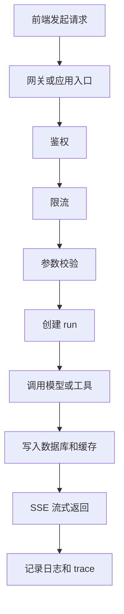
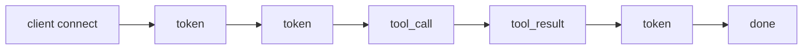

# 01. 请求生命周期与流式 API

前端开发者已经很熟悉 `fetch`，但转后端之后，重点会从“怎么发请求”变成“请求进入服务后发生了什么”。Agent 服务尤其要理解 **长连接、流式返回、超时、重试、幂等**。

## 先记住这条主线

一次 Agent 请求，最常见的链路是：

这条链路里，前端最熟悉的是 `A` 和 `I`，后端最容易出问题的是 `D` 到 `J`。

## 为什么 Agent 常用 SSE

Agent 输出通常是逐步生成的，不适合等完整结果再一次性返回。SSE 的优点是：

- 比普通 HTTP 更适合持续推送文本事件。
- 比 WebSocket 更简单，浏览器直接支持。
- 很适合 token、tool_call、tool_result、done 这类单向事件。

一个典型事件流可以长这样：

## 要重点补的 4 个概念

### 1. 超时

模型调用、数据库查询、外部工具调用都必须有超时。没有超时，就没有失败边界。

### 2. 重试

只有 **安全的读操作** 或 **显式设计为幂等的写操作** 才适合重试。比如“获取 run 状态”可以重试，“创建 run”必须配合幂等键才能重试。

### 3. 取消

用户关闭页面、SSE 断开、上游代理断连时，服务端应该知道“这次输出可能不用继续了”。

### 4. 幂等

同一个请求重复到达，结果仍然只生效一次。Agent 后端最常见的做法是请求头里带 `Idempotency-Key`。

## 一个最小 API 设计

- `POST /api/agents/:agentId/runs`：创建一次运行
- `GET /api/runs/:runId/events`：SSE 订阅事件
- `GET /api/runs/:runId`：查询最终状态

这比把所有逻辑都塞进一个接口更清晰，也更方便排查。

一个很实用的约定是：

- `POST` 只负责“创建 run”
- 真正的流式输出放在 `events`
- 最终一致状态放在 `GET /runs/:id`

这样即使 SSE 中途断了，前端也能重新查状态，而不是整次交互直接作废。

## 一个最小事件模型

SSE 不要只吐纯文本，最好带事件类型。最小可以有这几类：

- `run_started`
- `token`
- `tool_call`
- `tool_result`
- `error`
- `done`

这样前端既能显示文本，也能把工具调用过程渲染出来。

## 后端真正要盯住的资源

一次 SSE 请求至少会占用：

- 一个 HTTP 连接
- 一段服务端内存
- 可能还占着模型调用或数据库连接

所以“支持流式输出”不只是前端体验问题，也是连接管理问题。并发一高，这些资源都会变成瓶颈。

## 你现在可以动手做的事

1. 设计一个 `runs` 接口，而不是把问答塞在单个 `chat` 接口里。
2. 给创建 run 的请求加 `Idempotency-Key`。
3. 让 SSE 至少支持 `token`、`error`、`done` 三种事件。

## 前端转后端最容易忽略的点

- 请求不是函数调用，它可能重复、乱序、超时、断开。
- 流式响应不是“多次 `console.log`”，它是一条持续占用资源的连接。
- 一次模型响应很慢时，后端需要考虑连接数、超时和取消，而不是只盯着返回内容。

## 这篇结束后你应该能回答

- 为什么 Agent 输出更适合 SSE，而不是普通 JSON 响应？
- 哪些接口可以重试，哪些必须依赖幂等键？
- 用户断开连接后，服务端为什么不能假装什么都没发生？
