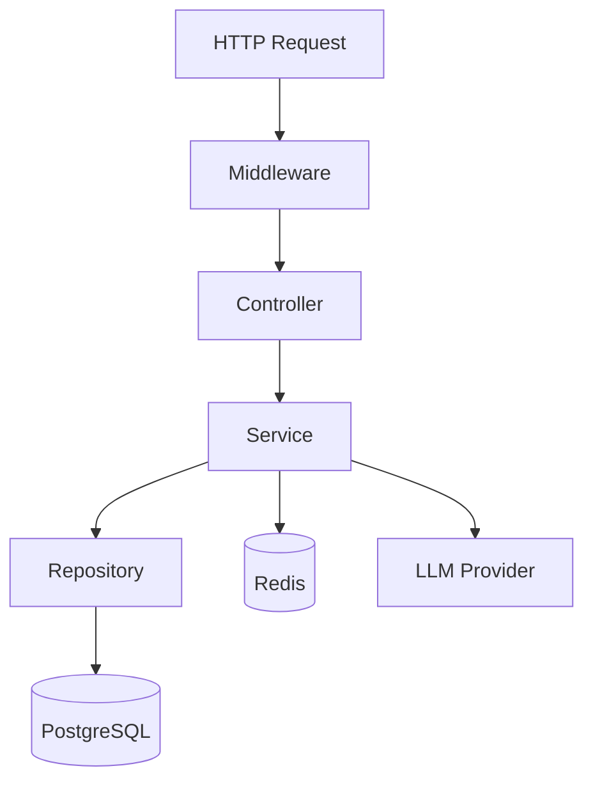
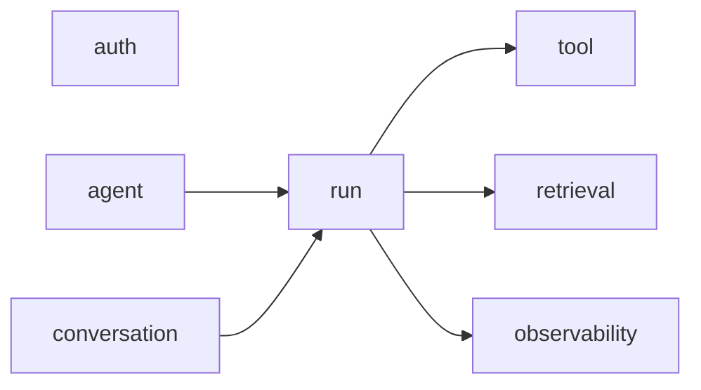
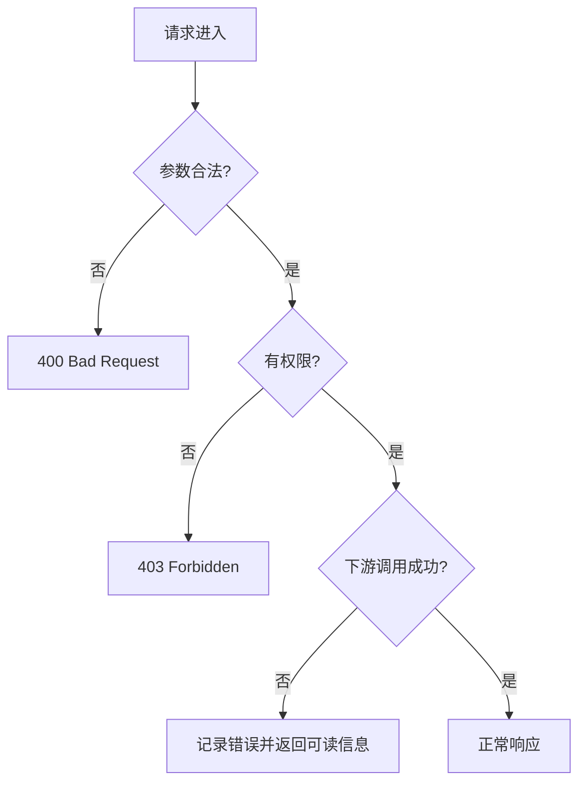

# 02. Node.js 后端分层与输入校验

TS 前端开发者转后端，最先要建立的是“代码边界感”。后端代码如果没有分层，很快就会变成把鉴权、查库、调模型、组响应全部塞进一个 handler。

## 最小分层模型

建议这样理解：

- `Middleware`：处理鉴权、日志、request id。
- `Controller`：解析请求，调用 service，返回响应。
- `Service`：放业务逻辑。
- `Repository`：只负责数据读写。

## 为什么要这样拆

因为 Agent 服务的复杂度主要在 `Service` 层，而不是路由层。比如：

- 创建 run
- 读取上下文
- 调模型
- 执行工具
- 写入消息
- 推送 SSE 事件

这些步骤都不应该直接写在路由函数里。

一个简单判断标准：

- 能复用的业务流程，进 `Service`
- 只和数据库打交道的，进 `Repository`
- 只和 HTTP 协议打交道的，留在 `Controller`

## 一个 Agent 服务的最小模块

你不一定要拆成这么多目录，但脑子里要有这个边界。

## 输入校验不能省

前端很容易默认“表单都被我控制了”。后端不能这么想。后端永远要假设：

- 参数缺失
- 类型不对
- 字段超长
- 用户越权访问别人的资源

所以请求一进来就要校验。常见做法：

- `zod`
- `valibot`
- `class-validator`

最小原则：

- Controller 只接收通过校验的数据
- Service 不相信原始请求
- Tool input 也要再次校验

这点在 Agent 后端尤其重要，因为 tool input 往往不是用户直接写的，而是模型生成的。模型生成的参数同样不可信。

## 一个常见坏味道

如果你看到下面这种代码结构，通常说明分层已经开始失控：

- Controller 里直接写 SQL
- Controller 里直接调模型 SDK
- Repository 里偷偷做权限判断
- Tool handler 里绕过 service 直接改库

这类写法短期看快，后面排查问题会非常痛苦。

## 错误处理也要分层

这能避免所有错误最后都变成一句“服务器异常”。

再往前走一步，建议把错误至少分成三类：

- 用户输入错误
- 业务规则错误
- 下游依赖错误

这样日志和返回信息才有区分度。

## 你现在可以动手做的事

1. 把现有后端代码分出 `controller/service/repository` 三层。
2. 给创建 run、执行 tool 的入口都加 schema 校验。
3. 统一错误结构，至少带 `code` 和 `requestId`。

## 对 TS 前端开发者最实用的结论

- 不要让 Controller 变成“大组件”。
- 不要在 Repository 里写业务判断。
- 不要相信前端传来的任何字段。
- 不要让工具调用跳过校验和权限判断。
