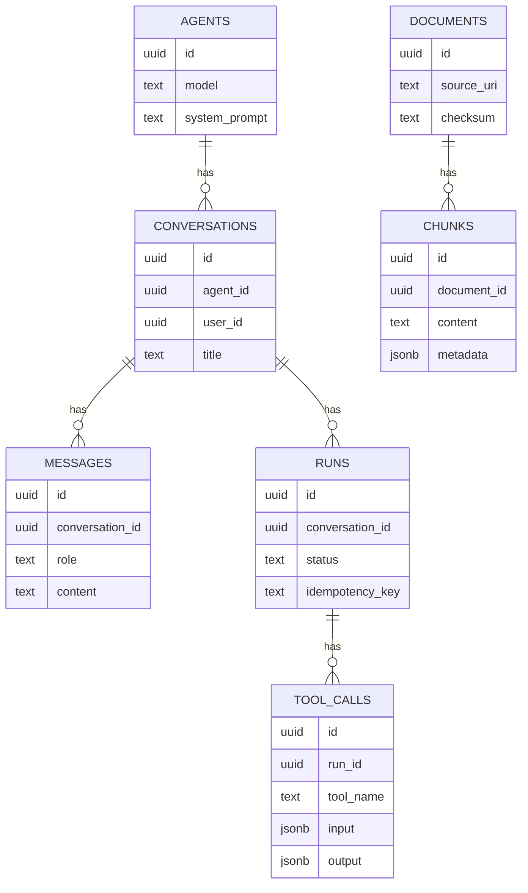
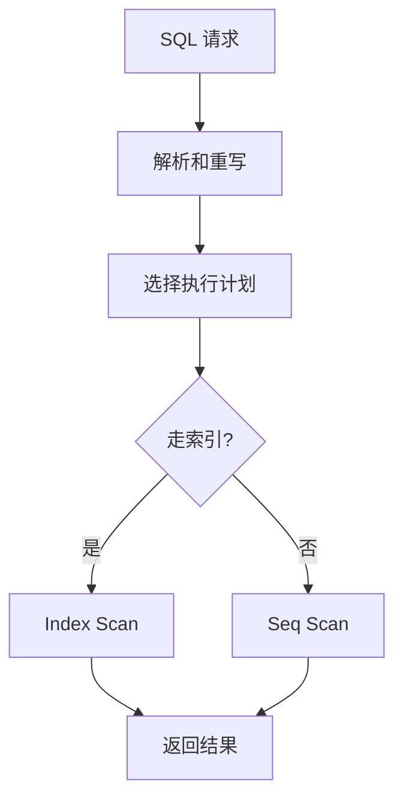

# 03. PostgreSQL 表设计、SQL 与索引

数据库部分这里以 **PostgreSQL** 为主。原因很简单：Agent 后端常见的数据模型、JSON 元数据、全文检索、向量检索，都和 PG 很契合。

## 先建立数据关系图

一个最小的 Agent 后端，通常至少有这些表：



## 表设计要抓住 5 个点

### 1. 主键

推荐优先用 `uuid` 或 `uuidv7`/`ulid` 风格主键。Agent 系统里跨服务、跨队列、跨日志追踪时更方便。

### 2. 约束

能交给数据库保证的，就别只靠代码判断。比如：

- `NOT NULL`
- `UNIQUE`
- `FOREIGN KEY`

### 3. 时间字段

建议统一有：

- `created_at`
- `updated_at`

任务和运行记录通常还要有：

- `started_at`
- `ended_at`

### 4. 状态字段

如 `runs.status`、`tool_calls.status`。状态机数据很常见。

### 5. JSONB

PG 的 `jsonb` 很适合存：

- tool input/output
- 模型返回的结构化元数据
- retrieval metadata

但它不适合替代表结构设计。可索引，不代表应该乱塞。

一个实用原则是：

- 高频过滤字段，单独成列
- 结构变化快、但又需要保留的元数据，放 `jsonb`

## 最常用的 SQL 能力

你至少要会这些：

- 按会话查最近消息
- 按 run 查工具调用
- 按时间分页
- 按状态筛选失败任务
- 聚合统计用户 token 消耗

举个最常见的查询例子：按会话加载最近 30 条消息。

```sql
SELECT id, role, content, created_at
FROM messages
WHERE conversation_id = $1
ORDER BY created_at DESC
LIMIT 30;
```

如果前端展示时要正序，再在应用层反转，或者外面再包一层子查询。

再比如查某次 run 下的工具调用：

```sql
SELECT tool_name, status, latency_ms, created_at
FROM tool_calls
WHERE run_id = $1
ORDER BY created_at ASC;
```

一个典型查询流程可以这样理解：



## 索引先学 4 类就够了

### 1. B-tree

默认、最常用，适合：

- 等值查询
- 范围查询
- 排序

### 2. 联合索引

比如：

- `(conversation_id, created_at)`
- `(run_id, created_at)`

这类索引对 Agent 时间线查询特别常见。

这里最容易踩的坑是：你明明写了索引，但查询条件和排序字段顺序对不上，最后还是没吃到索引收益。

### 3. GIN

适合：

- `jsonb`
- 全文检索

### 4. 向量索引

如果用了 `pgvector`，常见是：

- `ivfflat`
- `hnsw`

这部分先知道用途就够，早期项目不需要上来就深挖参数。

## 如何判断 SQL 慢

先看 `EXPLAIN (ANALYZE, BUFFERS)`，重点看：

- 是不是 `Seq Scan`
- 走没走你以为会走的索引
- 实际返回行数是不是远大于预期
- 排序和 join 有没有变成大开销

如果你刚入门，不用一开始就把执行计划读到非常细。先抓住两个信号就够：

- 为什么没走索引
- 为什么扫描了这么多不需要的行

## Agent 场景下很有用的 PG 能力

- `jsonb`：存 tool metadata、检索元数据
- `GIN`：给 `jsonb` 和全文检索加速
- `pgvector`：做向量召回
- `tsvector`：做简单全文检索

很多 Agent 项目早期用 PostgreSQL 就能把结构化数据、元数据和基础检索放在同一套系统里。

## 你现在可以动手做的事

1. 先画出 `conversations/messages/runs/tool_calls` 四张核心表。
2. 给 `messages(conversation_id, created_at)` 建联合索引。
3. 用 `EXPLAIN (ANALYZE, BUFFERS)` 看一次自己的查询计划。

## 这篇最重要的结论

- PostgreSQL 不是“换个语法的 MySQL”，它的 `jsonb`、全文检索、向量能力很适合 Agent 后端。
- 索引不是越多越好，先围绕查询模式建。
- 设计表时先想“最常查什么”，再决定索引。
