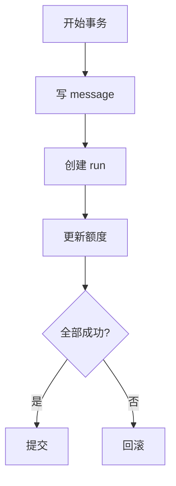
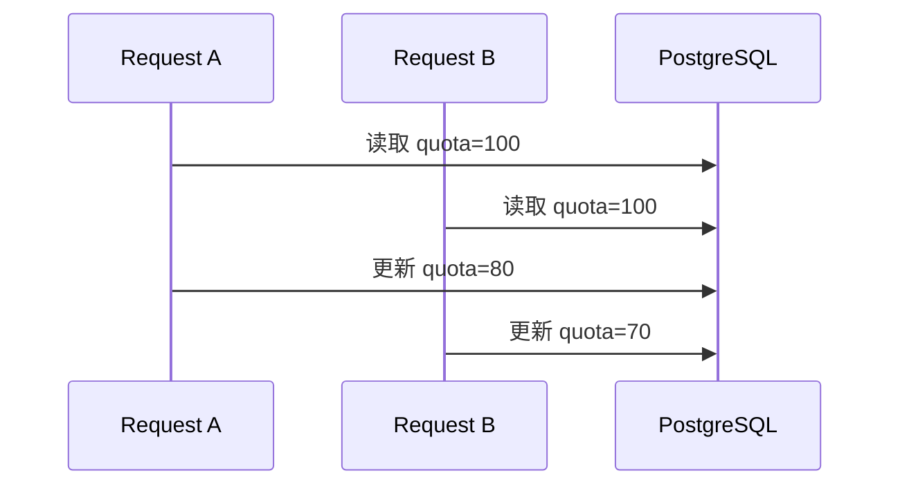

# 04. PostgreSQL 事务、锁与并发控制

很多前端开发者第一次做后端时，功能能跑通，但一遇到并发就开始出错。Agent 系统里尤其明显，因为一次请求可能同时涉及消息写入、额度扣减、任务状态更新。

## 事务到底在解决什么

事务不是为了“显得专业”，而是为了让一组操作要么都成功，要么都失败。



如果没有事务，上面任何一步失败，系统状态都可能变脏。

## PostgreSQL 默认隔离级别

PG 默认是 `READ COMMITTED`。这和很多 MySQL 教程默认讲的内容不同，所以这里不要直接套旧印象。

你要先理解三个实用级别：

- `READ COMMITTED`：够用，最常见
- `REPEATABLE READ`：同一事务内读到一致快照
- `SERIALIZABLE`：最严格，代价也最高

大多数 Agent 业务先从 `READ COMMITTED` 起步就够了，不要一上来就把所有事务都拉到最高隔离级别。

## 最值得先理解的并发问题：丢失更新

比如两个请求同时扣减用户余额或 token 配额：



结果看起来没报错，但真实应该是 `50`，却变成了 `70`。这就是典型并发写错。

## 两个常见解决方式

### 1. 行锁

```sql
SELECT * FROM quotas WHERE user_id = $1 FOR UPDATE;
```

适合“先读再改”的强一致更新。

### 2. 乐观锁

表里加 `version` 字段，更新时带条件：

```sql
UPDATE quotas
SET remaining = remaining - 20, version = version + 1
WHERE user_id = $1 AND version = $2;
```

如果更新行数为 0，说明被别人抢先改了。

乐观锁特别适合“冲突不算太频繁，但你又不想长时间持锁”的场景。

## Agent 场景里哪些操作该放事务

适合放事务内：

- 创建 run 并写入初始消息
- 任务领取并更新状态
- 扣减额度并记录账单

不适合长时间放事务里的：

- 外部模型调用
- HTTP 工具调用
- 长时间文件解析

原因很简单：事务持有的资源不能拖太久。

一个很好用的判断问题是：

“这一步如果执行到一半失败，数据库里会不会留下半成品状态？”

如果会，就说明它很可能需要事务保护。

## 任务领取是 PG 很适合教学的一点

如果你用 PG 做轻量任务队列，一个常见模式是：

```sql
SELECT id
FROM jobs
WHERE status = 'pending'
ORDER BY created_at
FOR UPDATE SKIP LOCKED
LIMIT 1;
```

它的意思是：锁住一条还没处理的任务，如果已经被别的 worker 锁住，就跳过它。

这能避免多个 worker 抢到同一条任务，是 PG 做轻量任务系统时非常常见的写法。

## 一个常见误区

很多人第一次做后端时，会把下面整个流程包进一个事务：

- 创建 run
- 调模型
- 执行工具
- 写最终结果

这通常是错误的。真正应该放事务里的，是“短而关键的数据库状态变更”，不是整个 Agent 生命周期。

## 你现在可以动手做的事

1. 找出你当前项目里一组“必须一起成功”的数据库写操作。
2. 给共享额度、库存、配额这类字段补一个并发保护方案。
3. 试着用 `FOR UPDATE SKIP LOCKED` 写一个最小 worker 领取查询。

## 这篇最重要的结论

- 事务保护的是一组数据操作，不是整个业务流程。
- 外部慢调用不要包在长事务里。
- PostgreSQL 的 `FOR UPDATE` 和 `SKIP LOCKED` 在 Agent 后端非常实用。
