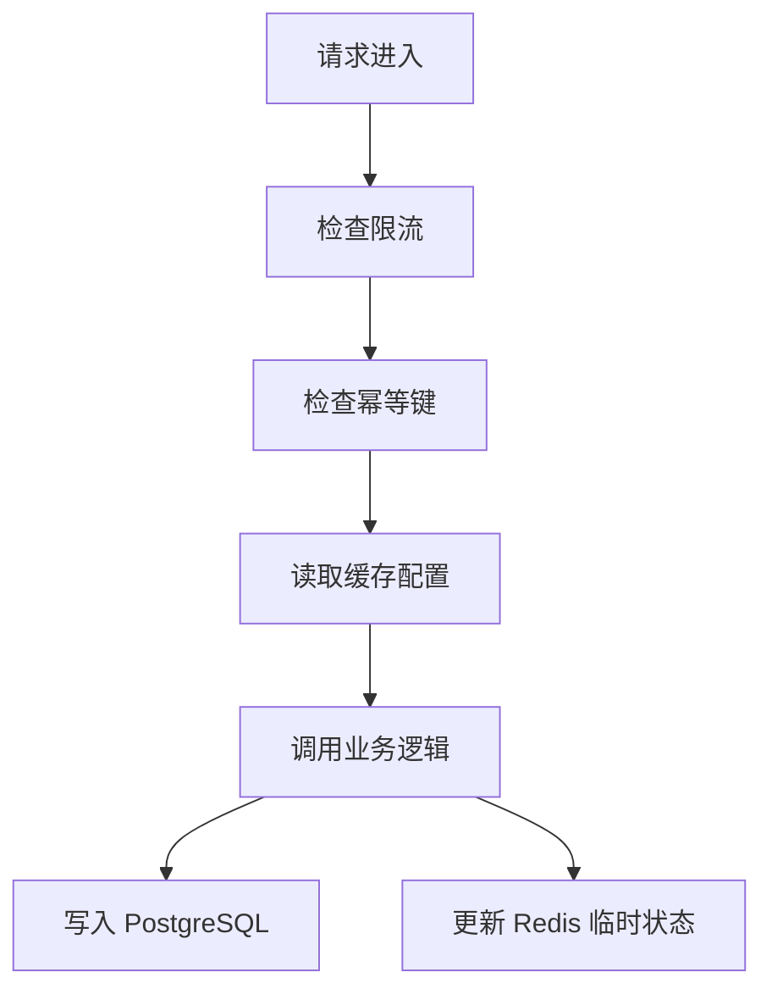
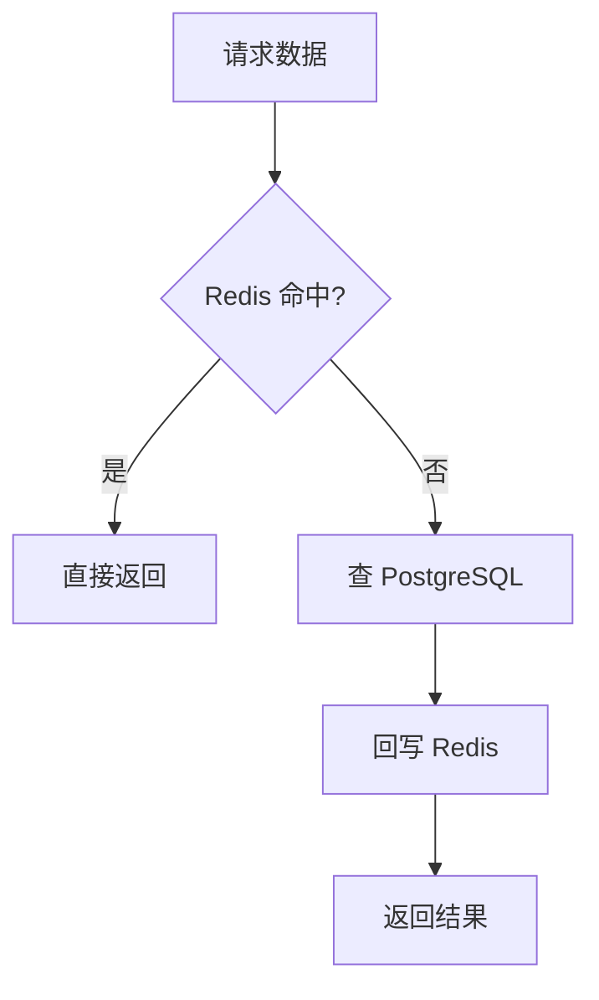
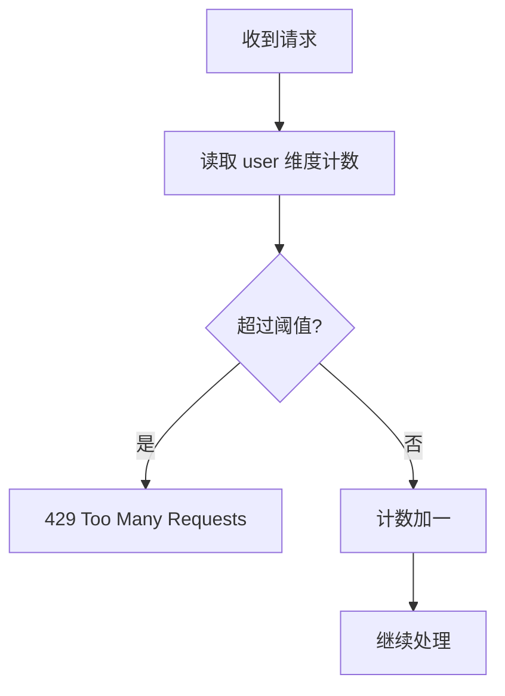

# 05. Redis 缓存、限流与幂等

Redis 在 Agent 后端里最常见，但也最容易被滥用。一个简单原则：

**权威数据放 PostgreSQL，Redis 放可重建的短期状态。**

## Redis 在 Agent 后端的常见位置

## 先掌握 4 个用途

### 1. 缓存

适合缓存：

- Agent 配置
- 热门文档元数据
- 可复用工具结果

不适合缓存的通常是：

- 强一致要求很高的余额类数据
- 无法接受短暂脏读的关键权限数据

### 2. 限流

适合做：

- 用户级 QPS 限流
- workspace 级配额限制
- 某个模型的并发上限

### 3. 幂等

相同用户、相同 `Idempotency-Key`，只允许成功创建一个 run。

### 4. 短期状态

比如：

- `run:{id}:state`
- `upload:{id}:progress`

## 缓存 Aside 是最常用模式

这个模式简单、直观，足够支撑大部分中小型 Agent 项目。

更新数据时，一个常见做法是：

1. 先写 PostgreSQL
2. 再删除旧缓存

这比“先改缓存再慢慢想办法同步数据库”稳得多。

## 要理解的 3 个缓存故障

### 1. 缓存穿透

查一个根本不存在的数据，Redis 和 DB 都被打。

### 2. 缓存击穿

热点 key 过期，瞬间大量请求一起打到 DB。

### 3. 缓存雪崩

大量 key 同时失效，导致后端整体抖动。

## 限流流程

最开始先学固定窗口或滑动窗口就够了，不必一上来手写复杂令牌桶。

如果你的系统有“普通用户、付费用户、内部服务”三类请求，也可以按身份做分层限流，而不是一刀切。

## 幂等别只靠 Redis 想象

Redis 可以做第一层拦截，但真正可靠的“只创建一次”，最好还要有数据库唯一约束配合。比如：

- `runs(idempotency_key)` 唯一索引
- `user_id + idempotency_key` 联合唯一索引

这样即使 Redis 短暂失效，数据库仍然能兜底。

## 你现在可以动手做的事

1. 找出一个最适合缓存的热点读取接口。
2. 给创建 run 的接口设计幂等键。
3. 对用户提问接口加最小限流。

## 这篇最重要的结论

- Redis 很快，但不是最终真相。
- 限流、幂等、短期状态都适合 Redis。
- 真正不能丢的数据，还是应该回到 PostgreSQL。
