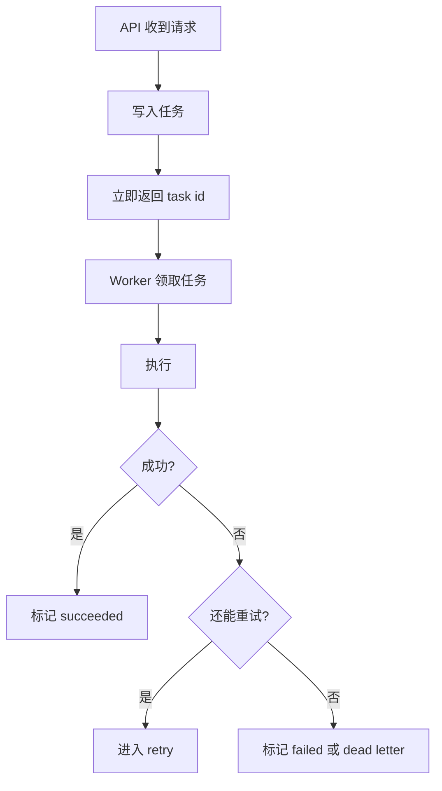
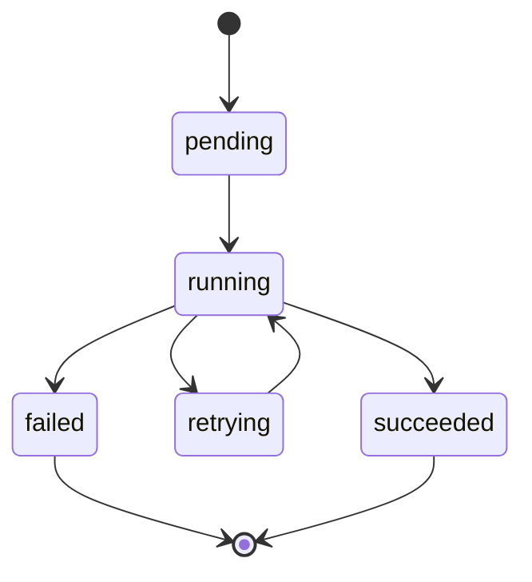

# 06. 队列、重试与异步任务

Agent 后端不能把所有工作都塞在请求里。像 embedding、文档解析、批量抓取、离线总结，这些都更适合放到后台任务。

## 先看最小任务流

## 为什么要异步

因为这些任务通常有一个或多个特点：

- 很慢
- 易失败
- 需要重试
- 不适合占着用户 HTTP 请求

## 任务表至少要有这些字段

- `id`
- `type`
- `status`
- `payload`
- `attempts`
- `max_attempts`
- `locked_at`
- `run_at`
- `last_error`

这能让你知道任务是什么、跑到哪了、失败了几次。

如果要再往前走一步，通常还会补：

- `locked_by`
- `finished_at`
- `next_run_at`

## 任务状态最好显式建模

## 重试不是无限重试

要有边界：

- 最大重试次数
- 退避策略
- 死信记录

否则一个坏任务会一直拖垮系统。

退避最常见的思路是指数退避。原因不复杂：失败得越多，越不该立刻疯狂重试。

## PG 也可以做轻量队列

项目早期不一定非要先上 RabbitMQ/Kafka。用 PostgreSQL 也能做基础任务系统，常见做法就是：

- 用任务表存状态
- worker 周期性轮询
- `FOR UPDATE SKIP LOCKED` 安全领取

这不是无限扩展的方案，但对很多 Agent 项目早期完全够用。

一个很现实的取舍是：

- 项目早期：PG 任务表就够
- 任务量变大：再引入 BullMQ、RabbitMQ 或更专业的调度系统

## 幂等任务的核心

同一个任务执行多次，结果也不能写坏。比如：

- 同一文档版本重复 embedding，不应重复写 chunk
- 同一 run 的完成回调，不应重复结算

所以任务执行逻辑里，往往还需要唯一约束、去重键或“已处理标记”。

## 你现在可以动手做的事

1. 把一个慢操作改造成后台任务。
2. 给任务表加 `attempts` 和 `last_error`。
3. 为同一文档版本设计一个去重规则。

## 这篇最重要的结论

- 慢任务要移出请求链路。
- 重试必须有上限和状态。
- PostgreSQL 在早期项目里足够承担基础任务队列角色。
