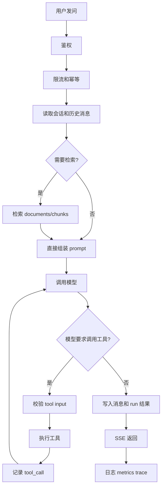
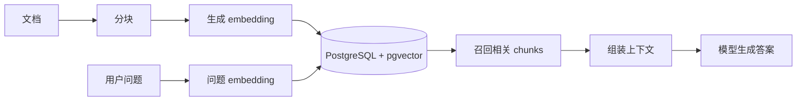
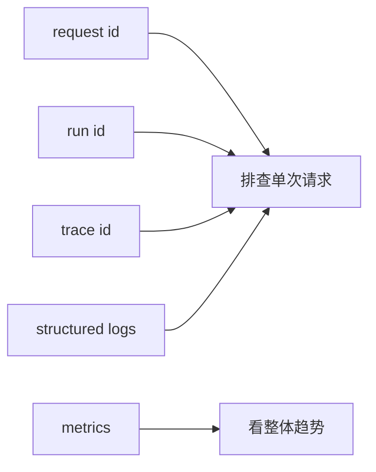

# 07. Agent 后端主链路、RAG 与可观测性

前面几篇是拆开讲组件，这一篇把它们重新拼回一个完整 Agent 服务。

## 一次 Agent 请求的完整主链路

如果你能把这张图讲清楚，就已经不是只会写前端接口调用了。

这条主链路里，真正有工程难度的点通常不是“调模型 API”，而是：

- 状态什么时候落库
- 检索结果怎么和历史消息拼装
- tool call 怎么记录
- SSE 中断后怎么补状态

## RAG 最小闭环

RAG 不等于“把文档塞给模型”，它至少包括：

- 文档入库
- 分块
- embedding
- 检索
- 可能的 rerank
- 最终生成

这里数据库主线仍然可以是 PostgreSQL：

- 结构化数据：普通表
- metadata：`jsonb`
- 向量：`pgvector`
- 简单全文检索：`tsvector`

这意味着很多 Agent 项目早期不必急着把数据拆到太多基础设施里。先把链路做通，比一开始堆很多组件更重要。

## 工具调用为什么要单独记录

因为 tool call 是 Agent 后端里最需要审计的一环。至少要能查到：

- 调了什么工具
- 输入是什么
- 输出是什么
- 花了多久
- 为什么失败

没有这层记录，用户一说“Agent 又乱来”，你很难定位。

最小的 `tool_calls` 表，通常可以有这些字段：

- `run_id`
- `tool_name`
- `status`
- `input`
- `output`
- `latency_ms`
- `error_message`

## 可观测性先做最小集

最小可观测性包括：

- `requestId`
- `runId`
- 结构化日志
- 基础指标：耗时、错误率、token 数、工具调用次数

如果现在只够做一件事，那就先把日志结构化，并保证每条日志都能带上 `requestId` 和 `runId`。这会立刻改善排查效率。

## 最实用的上线前检查

- 模型超时后，run 状态是否会卡住？
- SSE 断开后，后台任务是否继续执行？
- 工具调用失败后，日志里能否快速定位？
- Redis 不可用时，系统是否还能优雅失败？
- PostgreSQL 慢查询时，是否能从日志或 `EXPLAIN` 看出问题？

## 你现在可以动手做的事

1. 画出你自己的 Agent 主链路图，对照这篇检查缺口。
2. 建 `runs` 和 `tool_calls` 两张审计表。
3. 给所有关键日志补上 `requestId`、`runId`、`userId`。

## 这篇最重要的结论

- Agent 后端不是“调一下模型 API”。
- 它本质上是一个有状态、有任务、有缓存、有检索、有审计能力的后端系统。
- 你需要把 PostgreSQL、Redis、队列、SSE、工具调用和可观测性放在一条链路里理解。
