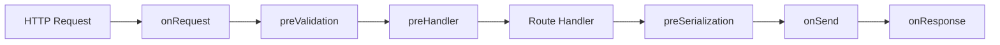

# 01. 请求链路与中间件定位

理解中间件，最重要的前提是先看懂请求链路。

## 一、先看一条最小请求路径

这不是全部细节，但足够先建立直觉：

- 有些逻辑在进入 handler 之前做
- 有些逻辑在返回响应之前做
- 有些逻辑在响应发送之后做

## 二、为什么这条链路重要

因为很多工程问题，本质上都是“放错层”：

- 鉴权放太晚，已经白白做了很多下游工作
- 参数校验放太晚，脏数据已经进了业务层
- 日志埋点放太散，查问题时链路拼不起来
- 响应包装放太早或太晚，结构不一致

## 三、哪些逻辑适合前置

一般越靠前，越适合“尽快失败”的逻辑。

例如：

- `requestId`
- 鉴权 token 初步解析
- 限流
- 基础安全校验

原因很简单：

**越早拦住无效请求，越省资源。**

## 四、哪些逻辑适合靠近业务前

通常是：

- 参数校验
- 权限判断
- 租户上下文注入
- 数据库事务边界准备

这些逻辑常常需要已经有较完整的请求信息，但又应该早于真正业务执行。

## 五、哪些逻辑适合响应阶段

例如：

- 统一响应包装
- 设置响应头
- 序列化前裁剪字段
- 记录耗时

而 `onResponse` 更适合：

- 记录最终状态码
- 输出访问日志
- 异步上报指标

## 六、哪些逻辑不该假装是中间件

不是所有公共逻辑都适合做中间件。

例如：

- 核心业务编排
- 复杂数据库事务
- 依赖特定业务状态机的规则

这些通常应该在 `service` 层，而不是硬塞进全局请求链里。

## 七、给 Fastify 用户的一个务实判断标准

如果你的逻辑主要是在回答这些问题，它大概率适合中间件层或 hook 层：

- 这个请求是否合法
- 这个请求是谁发的
- 这个请求是否该继续
- 这个请求要不要统一打标签
- 这个响应是否要统一处理

如果你的逻辑主要在回答这些问题，它更像业务层：

- 订单要不要发货
- 积分怎么结算
- 任务怎么分配
- 什么时候进入补偿流程

## 八、这篇最重要的结论

中间件不是“公共代码收容所”，而是请求生命周期中的固定拦截点。

放对层，代码会更清楚；放错层，后面会越来越难维护。
