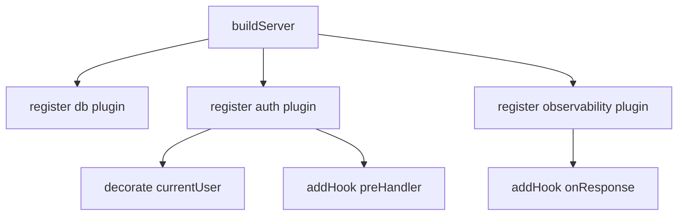

# 02. Fastify 的 middleware、hook 与 plugin

这是 `Fastify` 里最容易混淆的一组概念。

如果这一篇没理顺，后面写出来的代码很容易既不像 `Express`，也没真正用好 `Fastify`。

## 一、先说结论

在 `Fastify` 里，真实工程中通常优先级更高的是：

**plugin > hook > Express 风格 middleware**

这里不是绝对替代关系，而是说：

- 组织功能，优先想 `plugin`
- 接入请求生命周期，优先想 `hook`
- 必须兼容某些 `Express` 风格库时，再想 `middleware`

## 二、Fastify middleware 是什么

根据 `Fastify` 官方文档，`middleware` 从 `v3` 开始并非内置能力，需要通过 `@fastify/express` 或 `@fastify/middie` 这类插件接入；而且它发生在 `Fastify` 的 `Request/Reply` 包装之前，更偏原始 `Node req/res` 层。这个判断来自官方 `Middleware` 参考页。  
来源：https://fastify.dev/docs/latest/Reference/Middleware/

所以在 `Fastify` 里，`middleware` 不是默认主线路径。

## 三、为什么很多逻辑更适合 hook

根据官方 `Hooks` 文档，`Fastify` 提供了一整套请求/响应生命周期钩子，例如：

- `onRequest`
- `preValidation`
- `preHandler`
- `preSerialization`
- `onSend`
- `onResponse`

它们能直接拿到 `Fastify Request/Reply` 对象，而且天然在框架生命周期里工作。  
来源：https://fastify.dev/docs/latest/Reference/Hooks/

这意味着：

- 鉴权更适合 `onRequest` / `preHandler`
- 参数补充更适合 `preValidation`
- 响应包装更适合 `preSerialization`
- 日志和指标更适合 `onResponse`

## 四、plugin 又是在解决什么问题

根据官方 `Plugins` 文档，`register()` 不只是“引入一段代码”，它还会创建新的作用域；通过封装和继承机制，插件可以把路由、装饰器、hook 和功能注册组织成一个有边界的结构。  
来源：https://fastify.dev/docs/latest/Reference/Plugins/

所以 `plugin` 更像是：

**功能模块的装配单位。**

典型例子：

- `auth` 插件
- `observability` 插件
- `database` 插件
- `cors` 插件

## 五、一个简单对比表

| 能力 | 更像在解决什么问题 |
|---|---|
| middleware | 兼容原始 `req/res` 风格处理 |
| hook | 插入请求生命周期某个阶段 |
| plugin | 组织和注册一整块功能 |

## 六、一个更贴近工程的理解

### 1. `middleware`

适合：

- 接旧生态库
- 处理特别靠近原始 `req/res` 的事情

不适合默认承载整套 `Fastify` 风格业务横切逻辑。

### 2. `hook`

适合：

- 在固定生命周期点做拦截
- 控制请求是否继续
- 改写请求或响应

### 3. `plugin`

适合：

- 打包可复用能力
- 限定作用域
- 给某组路由统一注册 hook / decorator / route

## 七、一个典型组织方式

这里最关键的点是：

- 插件负责“把能力装上去”
- hook 负责“在请求里实际触发”

## 八、给 Fastify 初学者的实用建议

- 不要一上来找 `app.use()`，先想有没有更合适的 hook。
- 不要把所有逻辑都注册成全局 hook，很多能力应该限定作用域。
- 不要把插件理解成“文件拆分技巧”，它本质上是 `Fastify` 的封装边界。

## 九、这一篇最重要的结论

在 `Fastify` 里，真正应该先学会的不是“怎么写 middleware”，而是：

**怎么用 plugin 组织能力，怎么用 hook 放到正确生命周期。**
