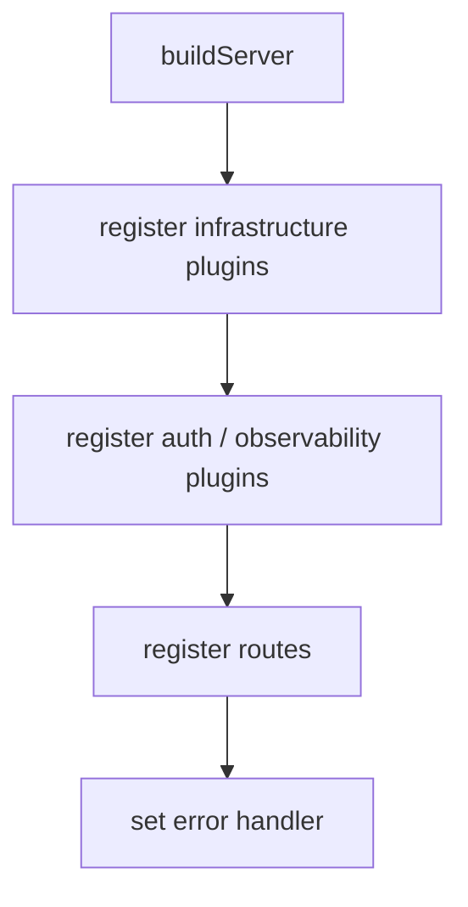

# 06. 面向 TypeScript 的工程组织方式

前面几篇讲的是概念，这一篇讲怎么把它们落成一个不容易失控的目录结构。

## 一、一个最小可维护结构

```text
src/
  app.ts
  plugins/
    auth.ts
    logger.ts
    cors.ts
    rate-limit.ts
  hooks/
    request-id.ts
    access-log.ts
  routes/
    users.ts
    orders.ts
  schemas/
    users.ts
    orders.ts
  services/
    user-service.ts
    order-service.ts
  lib/
    errors.ts
    types.ts
```

这不是唯一答案，但比“所有东西都堆到 routes 里”更稳。

## 二、为什么建议分 `plugins` 和 `hooks`

因为它们职责不同：

- `plugins/` 更偏能力注册和装配
- `hooks/` 更偏具体生命周期处理函数

这样后面读代码时，一眼就知道某段逻辑是“框架装配”，还是“请求拦截”。

## 三、为什么 schema 也该单独放

`TypeScript` 类型不等于运行时校验。

所以比较稳的做法是：

- `schemas/` 放运行时校验结构
- 类型由 schema 推导，或与 schema 保持一致
- route 只接收已经过校验的数据

## 四、一个更像真实项目的装配入口



这里最重要的不是目录本身，而是顺序感：

- 先把基础设施装好
- 再把横切能力装好
- 最后再进业务路由

## 五、哪些坏味道说明结构开始失控

- `routes/` 里直接写权限解析
- `routes/` 里直接拼日志字段
- 每个路由文件各自注册一套重复 hook
- 类型扩展 scattered 在很多文件里
- 一个“万能 plugin”里面塞所有能力

## 六、给 TS 开发者的一个现实建议

不要为了“类型很全”把中间件系统做得过重。

更稳的顺序通常是：

1. 先把插件边界和 hook 层次分清。
2. 再补 request/reply 的类型扩展。
3. 最后再做更复杂的 schema 推导和共享类型抽象。

## 七、这一专题的收尾结论

中间件工程化的核心，不是目录长得多漂亮，而是：

**横切逻辑有固定落点，请求生命周期有清晰阶段，TypeScript 类型和运行时行为能对得上。**
