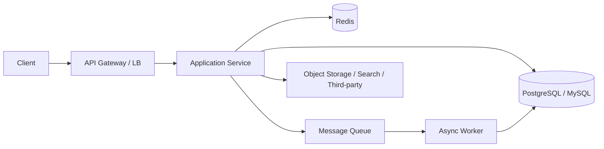

# 01. 系统设计场景题模板

这篇的目标很明确：

**给你一个系统设计场景题的通用答题模板。**

参考思路来自你给的 `claude-code-interview` 仓库中“系统设计题按分类练习、按模板回答”的组织方式，同时结合当前仓库里 [TS 前端开发者转向 Agent 开发的后端系统设计示例方案（面试向）](/home/wunai/Disks/Data/my-project/guidebooks/docs/backend-dev/TS%20前端开发者转向%20Agent%20开发的后端系统设计示例方案（面试向）.md:1) 的回答风格，整理成一个可复用框架。

## 一、系统设计题到底在考什么

很多人以为系统设计题在考“你知不知道 Kafka、Redis、分库分表”。

其实更常见的考点是：

- 你能不能先把问题定义清楚
- 你能不能抓住主链路
- 你能不能识别瓶颈和风险
- 你能不能在有限时间里做合理取舍

所以系统设计题不是背答案，而是展示你的工程判断。

## 二、通用回答骨架

建议按这个顺序讲：

1. 先确认需求和边界
2. 给出核心功能和非功能目标
3. 设计接口和核心数据模型
4. 讲主链路和核心组件
5. 分析瓶颈、扩展和故障处理
6. 最后补安全、监控和演进路线

这个顺序的好处是：

- 面试官容易跟上
- 你不容易一上来就发散
- 能先把主线讲稳，再展开细节

## 三、可直接套用的答题模板

下面这套模板适合大多数系统设计题。

---

## 1. 需求澄清

先不要急着画架构图，先确认题目。

你可以先问：

- 这是面向 ToC、ToB，还是内部系统？
- 核心功能只有一个，还是多条业务链路？
- 用户规模、QPS、数据量级大概多少？
- 是读多写少，还是写多读多？
- 对一致性、延迟、可用性更看重哪一边？

如果面试官不给具体数字，你可以自己假设，但一定要说出来。

例如：

> 我先做一个合理假设：这是一个日活 50 万、峰值 QPS 3000 的内容系统，读多写少，优先保证可用性和读性能。

## 2. 目标和约束

这一段回答两个问题：

- 系统必须做到什么
- 系统当前不能无限做到什么

你可以这样讲：

### 功能目标

- 用户可以发起请求
- 系统可以保存核心数据
- 支持查询、更新、状态流转

### 非功能目标

- 高峰期可承载预估流量
- 接口延迟控制在目标范围
- 核心数据不丢
- 故障时可降级

### 约束条件

- 人力有限，先不做过度复杂架构
- 首期部署成本受限
- 某些链路允许最终一致性

## 3. 高层架构

先给一个大图，不要一上来钻实现细节。

这一层重点不是把所有组件都堆上去，而是回答：

- 请求从哪里进来
- 主服务在哪
- 数据存哪
- 异步任务怎么处理

## 4. 核心数据模型

系统设计题里，数据模型很重要，因为它决定了：

- 查询模式
- 一致性边界
- 索引方案
- 扩展难度

建议至少讲清：

- 核心实体有哪些
- 实体之间是什么关系
- 哪些字段是高频查询字段
- 哪些字段需要状态流转或时间排序

例如：

| 表 / 实体 | 作用 | 关键字段 |
|---|---|---|
| `users` | 用户信息 | `id`, `status`, `created_at` |
| `orders` | 主业务记录 | `id`, `user_id`, `status`, `amount` |
| `jobs` | 异步任务 | `id`, `type`, `status`, `retry_count` |
| `audit_logs` | 审计记录 | `actor_id`, `action`, `created_at` |

## 5. 核心接口设计

系统设计题不要求 OpenAPI 写满，但至少要把关键接口讲出来。

例如：

- `POST /orders`
- `GET /orders/{id}`
- `POST /jobs/retry`

讲接口时重点说：

- 入参
- 幂等性
- 返回结果
- 失败处理

## 6. 主链路

这是整个回答里最关键的一段。

你可以按“正常流程”讲一遍：

1. 请求进入网关
2. 完成鉴权、限流和基础校验
3. 应用服务处理业务逻辑
4. 写主库
5. 必要时写缓存或投递消息
6. 返回结果

如果系统涉及异步任务，再单独补一段：

1. 主流程只写核心记录
2. 把耗时任务投递到队列
3. worker 异步消费
4. 更新状态并记录失败重试

## 7. 一致性与事务边界

这是很多人会漏掉的点。

要说明：

- 哪些操作必须强一致
- 哪些操作可以异步最终一致
- 哪些地方需要事务
- 哪些地方适合消息队列补偿

一个通用说法是：

> 核心主数据写入走本地事务，非关键副作用例如通知、索引同步、埋点统计，走异步队列做最终一致。

## 8. 性能设计

这里不要空喊“加缓存”，要讲清为什么。

常见可讲点：

- 热点读走 Redis
- 列表按时间或游标分页
- 高频筛选字段建索引
- 长耗时任务改异步
- 大对象存对象存储，不直接塞数据库
- 连接池和批处理控制数据库压力

## 9. 高可用与容灾

至少覆盖这些：

- 服务多实例部署
- 数据库主从或托管高可用
- 缓存哨兵或集群
- 队列消息堆积监控
- 超时、重试、熔断、降级

不要把高可用理解成“把所有组件都堆成集群”，而是先讲：

- 哪些点单了会挂
- 哪些点最需要优先保护

## 10. 安全设计

这一段很容易拉开差距。

至少可提：

- 认证方式：Session / JWT / OAuth2 / OIDC
- 授权模型：RBAC / ABAC
- 敏感数据加密和脱敏
- 接口限流、防刷、防重放
- 审计日志

## 11. 监控与排障

系统上线后，最怕的是出问题了但看不见。

可以补这些：

- 日志
- 指标
- Trace
- 慢查询监控
- 队列堆积监控
- 错误率和告警阈值

## 12. 演进路线

如果时间够，最后补一句会显得很稳：

> 首期先用单体服务 + PostgreSQL + Redis + 队列快速落地；当流量继续增长，再拆读写、拆异步任务、引入搜索或分区分库。

这能体现你知道“当前最优”和“长期演进”不是一回事。

## 四、一个通用答题话术模板

下面这段可以直接套：

> 我先澄清一下需求和约束。假设这是一个读多写少、峰值 QPS 在几千级别的业务系统，优先保证核心链路可用和主数据一致。  
> 架构上我会先采用 API 网关 + 应用服务 + 主库 + Redis + 异步队列 的基本形态。主流程同步完成核心写入，非关键副作用例如通知、索引同步和统计走异步。  
> 数据层面我会先定义核心实体、状态字段和高频查询索引，接口层保证幂等、鉴权和分页能力。  
> 风险点主要在热点读写、长事务、异步堆积和外部依赖超时，所以会配合缓存、限流、重试、降级和监控来做保护。  
> 如果后续规模继续增长，再考虑读写分离、分区分表或把检索和任务系统进一步拆开。

## 五、适用题型

这套模板适合这些系统设计题：

- 设计一个短链接系统
- 设计一个秒杀系统
- 设计一个消息通知系统
- 设计一个知识库问答系统
- 设计一个订单或预约系统
- 设计一个任务调度系统

## 六、答题时最常见的错误

### 1. 不先澄清规模和目标

结果讲了一堆架构，但不知道题目到底多大。

### 2. 上来就堆技术名词

Redis、Kafka、ES、分库分表全说了，但没解释为什么要用。

### 3. 只讲主流程，不讲失败路径

真实系统设计的价值，很大一部分就在失败处理。

### 4. 完全不讲数据模型

没有表、没有关系、没有索引，回答会显得很飘。

### 5. 忽略权限和安全

很多系统不是只能用，还得可控、可审计、可隔离。

## 这篇最重要的结论

系统设计题最重要的不是“组件背得多”，而是你能不能用一条稳定的主线，把需求、数据、链路、瓶颈和取舍讲清楚。
