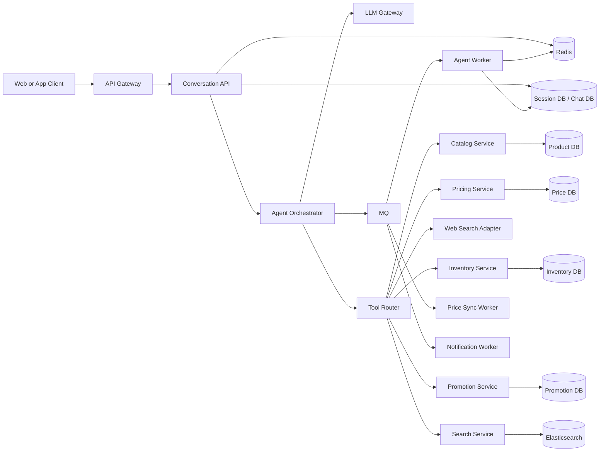
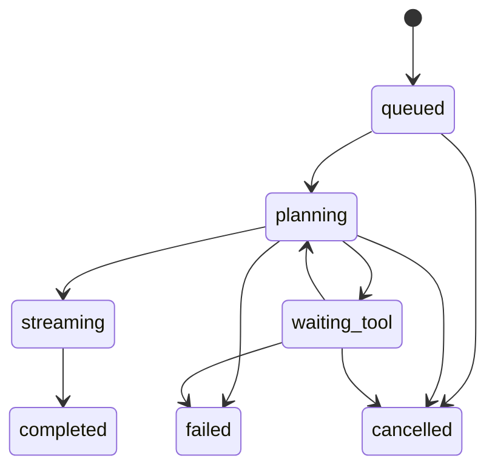
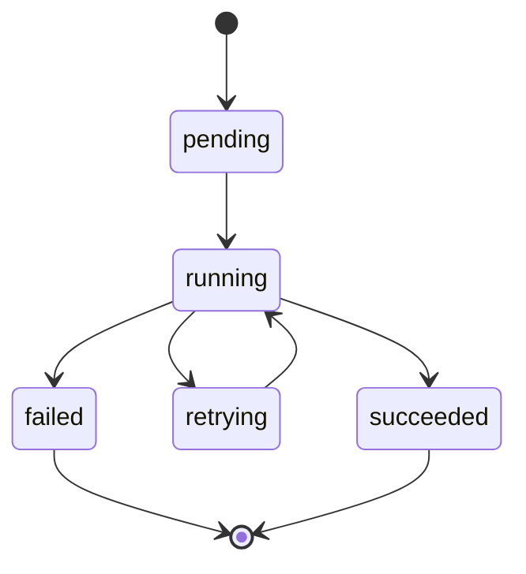
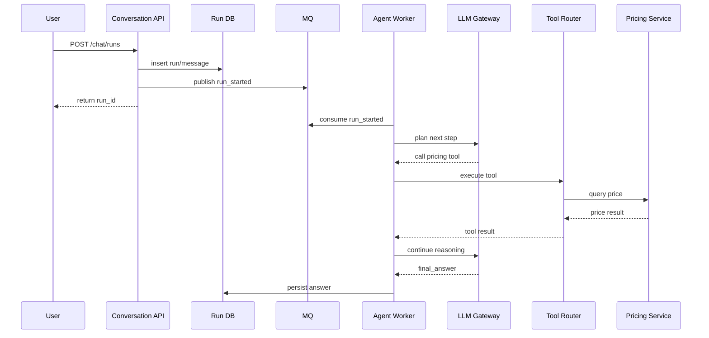
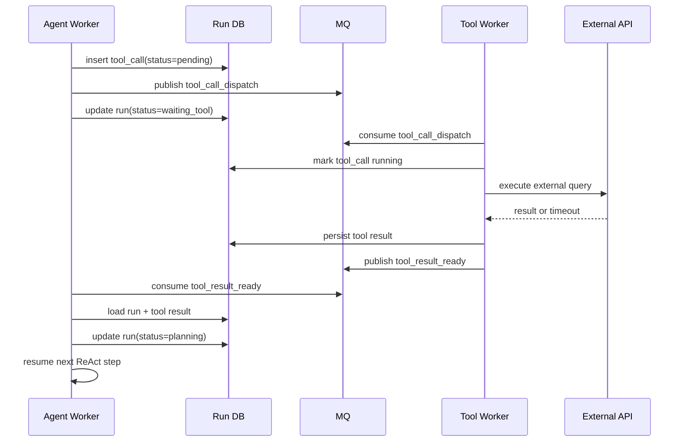
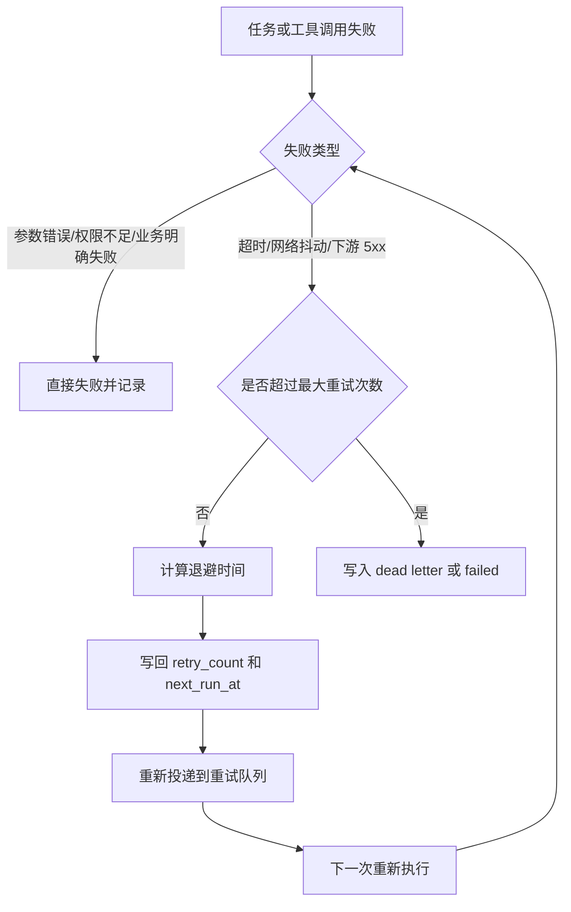
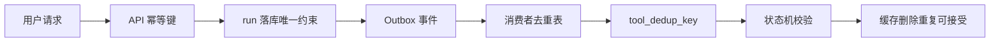
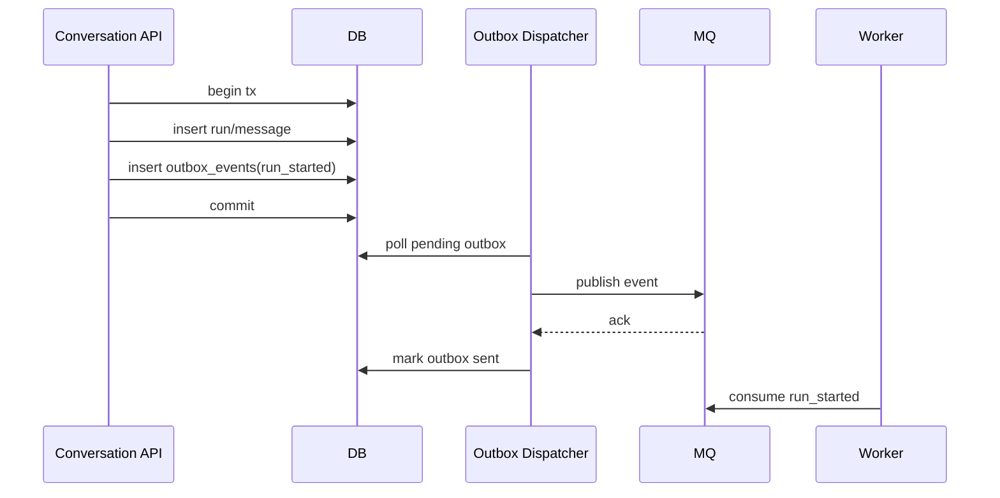
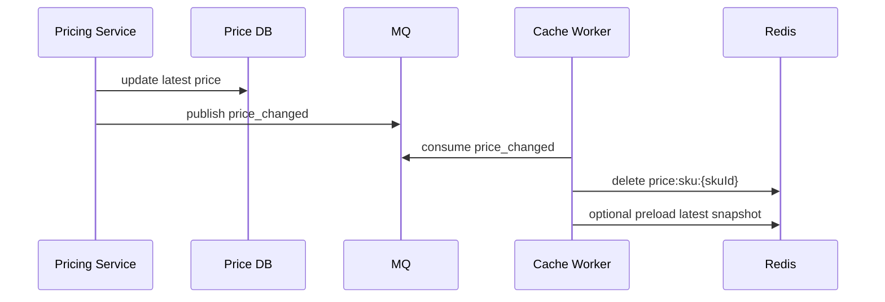
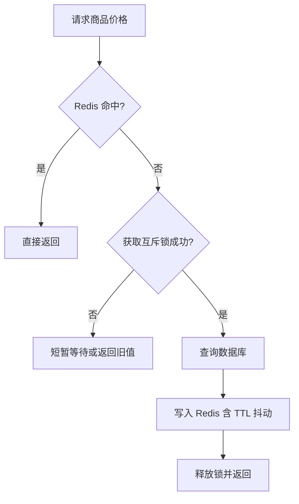

# 05. 电商平台与云端对话 AI 的系统设计示例

这篇给你一个更完整、也更接近真实工程的系统设计题：

**设计一个“电商平台 + 云端对话 AI”系统。**

用户可以在聊天框里输入需求，例如：

- 帮我找 300 元以内的机械键盘
- 比较一下这三款耳机的价格和评价
- 帮我查当前促销并推荐一套搭配

系统背后不是一次模型调用就结束，而是一个 **服务端 ReAct Agent Loop**：

- 模型先理解用户意图
- 决定要不要调用内部工具
- 可能多步查询商品、库存、价格、优惠、物流
- 再把结果汇总成最终回答

这个题很适合系统设计训练，因为它会同时覆盖：

- 对话系统
- 电商主数据
- MQ 异步解耦
- Redis 缓存与限流
- Agent 工具调用编排
- 幂等、重试、补偿
- 分库分表与演进路线

## 一、先定义需求和边界

### 功能目标

- 用户可以在 Web/App 聊天框发消息。
- 系统支持流式返回回答。
- Agent 可以调用内部工具：
  - 商品搜索
  - 商品详情查询
  - 价格查询
  - 库存查询
  - 营销活动查询
  - 联网查询外部公开信息
- Agent 允许多步推理，直到拿到足够信息再生成最终答案。
- 系统要保存会话、消息、工具调用、任务状态和审计日志。

### 非功能目标

- 聊天入口高可用，核心请求不能因单个工具慢而全部卡死。
- 价格、库存等关键读请求延迟低。
- 对话请求、工具执行、异步事件要可重试且不重复生效。
- 允许最终一致，但不能出现核心状态写乱。
- 系统要能从中小规模平滑演进到更高并发。

### 一组合理假设

- 日活 100 万。
- 聊天峰值请求 QPS 3000。
- 商品详情/价格查询峰值 QPS 2 万以上。
- 一个 Agent run 平均会触发 1 到 5 次工具调用。
- 价格和库存变化频繁，但商品基础信息变化相对慢。

## 二、整体架构

## 三、为什么这样拆

### 1. `Conversation API`

负责：

- 鉴权
- 会话入口
- 幂等校验
- SSE 或 WebSocket 推流
- 快速返回 `run_id`

它不负责把整条 Agent 链路同步跑完，否则请求生命周期太长，失败面太大。

### 2. `Agent Orchestrator`

负责：

- 创建 run
- 维护 ReAct 循环状态
- 控制最大步数
- 发起模型调用
- 决定同步执行还是投递异步任务

它是“控制平面”，不直接承载所有慢工具逻辑。

### 3. `Tool Router`

负责：

- 做工具注册和路由
- 统一超时、重试、权限校验
- 隔离不同工具的协议差异

这能避免 Agent 直接耦合每个内部服务。

### 4. `MQ + Worker`

负责：

- 解耦长耗时动作
- 支撑异步重试
- 削峰填谷
- 隔离外部依赖抖动

特别适合：

- 联网查询
- 大批量价格刷新
- 营销规则预计算
- 会话摘要和埋点落库

## 四、核心业务链路

### 1. 用户发起一次聊天

1. 客户端调用 `POST /api/chat/runs`，带 `Idempotency-Key`。
2. `Conversation API` 做鉴权、限流、参数校验。
3. 先查 Redis 中的幂等键，避免重复创建 run。
4. 在数据库事务里写入：
   - `run`
   - 用户消息 `message`
   - 初始上下文快照
5. 提交事务后把 `run_started` 事件投递到 MQ。
6. API 立即返回 `run_id`。
7. 客户端再通过 `GET /api/chat/runs/{runId}/events` 建立 SSE 订阅。

### 2. 服务端 ReAct Agent Loop

1. `Agent Worker` 消费 `run_started` 事件。
2. 读取会话历史、用户画像、候选商品上下文。
3. 调用模型，拿到结构化输出：
   - `thought`
   - `tool_call`
   - `final_answer`
4. 如果模型要求调用工具，则写入 `tool_call` 记录。
5. `Tool Router` 执行工具。
6. 工具结果落库并回写到 loop state。
7. Worker 继续下一步模型调用。
8. 达到停止条件后，写入最终消息，发布 `run_completed` 事件。
9. 推流层把 tool event、partial answer、final answer 发给用户。

### 3. 停止条件

- 模型返回 `final_answer`
- 达到最大步数，例如 8 步
- 达到总超时预算，例如 15 秒
- 命中风控或权限拒绝
- 工具连续失败达到阈值

## 五、ReAct Agent Loop 为什么要放服务端

如果把多步工具调用放前端，会有几个明显问题：

- 工具权限暴露给客户端，不安全。
- 多步状态不容易持久化和恢复。
- 工具重试、超时、并发控制不好做。
- 断线重连后很难恢复执行上下文。

放服务端后，才能把 run 当成一个可审计、可恢复、可重试的状态机。

## 六、状态机设计

### `run` 状态

### `tool_call` 状态

显式状态机的价值是：

- 可观测
- 可恢复
- 好做补偿
- 好做并发保护

## 七、接口设计

### 对话接口

- `POST /api/chat/runs`
  - 创建 run
  - Header: `Idempotency-Key`
- `GET /api/chat/runs/{runId}`
  - 查询 run 状态
- `GET /api/chat/runs/{runId}/events`
  - SSE 订阅事件流
- `POST /api/chat/runs/{runId}/cancel`
  - 取消运行中的 run

### 工具层内部接口

- `POST /internal/tools/catalog/search`
- `POST /internal/tools/pricing/get`
- `POST /internal/tools/inventory/get`
- `POST /internal/tools/promotion/query`
- `POST /internal/tools/web-search/query`

### 商品域接口

- `GET /api/products/{productId}`
- `GET /api/products`
- `GET /api/prices/{skuId}`
- `GET /api/inventory/{skuId}`

## 八、数据库设计

这里不要把所有数据都塞一库一表。这个系统天然有两类数据：

- **交易/主数据**
- **会话/运行数据**

### 1. 会话与 Agent 运行库

适合单独一套 PostgreSQL 或 MySQL 集群。

核心表：

#### `conversations`

- `id`
- `user_id`
- `tenant_id`
- `status`
- `created_at`

索引建议：

- `(user_id, created_at desc)`

#### `messages`

- `id`
- `conversation_id`
- `run_id`
- `role`
- `content`
- `tokens`
- `created_at`

索引建议：

- `(conversation_id, created_at)`

#### `runs`

- `id`
- `conversation_id`
- `user_id`
- `tenant_id`
- `status`
- `current_step`
- `max_steps`
- `deadline_at`
- `idempotency_key`
- `error_code`
- `created_at`
- `updated_at`

索引建议：

- `UNIQUE (user_id, idempotency_key)`
- `(conversation_id, created_at desc)`
- `(status, created_at)`

#### `tool_calls`

- `id`
- `run_id`
- `step_no`
- `tool_name`
- `tool_dedup_key`
- `status`
- `request_json`
- `response_json`
- `attempt_count`
- `started_at`
- `finished_at`

索引建议：

- `UNIQUE (run_id, step_no)`
- `UNIQUE (tool_dedup_key)`
- `(status, started_at)`

#### `outbox_events`

- `id`
- `aggregate_type`
- `aggregate_id`
- `event_type`
- `payload_json`
- `status`
- `retry_count`
- `created_at`

这个表用于事务消息 Outbox。

### 2. 电商商品域数据库

拆成多个逻辑域更合理：

- 商品中心 `catalog`
- 价格中心 `pricing`
- 库存中心 `inventory`
- 营销中心 `promotion`
- 订单中心 `order`

这样做的理由：

- 商品、价格、库存的数据写入频率和查询模式不同。
- 价格和库存更容易成为热点。
- 营销规则变化快，容易出现复杂查询和缓存失效。

## 九、分库分表怎么做

### 先说原则

不是一上来就全量分库分表，而是：

1. 先垂直拆库
2. 再按最先到瓶颈的表做水平拆分

### 1. 哪些表最可能先拆

#### `messages`

消息量增长最快，适合按 `conversation_id` 或 `tenant_id` 做分片。

#### `tool_calls`

日志型、追踪型数据量大，也适合按 `run_id` 或时间分表。

#### `price_history`

价格变更记录写多读少，通常按时间分表或冷热分层。

### 2. 分片键怎么选

常见思路：

- 会话数据按 `tenant_id` 或 `conversation_id hash`
- 订单数据按 `user_id hash`
- 商品评论按 `product_id hash`

分片键选择重点不是“平均”两个字，而是：

- 查询时能不能带上分片键
- 热点会不会过度集中
- 后续迁移成本是否可控

### 3. 一个务实的演进路线

- 阶段一：单库 + 规范索引
- 阶段二：商品域、会话域垂直拆库
- 阶段三：`messages`、`tool_calls`、`price_history` 水平分表
- 阶段四：热点租户单独迁移，配合路由层

## 十、Redis 怎么用

Redis 在这个系统里不是一个用途，而是四类用途。

### 1. 幂等键

例如：

- `idem:chat-run:{userId}:{idempotencyKey}`
- `idem:tool-call:{toolDedupKey}`

用于快速挡住重复提交和重复调度。

### 2. 热点缓存

例如：

- 商品详情
- SKU 当前价格
- 热门促销活动
- 库存快照

典型 key：

- `product:detail:{productId}`
- `price:sku:{skuId}`
- `inventory:sku:{skuId}`

### 3. 短期运行态

例如：

- run 的 SSE 游标
- 临时上下文
- 取消信号
- 限流计数

### 4. 分布式协调

例如：

- 工具并发信号量
- 热点 key 回源互斥锁
- Worker 轻量租约

### Redis 设计要点

- 热点缓存 TTL 加随机抖动，避免雪崩。
- 库存和价格可用短 TTL + 主动失效结合。
- 对不存在商品缓存空值，避免穿透。
- Redis 挂了时，聊天主链路可回源数据库，但要限流保护。

## 十一、MQ 选型与使用方式

这个场景里，MQ 主要不是“为了显得架构高级”，而是处理两类问题：

- 解耦
- 可靠异步

### 1. 适合放进 MQ 的任务

- `run_started`
- `tool_call_dispatch`
- `price_changed`
- `inventory_changed`
- `promotion_updated`
- `conversation_summary_requested`
- `audit_log_flush`

### 2. 中间件选型建议

#### 方案 A：RabbitMQ / RocketMQ

适合：

- 业务任务驱动
- 需要延迟队列、死信队列、重试队列
- 消息吞吐中高，但不是日志流级别

优点：

- 任务语义清晰
- 死信和重试机制直接
- 适合命令型消息

#### 方案 B：Kafka

适合：

- 高吞吐事件流
- 价格变更、埋点、行为日志、审计流
- 需要可回放和多消费者订阅

优点：

- 吞吐高
- 事件留存强
- 适合做事件总线

### 3. 这道题里的务实选型

可以这样回答：

- **Agent 工具调度、异步任务、补偿任务** 用 RabbitMQ 或 RocketMQ。
- **价格变更流、行为日志、审计事件** 用 Kafka。

如果系统还在中早期，不想一次引入两套 MQ，也可以先统一用 RocketMQ 或 RabbitMQ，等事件流规模上来再拆。

## 十二、服务端 ReAct Loop 和 MQ 的配合

这是这篇最关键的一部分。

### 同步和异步的边界

不是所有工具调用都必须过 MQ。

可以这样划分：

#### 同步直连工具

适合：

- 商品详情查询
- 当前价格查询
- 当前库存查询

原因：

- 响应要快
- 依赖稳定
- 单次耗时可控

#### 异步经 MQ 的工具

适合：

- 联网搜索
- 聚合多个来源报价
- 慢三方接口
- 大量候选商品比价

原因：

- 慢
- 抖动大
- 可能触发多次重试

### 一个典型流程

### 慢工具异步恢复执行流程

对于联网搜索、聚合比价这类慢工具，更适合拆成“子任务执行 + 结果回写 + loop 恢复”：

### 为什么不是“工具执行器消费 MQ，再回调 Agent”

也可以这么做，但要分场景。

更稳妥的模式是：

- `Agent Worker` 维护 loop 主状态
- 慢工具通过子任务消息异步执行
- 工具结果再回写 `tool_result_ready` 事件
- 原 run 由 orchestrator 恢复执行

这样主状态只有一个 owner，更不容易把 loop 写乱。

## 十三、设计模式怎么选

系统设计题里讲设计模式，不要背书式罗列，而要贴业务位置。

### 1. Strategy

用于：

- 不同工具执行策略
- 不同模型路由策略
- 不同重试策略

例如：

- 价格查询工具走强实时策略
- 联网搜索工具走异步容错策略

### 2. Factory

用于：

- 根据 `tool_name` 创建对应执行器
- 根据租户配置创建不同 Agent runtime

### 3. Template Method

用于：

- 统一工具调用骨架

骨架步骤大致一致：

1. 参数校验
2. 权限检查
3. 幂等检查
4. 执行工具
5. 结果标准化
6. 记录审计

### 4. State

用于：

- `run`
- `tool_call`
- `order`

状态机明确后，幂等和并发控制会容易很多。

### 5. Chain of Responsibility

用于中间件链：

- 鉴权
- 限流
- 上下文注入
- trace
- 审计
- 异常处理

### 6. Observer / Event-driven

用于：

- run 完成后触发摘要
- 商品变价后触发缓存失效
- 订单支付后触发通知

这里本质上就是事件驱动架构。

## 十四、中间件怎么选

如果用 Node.js / TypeScript 技术栈，一个很务实的组合是：

- `Fastify`
- `Zod`
- `Prisma` 或 `Drizzle`
- `ioredis`
- `amqplib` / RocketMQ SDK / KafkaJS
- `OpenTelemetry`

### 为什么偏向 Fastify

- 插件化清晰
- Hook 模型适合做中间件链
- 性能好
- 更适合高并发 API 服务

### 关键中间件

#### 1. 鉴权中间件

校验用户身份、租户身份、工具权限范围。

#### 2. 幂等中间件

在入口校验 `Idempotency-Key`。

#### 3. Trace 中间件

给每个请求、每个 run、每个 tool_call 注入 trace id。

#### 4. 限流中间件

至少做三层：

- 用户级
- 租户级
- 工具级

#### 5. 错误处理中间件

统一把：

- 模型超时
- 工具失败
- 下游 5xx
- 风控拒绝

转成可观测、可分类的错误码。

## 十五、重试设计

重试不是“失败了再来一次”这么简单。

要先分失败类型。

### 1. 可以重试的失败

- 网络抖动
- 下游 502/503
- 短时超时
- MQ 消费者临时失败
- Redis 短暂不可用

### 2. 不应该重试的失败

- 参数错误
- 权限不足
- 库存明确不足
- 商品不存在
- 风控明确拒绝

### 3. 重试策略

- 同步请求内重试：最多 1 到 2 次，小超时
- MQ 消费重试：指数退避
- 工具子任务：按工具类型分别配置
- 死信队列：达到上限后人工或定时补偿

### 4. 退避建议

- 第 1 次：1 秒
- 第 2 次：5 秒
- 第 3 次：30 秒
- 第 4 次：5 分钟

不要对高峰期热点失败做无脑立刻重试，否则会放大雪崩。

### 重试决策流程

## 十六、幂等设计

这类系统至少要做四层幂等。

### 1. API 请求幂等

用户重复点击“发送”，不能重复创建 run。

做法：

- `Idempotency-Key`
- Redis 短期去重
- 数据库唯一约束兜底

### 2. 事件投递幂等

同一个 `run_started` 事件可能重复发送。

做法：

- `event_id`
- Outbox 表
- 消费侧 processed 表或唯一键

### 3. 工具执行幂等

同一步工具调用重复消费，不能重复产生副作用。

例如联网查询可以重复查，但“发券”不能重复发。

做法：

- `tool_dedup_key = run_id + step_no + tool_name + normalized_args_hash`
- 落库唯一约束
- 对有副作用工具做状态机校验

### 4. 缓存失效幂等

价格变更消息可能重复，删除缓存要允许重复执行。

这类操作天然适合设计成幂等。

### 幂等控制全景图

## 十七、事务消息与最终一致性

### 为什么需要 Outbox

最常见的问题是：

- 数据库写成功了
- MQ 发消息失败了

这样会导致：

- run 已创建
- 但 worker 根本不知道要处理它

### Outbox 模式

1. 在本地事务里同时写业务表和 `outbox_events`
2. 后台 dispatcher 轮询 outbox
3. 成功发到 MQ 后更新 outbox 状态

这样能把“写库 + 发消息”从分布式事务改造成本地事务 + 最终投递。

### Outbox 投递流程

## 十八、缓存一致性和热点保护

### 价格与库存

这两类数据最难点在于：

- 读特别多
- 改也不少
- 用户对新鲜度敏感

建议：

- 读路径优先 Redis
- 变更路径更新数据库后删缓存
- 价格和库存消息异步广播给缓存失效 worker
- 对极热 SKU 用逻辑过期 + 后台刷新

### 商品详情

详情页变化慢，适合长 TTL + 被动失效。

### 热点保护

- 单飞锁防击穿
- 本地缓存挡住微小抖动
- 限流保护数据库

### 价格缓存更新链路

### 热点缓存回源保护

## 十九、并发控制

### 1. 同一 run 只能有一个 owner

避免两个 worker 同时推进同一个 ReAct loop。

做法：

- `runs` 表状态更新带版本号
- 或 Redis lease
- 或数据库 `SELECT ... FOR UPDATE`

### 2. 工具并发上限

联网搜索或价格聚合可能很贵。

要做：

- 每租户并发上限
- 每工具并发上限
- 全局 budget

### 3. 库存扣减不走聊天链路

聊天 Agent 可以查库存，但真正下单扣库存一定要走交易主链路，避免会话层直接改交易状态。

## 二十、可观测性

这个系统如果没有可观测性，排障会非常痛苦。

至少要有：

- 请求日志
- run 事件日志
- tool_call 审计日志
- MQ 堆积监控
- Redis 命中率
- 数据库慢查询
- LLM 调用耗时、token、错误率

### 建议关注的核心指标

- `run_create_qps`
- `run_success_rate`
- `run_p95_latency`
- `tool_call_timeout_rate`
- `mq_lag`
- `redis_hit_ratio`
- `pricing_cache_rebuild_qps`
- `duplicate_event_drop_count`

## 二十一、安全边界

### 1. 工具权限

不是所有租户、所有用户都能调用所有工具。

要把工具权限当作服务端策略，不要交给前端决定。

### 2. Prompt 注入与工具注入

用户输入里可能诱导模型：

- 越权查内部数据
- 绕过价格策略
- 连续触发高成本工具

所以要有：

- 工具白名单
- 参数 schema 校验
- 高风险工具人工审批或二次确认

### 3. 敏感数据

- 用户手机号
- 收货地址
- 订单金额
- 内部采购价

需要脱敏、分级授权和审计。

## 二十二、一条可直接讲的面试回答

如果面试官让你“口头设计”，可以这样答：

> 我会把这个系统拆成会话入口、Agent 编排层、工具路由层和电商领域服务几部分。聊天入口负责鉴权、限流、幂等和 SSE 推流，收到请求后先把 run 和 message 落到会话库，再通过 Outbox + MQ 触发服务端 ReAct Agent Loop。  
> Agent Worker 作为 loop 的唯一 owner，负责多步调用模型和工具。快工具如商品详情、价格、库存可以同步调用，慢工具如联网搜索、聚合报价通过 MQ 子任务异步执行，结果再回写 loop 状态继续推进。  
> 数据层面会把会话域和商品域先垂直拆开，商品、价格、库存、营销分别独立服务；消息量大的 `messages`、`tool_calls`、`price_history` 后续再按租户、会话或时间做水平分表。  
> Redis 主要做幂等键、热点缓存、限流和轻量协调，MQ 负责异步重试、削峰和最终一致。整体上接受至少一次投递，通过请求幂等、事件幂等、工具幂等和状态机校验来消化重复。再配合指数退避、死信队列、Outbox、Trace 和审计日志，保证系统在高并发和下游抖动下仍然可控。

## 二十三、这道题最容易被追问的点

- 为什么 ReAct loop 要服务端化
- 哪些工具同步，哪些工具异步
- 为什么需要 Outbox
- Redis 和数据库谁是准
- MQ 重复消费怎么处理
- 分库分表从哪里先下手
- 库存和价格缓存怎么保证新鲜度
- SSE 断开后怎么恢复

## 二十四、最后的落地原则

最重要的不是把所有组件一次性堆满，而是按增长阶段演进：

- 第一阶段：单体 API + 会话库 + 商品库 + Redis + 一套 MQ
- 第二阶段：拆出 Agent Worker、商品域服务、价格域服务
- 第三阶段：引入分库分表、Kafka 事件流、搜索和更强的可观测性

系统设计真正考察的不是“你知道多少名词”，而是：

**你能不能把同步链路、异步链路、一致性边界、失败路径和演进路线讲清楚。**
