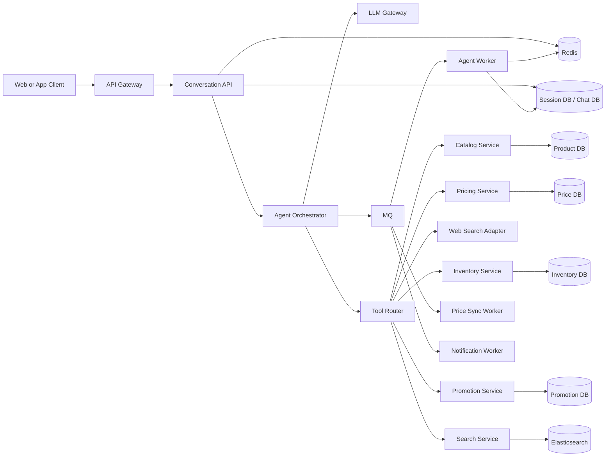

# 01. 需求边界与整体架构

## 一句话项目题

设计一个“电商平台 + 云端对话 AI”系统。

用户可以在聊天框里输入需求，例如：

- 帮我找 300 元以内的机械键盘
- 比较一下这三款耳机的价格和评价
- 帮我查当前促销并推荐一套搭配

系统背后不是一次模型调用就结束，而是一个服务端 ReAct Agent Loop：模型理解意图，决定是否调用内部工具，多步查询商品、库存、价格、优惠、物流和外部公开信息，再汇总成最终回答。

## 功能目标

- 用户可以在 Web/App 聊天框发消息。
- 系统支持 SSE 或 WebSocket 流式返回回答。
- Agent 可以调用商品搜索、商品详情、价格、库存、营销活动和联网查询工具。
- Agent 允许多步推理，直到拿到足够信息或达到停止条件。
- 系统保存会话、消息、工具调用、任务状态和审计日志。

## 非功能目标

- 聊天入口高可用，不能被单个慢工具拖垮。
- 价格、库存等关键读请求延迟低。
- 对话请求、工具执行、异步事件可重试且不重复生效。
- 系统接受最终一致，但核心状态不能写乱。
- 架构能从中小规模平滑演进到高并发。

## 规模假设

- 日活 100 万。
- 聊天峰值请求 QPS 3000。
- 商品详情、价格查询峰值 QPS 2 万以上。
- 一个 Agent run 平均触发 1 到 5 次工具调用。
- 价格和库存变化频繁，商品基础信息变化相对慢。

## 整体架构

## 服务边界

| 模块 | 职责 |
|---|---|
| Conversation API | 鉴权、会话入口、幂等、SSE/WebSocket 推流 |
| Agent Orchestrator | 创建 run、维护 loop 状态、控制最大步数和超时预算 |
| Agent Worker | 执行 ReAct loop，调用模型和工具，写回状态 |
| Tool Router | 工具注册、权限校验、超时、重试、结果标准化 |
| Catalog Service | 商品 SPU/SKU、类目、属性、上下架 |
| Pricing Service | 当前价、活动价、价格历史、价格缓存失效 |
| Inventory Service | 库存查询、库存预占、库存扣减主链路 |
| Promotion Service | 优惠券、满减、促销规则计算 |

## 为什么这样拆

`Conversation API` 是用户入口，重点是快、稳、可重连。它不应该同步跑完整个 Agent 链路，而是完成鉴权、幂等、落库和推流引导。

`Agent Worker` 是运行时 owner，负责推进 ReAct loop。这样 run 状态有明确归属，恢复、补偿、排障都更简单。

电商领域服务保持边界独立。聊天 Agent 可以读商品、价格、库存和促销信息，但交易动作仍然进入订单、支付、库存的正式主链路。
