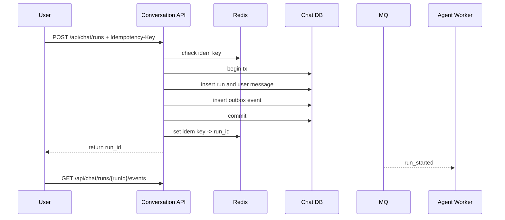
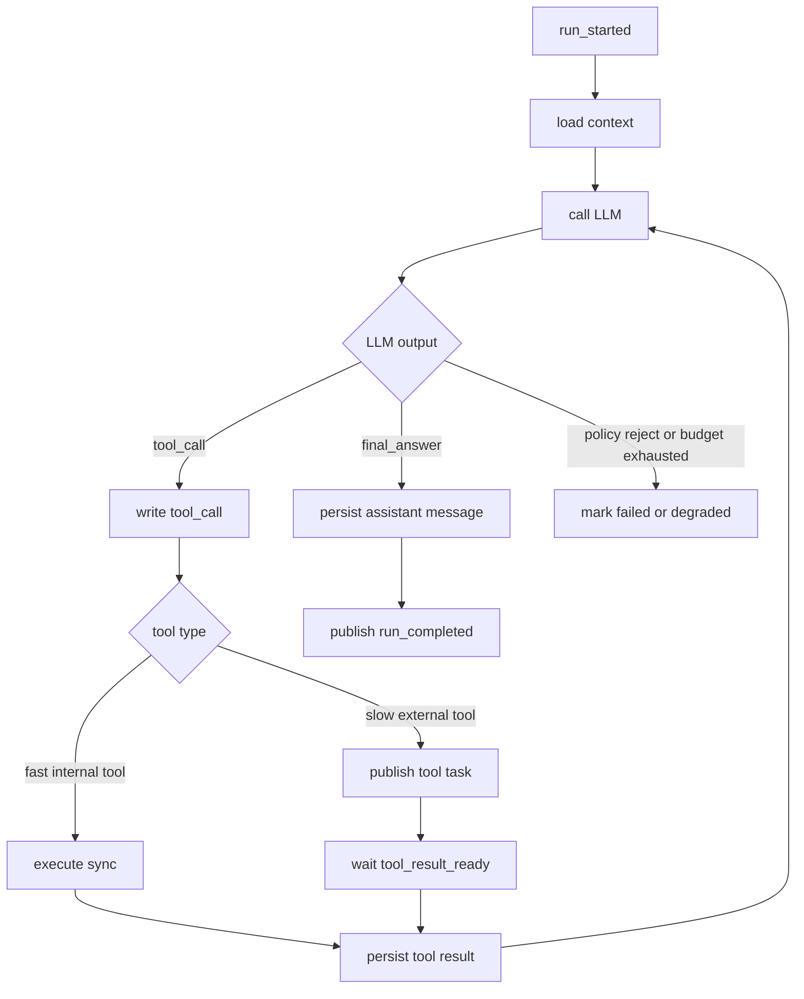
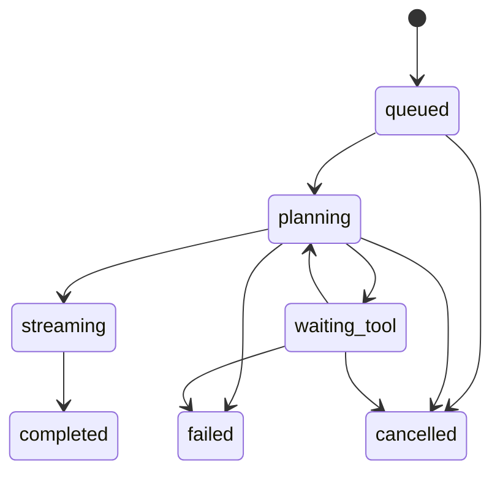
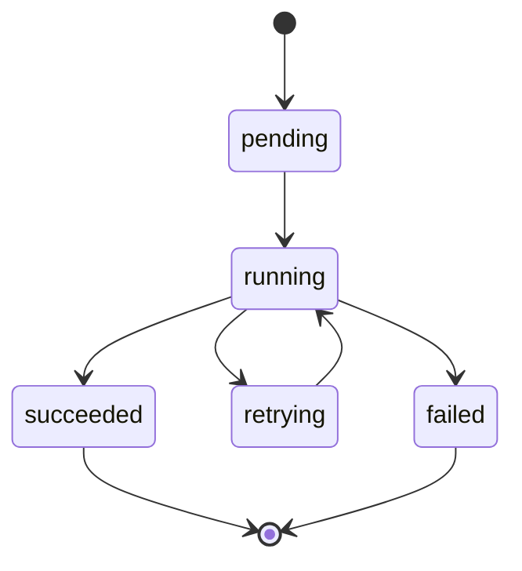

# 02. 核心链路与 ReAct Agent Loop

## 用户发起一次聊天

1. 客户端调用 `POST /api/chat/runs`，带 `Idempotency-Key`。
2. `Conversation API` 做鉴权、限流、参数校验。
3. API 查询 Redis 幂等键，避免重复创建 run。
4. 数据库事务写入 `run`、用户消息和初始上下文快照。
5. 同一事务写入 `outbox_events`。
6. API 返回 `run_id`。
7. 客户端通过 `GET /api/chat/runs/{runId}/events` 建立 SSE 订阅。

## 服务端 ReAct Agent Loop

1. `Agent Worker` 消费 `run_started`。
2. 读取会话历史、用户画像、候选商品上下文。
3. 调用模型获取结构化输出：`thought`、`tool_call` 或 `final_answer`。
4. 如果需要工具，写入 `tool_call` 记录并执行工具。
5. 工具结果落库并回写到 loop state。
6. Worker 继续下一轮模型调用。
7. 达到停止条件后写最终消息并发布 `run_completed`。

## 同步工具与异步工具

| 类型 | 示例 | 调用方式 |
|---|---|---|
| 快速内部读工具 | 商品详情、当前价格、库存快照 | 同步调用，短超时 |
| 慢外部工具 | 联网查询、聚合报价、三方接口 | MQ 子任务，异步恢复 |
| 有副作用工具 | 发券、创建订单、库存预占 | 必须经过领域服务状态机和幂等键 |

## run 状态机

## tool_call 状态机

## 停止条件

- 模型返回 `final_answer`。
- 达到最大步数，例如 8 步。
- 达到总超时预算，例如 15 秒。
- 命中风控或工具权限拒绝。
- 工具连续失败达到阈值。

## 为什么 ReAct Loop 要放服务端

- 工具权限不暴露给客户端。
- 多步状态可以持久化、恢复和审计。
- 工具重试、超时和并发控制可以统一治理。
- SSE 断开后可以用 `run_id` 重新订阅，而不是丢失运行状态。
