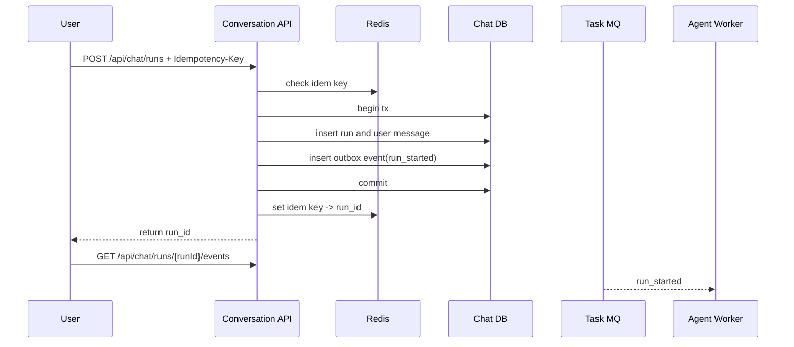
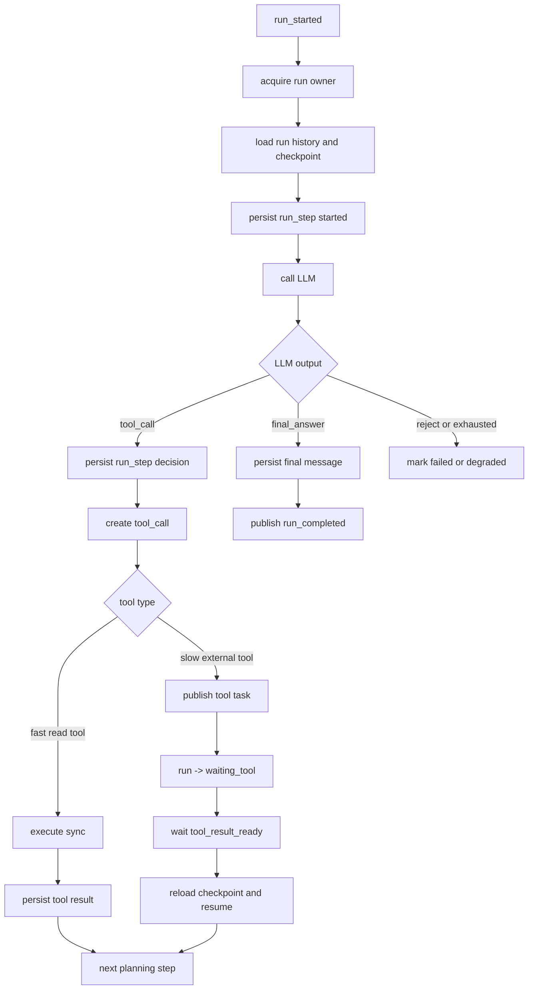
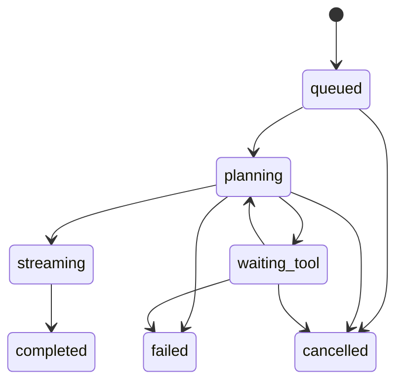
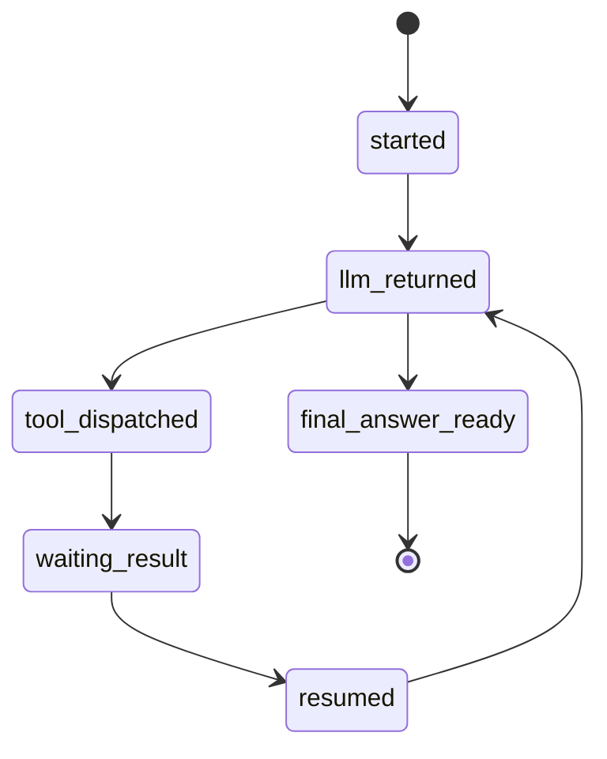
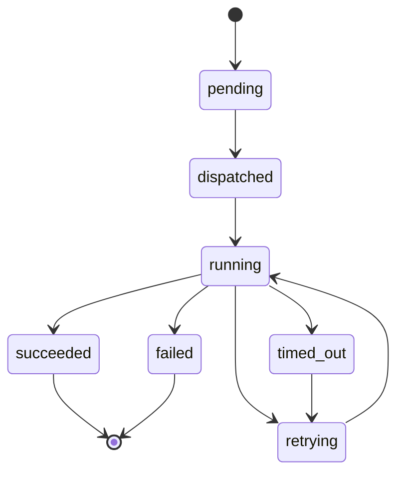
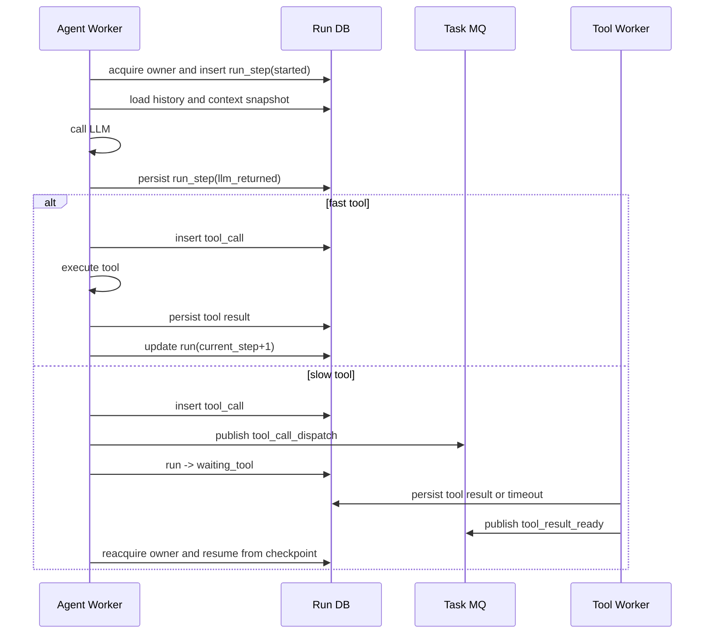

# 02. 核心链路与 ReAct Agent Loop

这一章只回答一件事：一次聊天请求是怎么从 `POST /api/chat/runs` 走到最终答案的，以及这个 loop 为什么必须按“可恢复状态机”来设计。

## 用户发起一次聊天

1. 客户端调用 `POST /api/chat/runs`，带 `Idempotency-Key`。
2. `Conversation API` 做鉴权、限流、参数校验。
3. API 查询 Redis 幂等键，快速拦截明显重复请求。
4. 数据库事务写入 `run`、用户消息和初始上下文快照。
5. 同一事务写入 `outbox_events`。
6. API 返回 `run_id`。
7. 客户端通过 `GET /api/chat/runs/{runId}/events` 建立 SSE 订阅。
8. Outbox Dispatcher 把 `run_started` 投递到任务型 MQ。
9. `Agent Worker` 获取这个 run 的推进权，开始 ReAct loop。

## 服务端 ReAct Loop 的真实执行单元

工程上不要把一个 run 看成“循环调用模型直到结束”这么抽象。更稳的理解是：

- `run`：整个请求级实例。
- `run_step`：loop 的一次检查点。
- `tool_call`：某一步里落出来的工具执行单元。

也就是说，loop 不是只有一个状态机，而是三层状态叠加：

| 层级 | 负责什么 | 是否必须持久化 |
|---|---|---|
| `run` | 请求总状态、owner、预算、取消、超时 | 必须 |
| `run_step` | 当前步骤号、模型决策、恢复点 | 必须 |
| `tool_call` | 工具执行、超时、重试、结果状态 | 必须 |

## 服务端 ReAct Agent Loop

1. `Agent Worker` 消费 `run_started`。
2. 用版本号或 lease 抢到这个 `run` 的推进权。
3. 读取会话历史、用户画像、候选商品上下文和上一次 checkpoint。
4. 组装本步 prompt，调用模型获取结构化输出：`tool_call`、`final_answer` 或 `reject`。
5. 先把 `run_step` 和决策结果落库，再决定后续动作。
6. 如果需要工具，创建 `tool_call`。
7. 快工具同步执行，慢工具投递异步任务并把 `run` 切到 `waiting_tool`。
8. 工具结果回流后，worker 重新获取 owner，基于上一步 checkpoint 恢复。
9. 达到停止条件后写最终消息并发布 `run_completed`。

## 三层状态机

### `run` 状态机

### `run_step` 状态机

### `tool_call` 状态机

## 哪些内容必须落盘

“落盘”在这里主要指持久化到数据库或对象存储，可供恢复和审计，不是指瞬时写 Redis。

| 数据 | 放哪里 | 原因 |
|---|---|---|
| `run.status`、`current_step`、`deadline_at`、`version` | DB | 这是恢复真相源 |
| `run_step.decision`、`resume_token`、`run.last_event_id` | DB | worker 重启后要知道从哪一轮接着跑，也要知道 SSE 补发位置 |
| `tool_call.request_json`、标准化结果摘要、失败原因 | DB | 幂等、重试、审计都依赖 |
| 超大工具结果、网页抓取原文、长回答附件 | 对象存储或 `tool_artifacts` | 不能把大对象直接塞 MQ 或热行表 |
| SSE 最近 cursor、短期 lease、取消信号 | Redis | 临时协调，丢了可以重建 |
| 组装中的 prompt buffer、流式 token buffer、瞬时 thought | 内存 | 不需要做长期真相源 |

## 哪些内容不应该持久化

- 模型流式输出过程中每个 token 不需要逐个落库。
- 未被采纳的中间 prompt 拼装产物不需要长期保留。
- Redis 里的热缓存值不应该被当成恢复依据。
- 对用户无价值、对审计也无价值的瞬时 chain-of-thought 草稿不应落长期库。

## 同步工具与异步工具

| 类型 | 示例 | 调用方式 | 持久化要求 |
|---|---|---|---|
| 快速内部读工具 | 商品详情、当前价格、库存快照 | 同步调用，短超时 | 只保留请求摘要和结果摘要 |
| 慢外部工具 | 联网查询、聚合报价、三方接口 | MQ 子任务，异步恢复 | 请求、状态、结果摘要必须落库 |
| 有副作用工具 | 发券、创建订单、库存预占 | 必须进入领域状态机 | 必须有业务幂等键和补偿记录 |

## 单 owner 推进 run

同一个 run 在任意时刻只能有一个 worker 推进，否则 loop 会出现重复工具调用、状态覆盖、重复 SSE 事件。

可选实现：

| 方案 | 优点 | 风险 |
|---|---|---|
| DB 版本号 CAS | 真相源统一在 DB | 高并发下会有重试竞争 |
| Redis lease | 抢占快 | lease 丢失后仍需 DB 二次确认 |
| `SELECT ... FOR UPDATE` | 最直观 | 长事务会放大锁等待 |

务实做法：Redis lease 做快速协调，DB 版本号做最终裁决。

## 一次 loop 的检查点时序

## SSE 与 loop 的关系

SSE 只是事件传输层，不是运行状态真相源。

- `run`、`run_step`、`tool_call` 先落库，再决定是否推 SSE。
- SSE 断开后，客户端可以按 `run_id` 重连，并从 `last_event_id` 继续。
- 如果 SSE 断了但 run 还没结束，worker 继续推进，不依赖客户端在线。
- 是否在客户端断开后取消 run，要看业务：
  - 纯问答型 run 可以尝试取消。
  - 还承担审计、汇总或异步产物生成的 run 可以继续。

## 停止条件

- 模型返回 `final_answer`。
- 达到最大步数，例如 8 步。
- 达到总超时预算，例如 15 秒。
- 命中风控或工具权限拒绝。
- 工具连续失败达到阈值。
- 用户取消。

## 为什么 ReAct Loop 要放服务端

- 工具权限不暴露给客户端。
- 多步状态可以持久化、恢复和审计。
- 工具重试、超时和并发控制可以统一治理。
- SSE 断开后可以用 `run_id` 重新订阅，而不是丢失运行状态。
- 只有服务端才能稳定实现“单 owner + checkpoint + 异步恢复”这套运行时模型。
