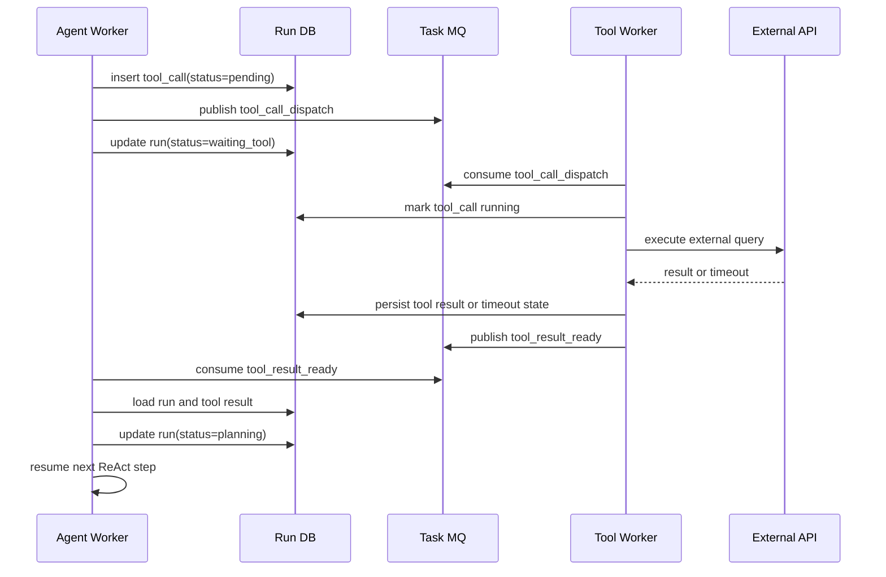
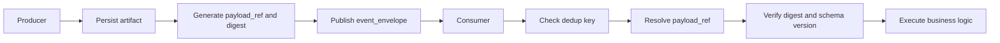
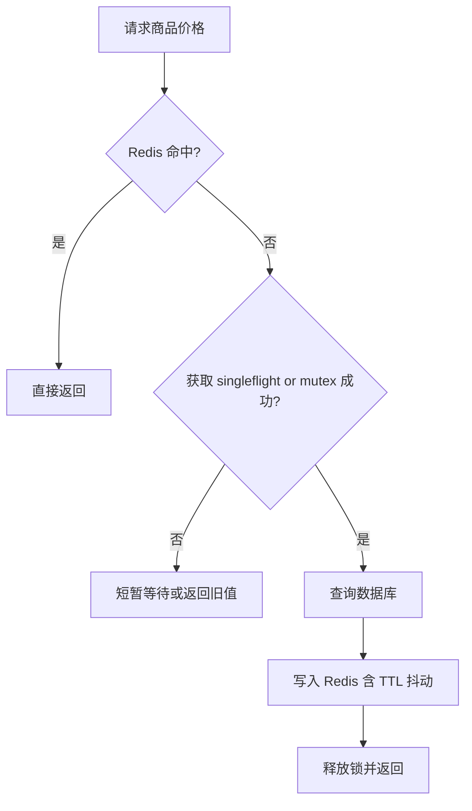

# 04. MQ Redis 与缓存一致性

这一章先把一个常见误区拆开：不是所有异步都该用一种消息语义。

- Agent run 和工具调度，核心是“任务被可靠执行”，更像任务型 MQ。
- 价格、库存、审计、行为流，核心是“事件被广播、可重放、可分析”，更像 Kafka。

## MQ 负责什么

任务型 MQ 主要解决两类问题：

- 解耦
- 可靠异步

适合投递的事件：

- `run_started`
- `tool_call_dispatch`
- `tool_result_ready`
- `conversation_summary_requested`
- `audit_log_flush`

## Kafka 负责什么

Kafka 更适合承载高吞吐、可回放、按 key 局部有序的事件流：

- `price_changed`
- `inventory_changed`
- `promotion_updated`
- `user_behavior_recorded`
- `agent_trace_emitted`

## 分层选型

| 通道 | 更适合什么 |
|---|---|
| RabbitMQ / RocketMQ 一类任务 MQ | Agent 工具调度、异步任务、补偿任务、死信队列 |
| Kafka | 价格变更流、库存流、审计事件、高吞吐行为日志 |

务实做法：不要为了“统一中间件”把调度任务和事件流硬揉成一种模型。任务调度关注完成，事件流关注传播和回放。

## Redis 负责什么

| 用途 | 示例 key | 说明 |
|---|---|---|
| API 幂等 | `idem:chat-run:{userId}:{idempotencyKey}` | 短期快速判重 |
| 工具幂等 | `idem:tool-call:{toolDedupKey}` | 避免明显重复执行 |
| 商品缓存 | `product:detail:{productId}` | 基础信息长 TTL |
| 价格缓存 | `price:sku:{skuId}` | 短 TTL + 主动失效 |
| 库存缓存 | `inventory:sku:{skuId}` | 更短 TTL + 失效事件 |
| 限流计数 | `rate:{tenantId}:{window}` | 用户、租户、工具级别 |
| SSE cursor | `run:cursor:{runId}` | 断线重连加速 |
| 取消信号 | `run:cancel:{runId}` | worker 快速感知 |
| owner lease | `run:lease:{runId}` | 短期协调，不是真相源 |

## Outbox 投递流程

## 慢工具异步恢复执行

## Kafka 事件流的关键口径

### 分区 key 怎么选

- 价格流用 `sku_id` 做 key，保证同一 SKU 价格事件局部有序。
- 库存流用 `sku_id` 或 `warehouse_id + sku_id`。
- 审计流用 `run_id`。
- 不要把完全无关的业务硬塞到一个 key，否则热点分区会非常严重。

### offset 什么时候提交

务实原则：先落库或先完成幂等 side effect，再提交 offset。

原因：

- 如果先提交 offset 再处理，消费者挂掉后会丢业务动作。
- 如果先处理后提交，最多是重复消费一次，但可用幂等消化。

这也是为什么整体设计接受“至少一次”，不追求纸面上的“恰好一次”。

## 重复、丢失、乱序、积压的固定处理策略

| 问题 | 典型原因 | 固定策略 |
|---|---|---|
| 重复 | 生产端重试、消费后未提交 offset | 幂等键 + 状态机校验 + 可重复副作用 |
| 丢失 | 生产失败、outbox 未补发、错误先 ack | Outbox + 发送确认 + 补偿扫描 |
| 乱序 | 多分区、重试插队、跨服务时间差 | 只要求局部有序，按业务版本号兜底 |
| 积压 | 下游慢、热点分区、消费者缩容 | lag 告警、扩容、限流、降级、旁路缓存 |

## 什么时候消息里放 payload，什么时候放 pointer

| 场景 | 建议 |
|---|---|
| 小结果，如价格快照、状态变更 | 直接放 payload |
| 大网页正文、长模型输出、三方原始 JSON | 只放 pointer |
| 多消费者共享同一大结果 | 放 pointer，避免消息体复制膨胀 |
| 需要长期审计或重放 | pointer 指向持久存储，并带 digest |

## pointer message 的设计

消息里建议至少带这些字段：

- `event_id`
- `aggregate_id`
- `event_type`
- `payload_ref`
- `schema_version`
- `digest`
- `trace_id`

对应的存储设计：

- `payload_ref` 指向对象存储路径或 `tool_artifacts.id`
- artifact 要带 `retention_until`
- 需要定期清理过期 artifact
- 清理前必须确认没有待重放消费者依赖它

## 价格缓存更新链路

## 热点缓存回源保护

## 缓存穿透、击穿、雪崩

| 问题 | 在本系统里是什么 | 处理策略 |
|---|---|---|
| 穿透 | 查询不存在商品、非法 SKU、错误类目组合 | 空值缓存、布隆过滤器、参数校验 |
| 击穿 | 热门 SKU 价格或库存 key 同时过期 | singleflight、互斥锁、逻辑过期、后台刷新 |
| 雪崩 | 大量价格/库存 key 同时失效 | TTL 打散、分批预热、分级缓存、回源限流 |

## 不同数据的缓存策略

| 数据 | 缓存策略 | 一致性口径 |
|---|---|---|
| 商品详情 | 长 TTL + 主动失效 | 允许分钟级最终一致 |
| 当前价格 | 短 TTL + Kafka 失效事件 | 用户看到近实时，结算时再强校验 |
| 库存快照 | 更短 TTL + 强回源保护 | 推荐阶段近实时，下单阶段强校验 |
| 促销规则 | 中 TTL + 规则变更失效 | 活动生效时以领域服务为准 |
| 会话上下文摘要 | 短 TTL | 丢了可从 DB 重建 |

## Redis 不是恢复真相源

Redis 在这里承担的是快路径，不承担最终真相。

- Redis 里可以放 `run cursor`
- Redis 里可以放 `owner lease`
- Redis 里可以放热点商品和价格缓存

但下面这些不能只在 Redis 里存在：

- `run` 当前状态
- `run_step` 当前检查点
- `tool_call` 最终结果
- pointer 指向的大结果

## 缓存一致性原则

- 商品详情长 TTL + 主动失效。
- 价格和库存短 TTL + 变更消息删除缓存。
- 热点 SKU 用逻辑过期 + 后台刷新。
- Redis 故障时允许部分链路回源数据库，但必须限流。
- 推荐阶段允许最终一致，下单阶段必须重新强校验。
