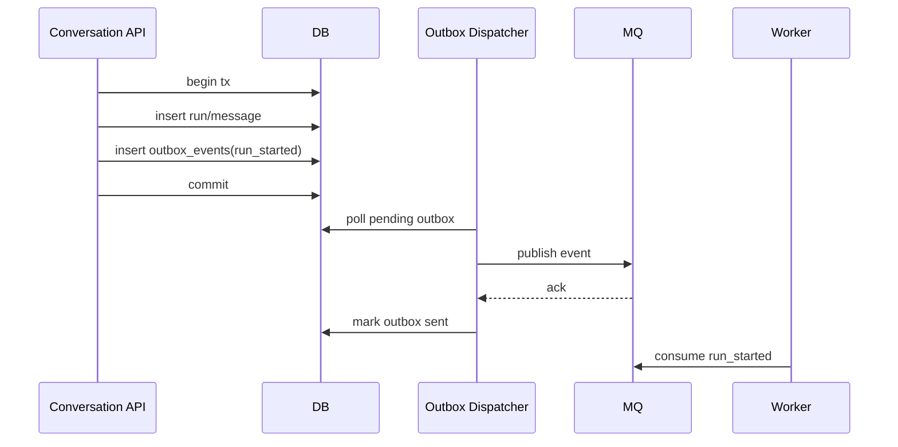
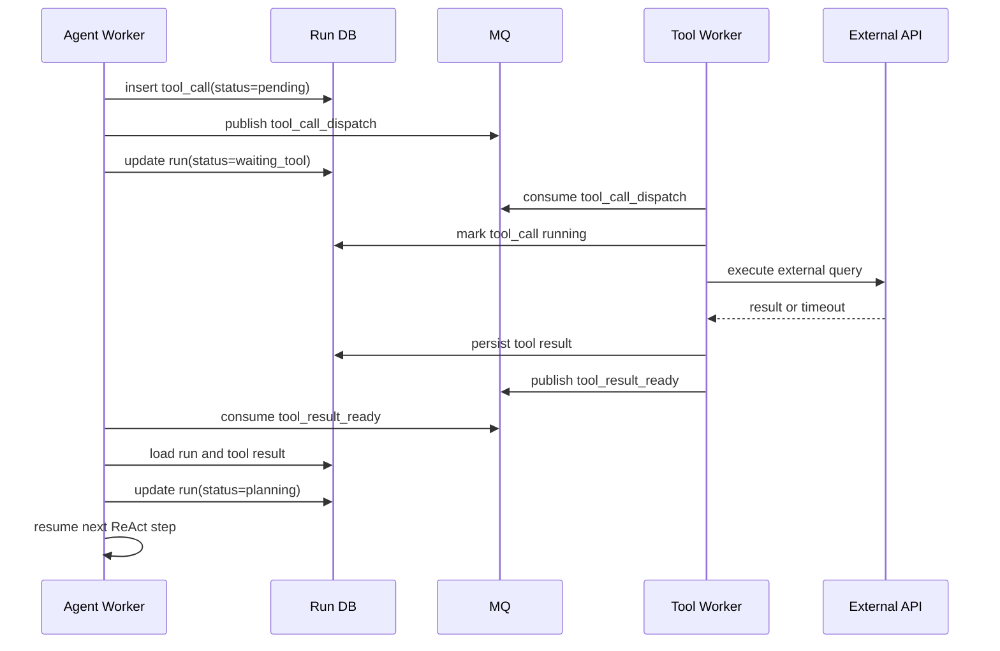
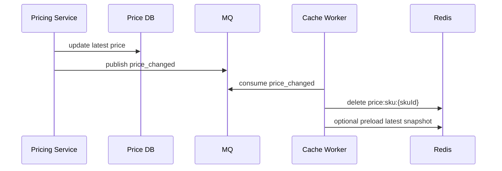
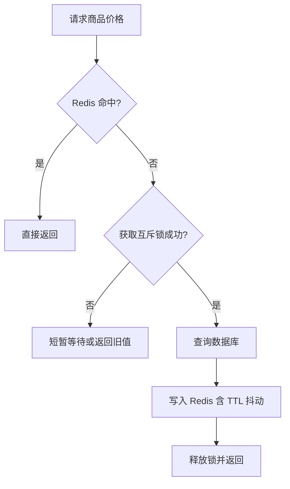

# 04. MQ Redis 与缓存一致性

## MQ 负责什么

MQ 主要解决两类问题：

- 解耦
- 可靠异步

适合投递的事件：

- `run_started`
- `tool_call_dispatch`
- `tool_result_ready`
- `price_changed`
- `inventory_changed`
- `promotion_updated`
- `conversation_summary_requested`
- `audit_log_flush`

## MQ 选型

| 中间件 | 适合场景 |
|---|---|
| RabbitMQ / RocketMQ | Agent 工具调度、异步任务、补偿任务、死信队列 |
| Kafka | 价格变更流、行为日志、审计事件、高吞吐可回放事件 |

务实选型：中早期可以先用 RabbitMQ 或 RocketMQ 统一承载业务任务；当价格流、审计流、行为日志规模变大，再引入 Kafka。

## Redis 负责什么

| 用途 | 示例 key |
|---|---|
| API 幂等 | `idem:chat-run:{userId}:{idempotencyKey}` |
| 工具幂等 | `idem:tool-call:{toolDedupKey}` |
| 商品缓存 | `product:detail:{productId}` |
| 价格缓存 | `price:sku:{skuId}` |
| 库存缓存 | `inventory:sku:{skuId}` |
| 限流计数 | `rate:{tenantId}:{window}` |
| 运行态 | `run:cursor:{runId}` |
| 取消信号 | `run:cancel:{runId}` |

## Outbox 投递流程

## 慢工具异步恢复执行

## 价格缓存更新链路

## 热点缓存回源保护

## 缓存一致性原则

- 商品详情长 TTL + 主动失效。
- 价格和库存短 TTL + 变更消息删除缓存。
- 热点 SKU 用逻辑过期 + 后台刷新。
- Redis 故障时允许部分链路回源数据库，但必须限流。
