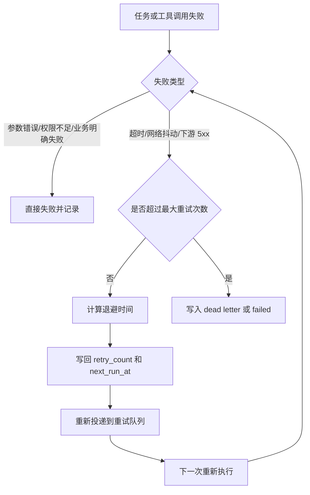

# 05. 重试 幂等与并发控制

这一章专门回答“系统接受至少一次以后，怎么把重复、迟到、并发推进都控制住”。

## 重试分类

可以重试：

- 网络抖动
- 下游 502/503
- 短时超时
- MQ 消费者临时失败
- Redis 短暂不可用

不应该重试：

- 参数错误
- 权限不足
- 库存明确不足
- 商品不存在
- 风控明确拒绝

## 重试决策流程

## 退避策略

| 次数 | 延迟 |
|---|---|
| 第 1 次 | 1 秒 |
| 第 2 次 | 5 秒 |
| 第 3 次 | 30 秒 |
| 第 4 次 | 5 分钟 |

同步请求内最多重试 1 到 2 次，MQ 消费重试使用指数退避，达到上限后进入死信队列。

## 四层幂等

| 层级 | 问题 | 方案 |
|---|---|---|
| API 请求幂等 | 用户重复点击发送 | `Idempotency-Key` + Redis + DB 唯一约束 |
| 事件投递幂等 | `run_started` 重复发送 | `event_id` + Outbox + 消费去重 |
| 工具执行幂等 | 工具子任务重复消费 | `tool_dedup_key` + 状态机 |
| 缓存失效幂等 | 重复删除缓存 | 删除操作天然可重复 |

## 幂等键的作用域

不要把所有重复都压成一个 key。不同层需要不同幂等粒度：

| 对象 | 建议 key |
|---|---|
| run 创建 | `(user_id, idempotency_key)` |
| outbox 事件 | `event_id` |
| tool_call | `tool_dedup_key` |
| 有副作用领域动作 | `business_idempotency_key`，例如 `reserve:{orderId}:{skuId}` |
| Kafka 消费去重 | `consumer_group + event_id` |

## 幂等控制全景图

## 单 owner 推进 run

同一个 run 只能有一个 worker 推进，否则 ReAct loop 会出现重复工具调用、状态覆盖、重复推流。

最少要有两层保护：

- 快速层：Redis lease 或队列内串行 key。
- 最终层：DB `version` 或状态机条件更新。

示意：

1. worker 抢 `run:lease:{runId}`
2. 抢到后读 DB 中 `run.version`
3. 更新 `run` 时带 `where version = ?`
4. 更新成功才算拿到推进权
5. 更新失败说明别的 worker 已推进，当前 worker 立即退出

## 重试不等于重放

- 重试：同一业务动作再次尝试执行，目标是成功完成。
- 重放：历史事件重新回灌，目标是恢复下游状态或补数。

两者不能混着设计：

- 重试依赖业务幂等键和当前状态机。
- 重放依赖事件版本、可审计历史和长保留 artifact。

## 迟到结果处理

慢工具最容易出现“run 已超时，但结果晚到了”。

固定策略：

| 场景 | 动作 |
|---|---|
| run 仍在 `waiting_tool` | 正常回流并继续 |
| run 已 `cancelled` | 记录结果，丢弃推进动作 |
| run 已 `failed` 或 `completed` | 只记审计，不再恢复 loop |
| 结果版本落后于当前 step | 标记 stale result，不回写主状态 |

这一步非常关键，否则迟到消息会把一个已经结束的 run 又推进起来。

## 工具重试的边界

| 工具类型 | 是否可自动重试 | 备注 |
|---|---|---|
| 只读内部查询 | 可以 | 例如商品详情、价格、库存 |
| 外部查询 | 可以 | 需要超时、熔断和上限 |
| 发券、创建订单、库存预占 | 不能直接粗暴重试 | 必须走领域状态机和业务幂等键 |

## 为什么副作用工具必须过业务状态机

例如“库存预占”不能只靠通用 `tool_call.retry`：

- 第一次调用可能已成功，但响应丢了
- 第二次重试如果没有业务幂等键，会重复预占库存
- 库存这种副作用不能靠“重复了再修”来兜底

更稳的做法是：

1. `tool_call` 只作为编排记录
2. 真正副作用进入库存域或订单域服务
3. 领域服务用自己的状态机和幂等键决定是否重复生效

## 并发预算

工具并发控制至少分三层：

- 用户级并发
- 租户级并发
- 工具级全局并发

联网搜索、价格聚合、模型调用这类高成本工具必须有预算控制。

## 并发冲突的典型场景

| 场景 | 风险 | 处理策略 |
|---|---|---|
| 同一 run 被两个 worker 消费 | 重复推进 | 单 owner + version CAS |
| 同一工具消息重复消费 | 重复执行 | `tool_dedup_key` + 状态机 |
| 同一 SKU 价格变更风暴 | 缓存频繁失效 | 合并失效、批量 preload |
| 同一用户高频点发送 | 重复 run | API 幂等 + 限流 |

## 死信与补偿

达到重试上限后不要无脑丢弃：

- 进入死信队列
- 记录失败原因和最后一次输入
- 区分“可人工重放”和“明确业务失败”
- 对关键链路保留补偿入口

例如：

- 联网查询连续 4 次超时，可以死信后人工重放
- 库存不足不应进入死信重试，而应直接给上游明确失败

## 一句话原则

- 系统接受至少一次，但每一层都必须有幂等。
- 重试只针对暂时性错误，不针对明确业务失败。
- Redis 负责快，数据库负责准。
- 迟到结果只能记账，不能随意重新推进已经结束的 run。
