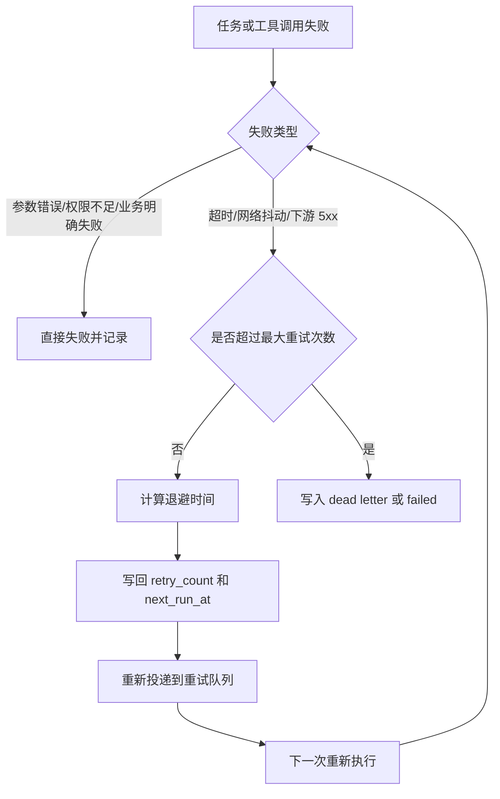

# 05. 重试 幂等与并发控制

## 重试分类

可以重试：

- 网络抖动
- 下游 502/503
- 短时超时
- MQ 消费者临时失败
- Redis 短暂不可用

不应该重试：

- 参数错误
- 权限不足
- 库存明确不足
- 商品不存在
- 风控明确拒绝

## 重试决策流程

## 退避策略

| 次数 | 延迟 |
|---|---|
| 第 1 次 | 1 秒 |
| 第 2 次 | 5 秒 |
| 第 3 次 | 30 秒 |
| 第 4 次 | 5 分钟 |

同步请求内最多重试 1 到 2 次，MQ 消费重试使用指数退避，达到上限后进入死信队列。

## 四层幂等

| 层级 | 问题 | 方案 |
|---|---|---|
| API 请求幂等 | 用户重复点击发送 | `Idempotency-Key` + Redis + DB 唯一约束 |
| 事件投递幂等 | `run_started` 重复发送 | `event_id` + Outbox + 消费去重 |
| 工具执行幂等 | 工具子任务重复消费 | `tool_dedup_key` + 状态机 |
| 缓存失效幂等 | 重复删除缓存 | 删除操作天然可重复 |

## 幂等控制全景图

## 单 owner 推进 run

同一个 run 只能有一个 worker 推进，否则 ReAct loop 会出现重复工具调用或状态覆盖。

可选方案：

- `runs` 表状态更新带版本号。
- Redis lease。
- 数据库 `SELECT ... FOR UPDATE`。

## 工具并发预算

工具并发控制至少分三层：

- 用户级并发。
- 租户级并发。
- 工具级全局并发。

联网搜索、价格聚合、模型调用这类高成本工具必须有预算控制。
