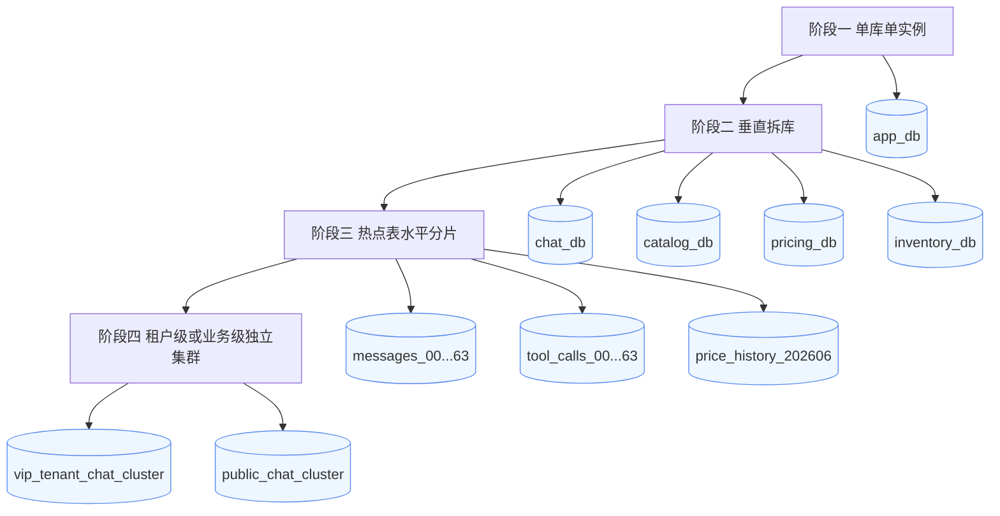

# 06. 分库分表与容量演进

## 先垂直拆，再水平拆

不要一开始就全量分库分表。更稳妥的路线是：

1. 单库 + 规范索引。
2. 商品域、会话域垂直拆库。
3. `messages`、`tool_calls`、`price_history` 水平分表。
4. 热点租户独立迁移，配合路由层。

## 分库分表演进图

## 哪些表优先拆

| 表 | 原因 | 拆分方式 |
|---|---|---|
| `messages` | 消息量增长快 | `conversation_id hash` 或 `tenant_id` |
| `tool_calls` | 工具追踪和审计量大 | `run_id hash` 或时间分表 |
| `price_history` | 写多读少，历史数据大 | 按月或按天分表 |
| `audit_logs` | 只追加，保留周期长 | 时间分区 + 冷归档 |

## 分片键选择

分片键需要同时考虑：

- 查询是否天然带上分片键。
- 热点是否会集中。
- 后续迁移成本是否可控。

常见选择：

- 会话数据按 `tenant_id` 或 `conversation_id hash`。
- 订单数据按 `user_id hash`。
- 商品评论按 `product_id hash`。

## 容量治理

- 最近消息留在线上库，历史消息归档到冷存储。
- 工具调用保留结构化摘要，完整 request/response 按策略压缩或归档。
- 价格历史服务在线查询最近窗口，长期分析走离线数仓。
