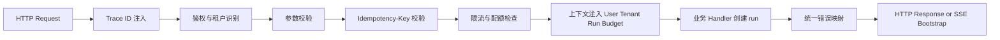
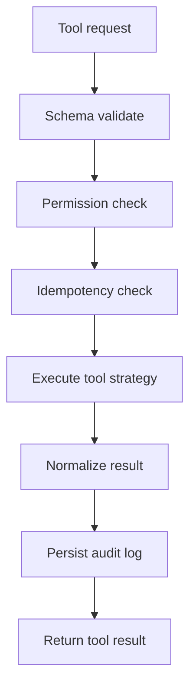

# 07. 中间件 设计模式与工程组织

## 技术栈建议

如果使用 Node.js / TypeScript，一个务实组合是：

- `Fastify`
- `Zod`
- `Prisma` 或 `Drizzle`
- `ioredis`
- `amqplib` / RocketMQ SDK / KafkaJS
- `OpenTelemetry`

## 请求入口中间件链

## 设计模式落点

| 模式 | 使用位置 | 价值 |
|---|---|---|
| Strategy | 工具执行策略、模型路由、重试策略 | 按工具和租户切换行为 |
| Factory | 根据 `tool_name` 创建执行器 | 避免业务层写大量条件分支 |
| Template Method | 工具调用骨架 | 固定校验、权限、审计、执行、标准化步骤 |
| State | `run`、`tool_call`、`order` | 控制合法状态流转 |
| Chain of Responsibility | 请求中间件链 | 统一鉴权、限流、trace、错误处理 |
| Observer / Event-driven | run 完成、价格变更、缓存失效 | 解耦副作用 |

## 工具执行骨架

## 工程组织建议

- `conversation` 模块只负责会话入口、run 创建和推流。
- `agent-runtime` 模块负责 ReAct loop 和状态推进。
- `tool-runtime` 模块负责工具注册、权限、策略和执行。
- `ecommerce` 领域服务保持商品、价格、库存、营销边界。
- `infrastructure` 模块封装 Redis、MQ、数据库和 OpenTelemetry。
