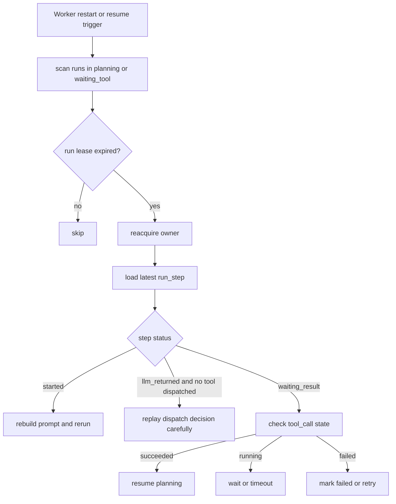

# 09. ReAct Runtime 持久化 恢复与状态推进

这一篇只讲运行时，不讲业务字段。目标是回答：worker 崩了、SSE 断了、工具晚到了，run 怎么继续而不是写乱。

## 运行时分层

ReAct runtime 至少拆成 4 层：

| 层 | 作用 |
|---|---|
| API 入口层 | 创建 run、落初始消息、启动 SSE |
| Runtime 状态层 | 维护 `run`、`run_step`、owner、超时、取消 |
| Tool 执行层 | 执行同步工具和异步工具 |
| Event 推送层 | SSE、审计流、Kafka 事件 |

## 一个可恢复 run 的最小真相源

如果只保留 `run.status`，是恢复不了的。最小真相源至少包括：

- `run.status`
- `run.current_step`
- `run.version`
- `run.owner_worker_id`
- `run.lease_expire_at`
- `run_step.decision_json`
- `run_step.waiting_tool_call_id`
- `tool_call.status`
- `tool_call.payload_ref` 或结果摘要

## 一次 step 的落盘点

推荐把一次 loop 拆成 5 个固定落盘点：

1. `step_started`
2. `llm_returned`
3. `tool_dispatched` 或 `final_answer_ready`
4. `tool_result_persisted`
5. `step_committed`

这样做的意义：

- 崩溃后能知道崩在“模型前、模型后、工具前、工具后”的哪个阶段
- 能明确哪些动作可能已对外生效
- 迟到消息可以根据状态机决定是否丢弃

## 推荐的恢复流程

## 哪些地方必须恢复，哪些地方不必恢复

| 场景 | 是否必须恢复 | 原因 |
|---|---|---|
| `run` 在 `planning` 中断 | 是 | 用户仍在等待结果 |
| `run` 在 `waiting_tool` 中断 | 是 | 工具结果可能已经在路上 |
| SSE 连接断开 | 否，但要能重连 | 传输断了，不等于业务失败 |
| 某一步 token stream 丢失 | 否 | 最终结果和 step 状态更重要 |
| 未完成的瞬时 thought buffer | 否 | 不是业务真相源 |

## SSE 断线恢复

SSE 断线恢复不要做成“重新执行 run”，而是“重新订阅事件”。

正确做法：

1. 客户端带 `Last-Event-ID` 重连
2. 服务端优先从 Redis cursor 查最近事件位置
3. Redis 没有，再从 DB 里按 `run_id` 补发必要事件摘要
4. run 若已结束，直接返回最终状态和最终消息

## 工具异步等待时的恢复

`waiting_tool` 是最容易出错的状态。

需要明确：

- 等的是哪个 `tool_call_id`
- 当前 step 是否已完成 dispatch
- 工具结果回来后应该推进到哪个 step
- 超时后谁负责把 `running` 改成 `timed_out`

推荐做法：

- `run_step.waiting_tool_call_id` 明确记录当前阻塞点
- `tool_call` 独立维护 `attempt_count` 和 `next_retry_at`
- 扫描器定时捞超时中的 `tool_call`
- 迟到结果只在 `run` 仍处于合法等待状态时才允许恢复

## 取消与超时

取消和超时不能只存在内存里。

| 类型 | 持久化位置 | 说明 |
|---|---|---|
| 用户取消 | DB + Redis cancel key | DB 是准，Redis 是快 |
| run 超时 | DB `deadline_at` | worker 启动时和每步前都检查 |
| tool 超时 | `tool_call.timeout_at` | 独立于 run 超时 |

取消时的处理顺序：

1. DB 标记 `run.cancel_requested = true`
2. Redis 写 `run:cancel:{runId}`
3. worker 在安全点检查并停止推进
4. 已经发出去的慢工具结果回来后只记审计，不再恢复主流程

## 是否缓存会话上下文

可以缓存，但要分层：

- 短摘要、最近几轮消息、热点商品候选：可以放 Redis
- 完整对话真相、最终 assistant message、工具结果：必须回 DB

也就是说，缓存是加速上下文装配，不是替代状态恢复。

## 什么时候需要对象存储

下面这些内容不适合继续塞进 `messages` 或 `tool_calls.response_json`：

- 联网抓取原文
- 大型结构化比价结果
- 长回答的中间附件
- 审计需要保留的原始工具输入输出

这类内容应该走 `tool_artifact`：

- DB 里存 metadata
- 对象存储里存正文
- MQ/Kafka 里只带 `payload_ref`

## 一句话原则

一个可恢复的 ReAct runtime，不是“把 loop 放到服务端”就够了，而是：

- 每一步都有检查点
- 每个异步等待都有明确阻塞点
- 每个恢复动作都基于 DB 真相源
- 每个迟到结果都经过状态机裁决
