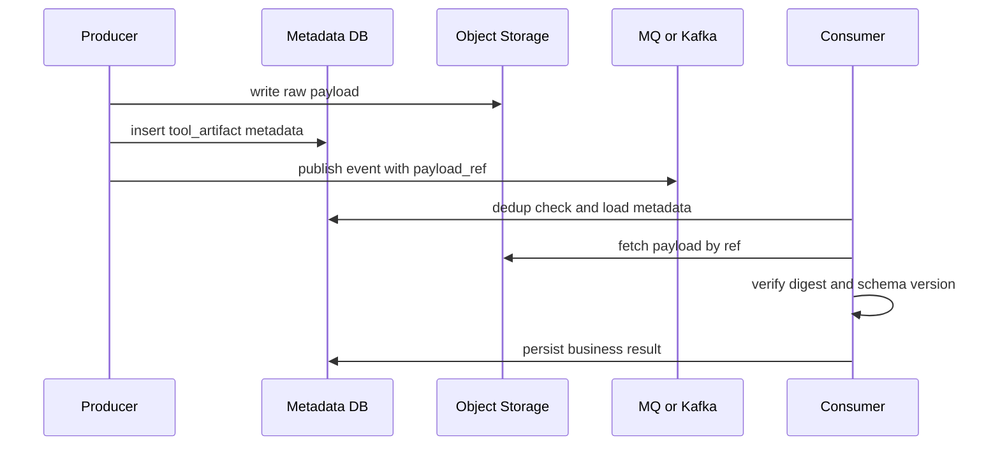

# 10. MQ 事件流 指针消息与缓存防线

这一篇专门讲主线章节里最容易被追问的细节：消息到底怎么放、Kafka 怎么用、缓存异常怎么成体系处理。

## 两类消息，不要混写

| 类别 | 目标 | 更适合的通道 |
|---|---|---|
| 调度消息 | 确保任务被执行 | 任务型 MQ |
| 事件消息 | 广播变化、支持回放 | Kafka |

## 为什么不能所有消息都塞 Kafka

Kafka 很强，但不是所有问题都该用它直接解决：

- tool dispatch 更关心消费重试、死信、延迟任务
- Kafka 更擅长事件流、分析流、回放流
- 如果硬把所有任务都做成 Kafka consumer，延迟任务、失败补偿、任务优先级都会更绕

所以更实用的表达是：

- Agent/tool 调度走任务 MQ
- 价格/库存/审计/行为走 Kafka

## pointer message 的完整设计

### 适用场景

- 网页抓取原文很大
- 第三方返回超大 JSON
- 一个结果要被多个消费者复用
- 结果需要保留较长时间用于审计或重放

### 不适用场景

- 很小的状态变化
- 超高频但生命周期极短的内存型消息
- 结果天然只在本进程同步消费

## pointer message 的生命周期

## payload_ref 建议长什么样

示例：

- `artifact://tool-results/tc_123/v2`
- `s3://agent-artifacts/prod/tool-results/2026/06/11/tc_123.json.gz`
- `db://tool_artifacts/987654`

要求：

- 可解析
- 带版本感知
- 能映射到唯一 artifact
- 不依赖 Redis 这种易失缓存

## Kafka 下的顺序与去重

### 顺序

Kafka 只能天然保证分区内顺序，不保证全局顺序。

在这类系统里，够用的顺序一般是：

- 同一 `sku_id` 的价格变更要局部有序
- 同一 `run_id` 的审计事件要局部有序
- 跨实体不追求全局总序

### 去重

接受至少一次后，消费端固定做三件事：

1. 检查 `event_id` 是否已处理
2. 检查业务版本号是否倒退
3. 检查状态机是否允许当前转换

## Kafka lag 上来后怎么办

| 现象 | 影响 | 处理 |
|---|---|---|
| 价格流 lag 上升 | 价格缓存新鲜度下降 | 扩容消费者、降级为短 TTL 回源 |
| 库存流 lag 上升 | 推荐库存更旧 | 缩短前端缓存、下单强校验 |
| 审计流 lag 上升 | 数据分析延迟 | 允许延迟，不影响主链路 |

## 缓存防线要分层，不是只会“加个 Redis”

### 第一层：参数校验

- 非法 SKU、非法类目组合、超长 query 先在入口挡住
- 这是最便宜的穿透防线

### 第二层：空值缓存

- 商品不存在、类目无结果、促销未命中都可以短 TTL 缓空值
- TTL 不要太长，避免后续真实数据写入后长期被挡

### 第三层：布隆过滤器

- 适合商品 ID、SKU ID 这类大规模存在性判断
- 不适合频繁精确删除的强一致业务状态

### 第四层：singleflight 或互斥锁

- 只让一个请求回源重建热点 key
- 其他请求等待、返回旧值或快速失败

### 第五层：逻辑过期

- 对热点价格、热点商品详情很好用
- 用户先拿旧值，后台异步刷新
- 适合推荐阶段，不适合最终下单校验

## 推荐链路与交易链路的缓存口径必须分开

| 链路 | 允许什么 | 不允许什么 |
|---|---|---|
| 推荐链路 | 近实时缓存、逻辑过期、最终一致 | 把缓存值当最终交易依据 |
| 交易链路 | 读缓存做预检查 | 不做最终库存和价格确认 |

一句话：导购可以接受近实时，交易必须回领域服务强校验。

## 常见失败场景与动作

| 场景 | 系统动作 | 用户可见结果 |
|---|---|---|
| 商品详情缓存击穿 | singleflight + 返回旧值 | 页面稍旧，但可用 |
| 价格流 lag 升高 | 缩短价格缓存 TTL，必要时回源 | 价格更新稍慢，结算再校验 |
| tool result payload 丢失 | 记录审计，标记工具失败，可重试 | 本次问答降级或失败 |
| pointer 指向对象已过期 | 标记恢复失败，禁止盲目重放 | 人工补偿或重跑任务 |
| Kafka 重复投递 | 幂等检查后丢弃重复 | 用户无感知 |

## Redis 故障时怎么退化

Redis 不是单点真相源，所以故障时要能退化：

- 幂等短键失效：靠 DB 唯一约束兜底
- 热点缓存失效：回源，但必须限流
- lease 丢失：靠 DB 版本号裁决 owner
- SSE cursor 丢失：从 DB 事件摘要补发

## 一句话原则

- 调度消息和事件流分层。
- 大 payload 不进消息体，只进持久存储。
- pointer 一定可验证、可追溯、可清理。
- 缓存设计服务于主链路，不替代主链路真相。
