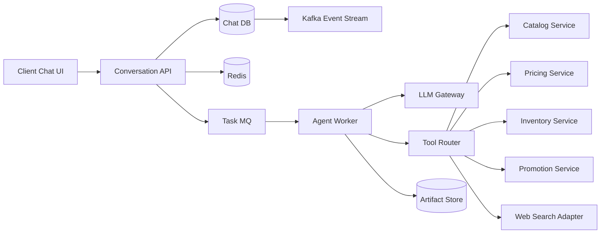

# 电商平台与云端对话 AI 系统设计

这一组文档把“电商平台 + 云端对话 AI”拆成一个完整系统设计案例。

核心场景是：用户在聊天框输入需求，服务端 ReAct Agent Loop 可能多步调用商品、价格、库存、促销、联网查询等内部或外部工具，最后流式返回答案。

这组内容默认按工程落地口径写，不只回答“面试里怎么讲”，也回答“系统挂了之后怎么恢复、消息重复后怎么消化、缓存失效后怎么兜底”。

## 阅读顺序

1. [需求边界与整体架构](./01-需求边界与整体架构.md)
2. [核心链路与 ReAct Agent Loop](./02-核心链路与%20ReAct%20Agent%20Loop.md)
3. [接口设计与数据模型](./03-接口设计与数据模型.md)
4. [MQ Redis 与缓存一致性](./04-MQ%20Redis%20与缓存一致性.md)
5. [重试 幂等与并发控制](./05-重试%20幂等与并发控制.md)
6. [分库分表与容量演进](./06-分库分表与容量演进.md)
7. [中间件 设计模式与工程组织](./07-中间件%20设计模式与工程组织.md)
8. [安全 可观测性与面试话术](./08-安全%20可观测性与面试话术.md)
9. [ReAct Runtime 持久化 恢复与状态推进](./09-ReAct%20Runtime%20持久化%20恢复与状态推进.md)
10. [MQ 事件流 指针消息与缓存防线](./10-MQ%20事件流%20指针消息与缓存防线.md)

## 总览图

## 这组文档回答的问题

- 聊天请求如何创建 run 并流式返回？
- 为什么 ReAct Agent Loop 应该放在服务端？
- ReAct loop 的每一步哪些必须落盘，哪些只放缓存或内存？
- 哪些工具同步调用，哪些工具通过 MQ 异步执行？
- Redis 在幂等、缓存、限流和协调里分别怎么用？
- MQ 如何配合 Outbox、重试、死信和幂等消费？
- Kafka 在价格、库存、审计和行为流里承担什么角色？
- MQ 里什么时候直接放 payload，什么时候只放 pointer？
- 商品、价格、库存、消息和工具调用如何建模？
- 缓存穿透、击穿、雪崩在这个系统里分别怎么防？
- 分库分表应该从哪里开始，而不是一上来全拆？
- 面试里如何把这套设计讲成一条清晰主线？

## 统一术语

为了避免后面章节里同一个概念说法漂移，先统一 5 个对象：

- `run`：一次用户请求级执行实例，是取消、超时、恢复的主聚合。
- `run_step`：一次 ReAct loop 迭代检查点，记录模型决策、工具分支和恢复位置。
- `tool_call`：一次工具执行单元，可以独立重试、超时和审计。
- `event_envelope`：统一消息信封，包住 `event_id`、业务 key、payload 或 pointer。
- `tool_artifact`：大体积结果或原始附件，不直接塞进 MQ，也不把 Redis 当真相源。
