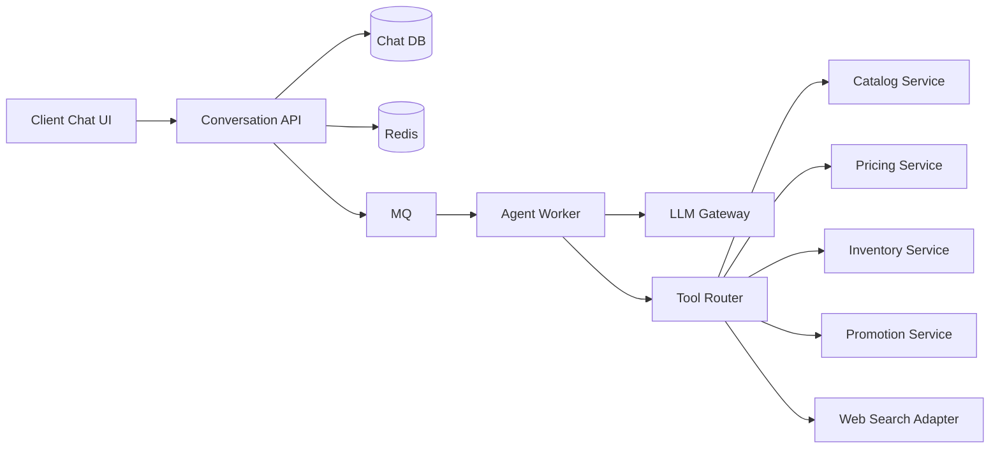

# 电商平台与云端对话 AI 系统设计

这一组文档把“电商平台 + 云端对话 AI”拆成一个完整系统设计案例。

核心场景是：用户在聊天框输入需求，服务端 ReAct Agent Loop 可能多步调用商品、价格、库存、促销、联网查询等内部或外部工具，最后流式返回答案。

## 阅读顺序

1. [需求边界与整体架构](./01-需求边界与整体架构.md)
2. [核心链路与 ReAct Agent Loop](./02-核心链路与%20ReAct%20Agent%20Loop.md)
3. [接口设计与数据模型](./03-接口设计与数据模型.md)
4. [MQ Redis 与缓存一致性](./04-MQ%20Redis%20与缓存一致性.md)
5. [重试 幂等与并发控制](./05-重试%20幂等与并发控制.md)
6. [分库分表与容量演进](./06-分库分表与容量演进.md)
7. [中间件 设计模式与工程组织](./07-中间件%20设计模式与工程组织.md)
8. [安全 可观测性与面试话术](./08-安全%20可观测性与面试话术.md)

## 总览图

## 这组文档回答的问题

- 聊天请求如何创建 run 并流式返回？
- 为什么 ReAct Agent Loop 应该放在服务端？
- 哪些工具同步调用，哪些工具通过 MQ 异步执行？
- Redis 在幂等、缓存、限流和协调里分别怎么用？
- MQ 如何配合 Outbox、重试、死信和幂等消费？
- 商品、价格、库存、消息和工具调用如何建模？
- 分库分表应该从哪里开始，而不是一上来全拆？
- 面试里如何把这套设计讲成一条清晰主线？
