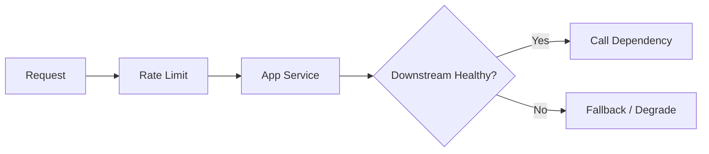

# 02. 限流、降级与熔断

高可用系统最重要的一课，就是学会在扛不住时主动收缩，而不是硬撑到全挂。

## 一、限流是在解决什么问题

限流的目标是：

**当请求太多时，不让系统被无限打爆。**

你可以把它理解成“入口阀门”。

常见场景：

- 秒杀抢购
- 登录接口防刷
- 公共 API 防滥用

## 二、降级是在解决什么问题

降级的目标是：

**系统资源紧张或依赖异常时，先保核心功能。**

例如：

- 推荐挂了，但下单还能用
- 评论挂了，但正文还能看
- 大盘统计延迟了，但主交易链路照常

## 三、熔断是在解决什么问题

熔断的目标是：

**下游已经明显不稳定时，先别继续猛打它，避免故障扩散。**

如果你还不断请求一个已经超时严重的下游：

- 你的线程会被拖住
- 连接会被占满
- 整个上游也会慢慢被拖死

## 四、这三个概念怎么区分

| 概念 | 核心作用 |
|---|---|
| 限流 | 控制流量进入速度 |
| 降级 | 资源不够时保核心功能 |
| 熔断 | 下游故障时及时切断依赖 |

## 五、限流常见维度

- 按用户
- 按 IP
- 按接口
- 按租户
- 按系统整体

## 六、什么场景适合降级

- 非核心推荐
- 次要统计
- 辅助搜索
- 延迟可接受的扩展功能

不适合随便降级的通常是：

- 核心下单
- 支付
- 扣库存
- 核心权限校验

## 七、熔断和超时为什么经常一起出现

因为没有超时，调用可能一直卡住。
没有熔断，即使下游已经很差，上游还会继续不断请求。

所以常见组合是：

- 先设超时
- 再配熔断
- 最后配降级兜底

## 八、一个常见保护链路

## 九、最容易犯的错误

### 1. 只有限流，没有降级

### 2. 无限重试，结果把下游彻底打死

### 3. 所有功能都当核心，不敢做取舍

### 4. 熔断后没有恢复和观测机制

## 这篇最重要的结论

限流、降级、熔断的本质都是主动控制损失面。高可用系统不是硬扛，而是知道什么时候该挡、该退、该切断。
