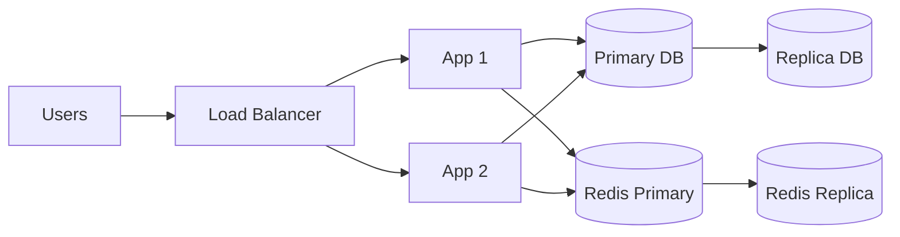

# 05. 冗余设计

冗余设计是高可用里最容易被说空的一块。

很多人会直接说“多机部署、主从备份”，但没有说清：

**到底哪些东西要冗余，为什么要冗余，冗余到什么程度才划算。**

## 一、什么叫冗余设计

冗余设计的本质是：

**关键资源不要只有一份。**

因为只要只有一份，它挂了，系统就可能直接断。

## 二、为什么要做冗余

系统里的故障很难完全避免：

- 机器会宕
- 磁盘会坏
- 进程会崩
- 网络会抖
- 机房会出问题

冗余设计的目标不是消灭故障，而是让故障发生后，系统还有备份路径。

## 三、冗余设计最常见的层次

### 1. 应用层冗余

最常见，也最基础。

做法通常是：

- 服务多实例部署
- 负载均衡分发流量
- 单实例故障自动摘除

### 2. 数据层冗余

典型方式：

- 主从复制
- 多副本存储
- 备份与快照

这一层很关键，因为很多系统即使服务能快速重启，数据一旦出问题就更难恢复。

### 3. 缓存层冗余

例如：

- Redis 主从
- 哨兵
- 集群

### 4. 网络和入口层冗余

例如：

- 多台负载均衡
- 多入口
- 多可用区

### 5. 机房和地域层冗余

例如：

- 同城双活
- 异地容灾

## 四、冗余不是越多越好

冗余是有成本的：

- 机器成本
- 运维复杂度
- 数据同步复杂度
- 故障切换难度
- 一致性问题

所以正确问题不是“要不要冗余”，而是：

**哪个点值得冗余，冗余到什么级别才合理。**

## 五、哪些资源最值得优先做冗余

通常优先级最高的是：

1. 入口层
2. 应用服务
3. 数据库
4. 缓存
5. 队列

因为这些点一旦单了，影响范围通常最大。

## 六、冗余设计的核心判断方法

问三个问题：

1. 这个组件挂了，系统还能不能继续提供核心功能？
2. 这个组件恢复要多久？
3. 这个组件一旦损坏，会不会导致数据丢失或大面积不可用？

这三个问题能帮助你判断冗余优先级。

## 七、一个常见的冗余系统图

## 八、常见冗余误区

### 1. 只有副本，没有切换方案

副本存在不代表真能接管。

### 2. 只做服务冗余，不做数据冗余

这类系统一旦数据库出问题，前面多实例也没意义。

### 3. 有备份，但从没做过恢复验证

这其实等于不确定备份能不能用。

### 4. 小系统为了“看起来高级”过早做复杂双活

架构复杂度和收益不匹配。

## 九、务实的落地顺序

大多数系统可以按这个顺序做：

1. 服务多实例
2. 入口负载均衡
3. 数据库主从和定期备份
4. 缓存高可用
5. 再根据业务级别决定是否做跨机房容灾

## 十、冗余设计和备份的区别

很多人会混淆。

- 冗余重点是“在线可接管”
- 备份重点是“出事后可恢复”

这两个都重要，但不是同一个东西。

## 这篇最重要的结论

冗余设计的核心，不是把所有东西都复制一份，而是识别真正的单点和高风险资源，给关键链路准备可切换、可恢复、成本合理的备份路径。
