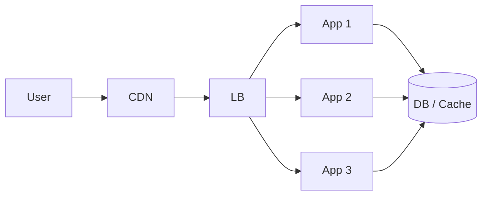

# 02. CDN、静态资源与负载均衡

高性能不只是数据库和代码问题，很多性能收益首先来自入口层。

## 一、为什么入口层优化这么重要

因为请求还没进业务服务之前，就已经可能浪费很多时间：

- 静态资源太大
- 用户离源站太远
- 所有流量只打到一台机器

这些问题如果不先处理，后面服务再优化也容易事倍功半。

## 二、CDN 是在解决什么问题

CDN 本质上是在做一件事：

**把适合缓存的内容放到更靠近用户的节点。**

这样做的好处：

- 用户访问更快
- 源站带宽压力变小
- 静态资源请求不用每次都回源

## 三、哪些内容适合走 CDN

- 图片
- 视频
- JS / CSS
- 下载文件
- 不频繁变化的公开资源

如果内容变化非常频繁、强依赖实时权限校验，就要更谨慎。

## 四、负载均衡是在解决什么问题

负载均衡的目标是：

**不要让所有请求都压到同一台服务实例上。**

它常见作用：

- 分摊流量
- 提升可用性
- 支持多实例扩容

## 五、常见负载均衡方式

### 1. DNS 负载均衡

比较粗粒度，通常作为更前置的一层流量分发。

### 2. 四层负载均衡

按 IP 和端口转发，性能高。

### 3. 七层负载均衡

按 HTTP 层处理，更适合根据路径、域名、Header 做转发。

## 六、静态资源为什么不该和业务接口混在一台应用服务上

因为：

- 静态文件会吃带宽
- 资源缓存逻辑和业务逻辑不同
- 对扩容方式要求也不同

所以常见做法是：

- 静态资源走对象存储 + CDN
- 动态请求走应用服务

## 七、一个常见高性能入口层架构

## 八、入口层常见问题

### 1. 缓存没命中率

CDN 配了，但缓存策略不合理，导致频繁回源。

### 2. 静态资源过大

图片不压缩、前端包太大，导致首屏慢。

### 3. 负载不均

某些实例特别忙，某些实例很闲。

### 4. 会话粘性设计不当

如果过度依赖单机会话，会让横向扩容变麻烦。

## 九、实践中的几个务实原则

1. 静态资源尽量和业务服务解耦。
2. 公共内容优先缓存到 CDN。
3. 应用服务尽量无状态，便于横向扩容。
4. 负载均衡不只是“分发流量”，也是高可用入口。

## 这篇最重要的结论

很多性能提升不是从数据库开始，而是从入口层开始。CDN 负责减少回源和带宽压力，负载均衡负责把流量摊开，这两者是高性能系统的基础设施。
