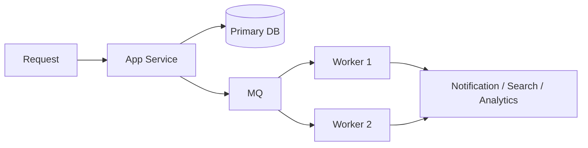

# 04. 消息队列与异步削峰

很多系统慢，不是因为单条逻辑写得差，而是因为把太多慢操作都塞进了同步主流程。

## 一、消息队列是在解决什么问题

它最常解决三类问题：

- 异步化
- 解耦
- 削峰填谷

## 二、什么叫异步化

就是把“不需要立刻做完”的操作，从主请求里拆出去。

例如：

- 下单后发通知
- 注册后发欢迎邮件
- 上传后转码
- 写完主记录后再做索引同步

这样主流程能更快返回。

## 三、什么叫削峰填谷

高峰时流量一下子涌进来，系统来不及立刻全处理。

这时可以先把请求或任务写进队列，后面的消费者按可承受速度慢慢处理。

这就像：

**门口先排队，不要一窝蜂全冲进厨房。**

## 四、消息队列为什么能提升性能

严格说，它不一定让单条任务更快，但它能让系统整体更稳：

- 主流程更短
- 高峰更可控
- 资源分配更平滑

## 五、常见适用场景

- 秒杀下单
- 异步通知
- 审核任务
- 批量数据处理
- 日志采集

## 六、用了消息队列后要多想什么

### 1. 消息会不会重复

所以消费者通常要做幂等。

### 2. 消息会不会丢

要看投递确认、持久化和重试机制。

### 3. 消费会不会积压

如果生产速度远大于消费速度，队列会越堆越多。

### 4. 顺序要不要保证

有些业务很在意顺序，有些则没那么严格。

## 七、一个典型异步链路

## 八、什么时候不该为了“显得高级”硬上 MQ

- 请求量很小
- 业务链路非常简单
- 团队还没能力运维消息系统
- 其实一个数据库任务表就够

这点很重要。不是所有系统都一开始就需要 Kafka、RocketMQ 这类重型方案。

## 九、务实的演进顺序

1. 小系统先用数据库任务表或轻量队列
2. 有明显异步压力后再引入专业 MQ
3. 同步补上重试、幂等、死信和监控

## 这篇最重要的结论

消息队列最重要的价值，不是“更高级”，而是把慢操作和高峰流量从主链路里拆出来，让系统整体吞吐和稳定性更好。
