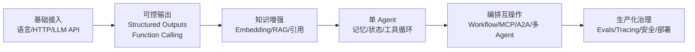
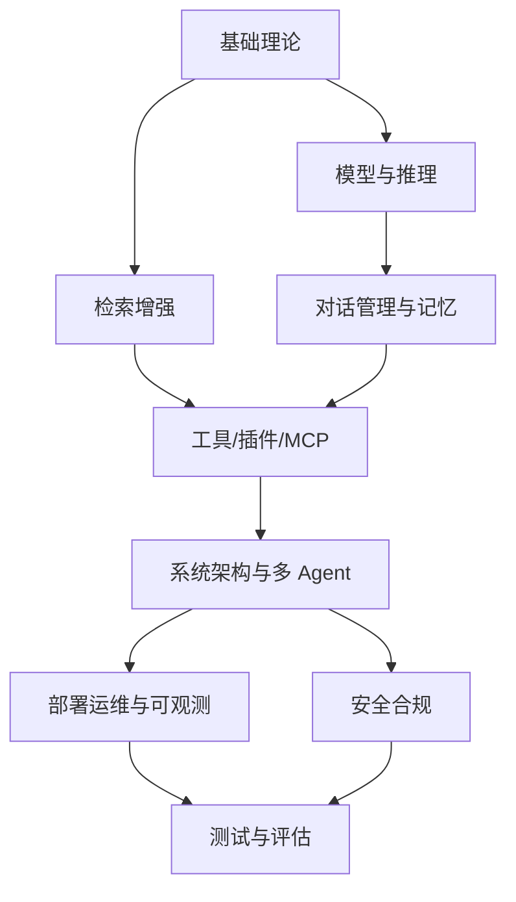
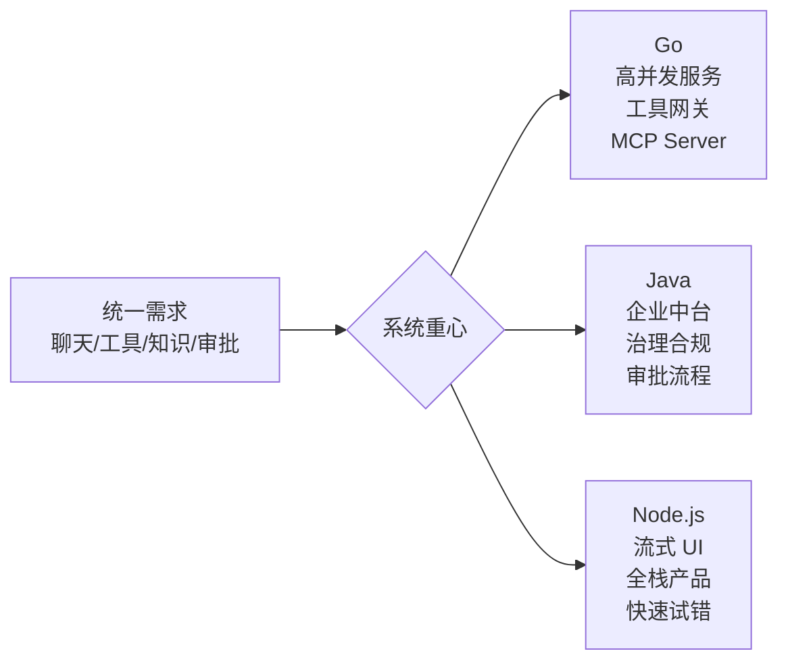

# AI Agent 应用开发学习历程与 Go、Java、Node.js 技术路线比较报告

## 执行摘要

本文将 **roadmap.sh** 作为能力清单框架，将 **AIInfra/07Application** 作为中文实践骨架，再用 **Anthropic、OpenAI、MCP、A2A、Spring AI、LangChain4j、CloudWeGo Eino、Vercel AI SDK、Mastra** 等官方或原始资料补齐工程细节。roadmap.sh 明确提供 AI Engineer、AI Agents、Backend、Java、Node.js 等路线图；AIInfra 的“大模型应用”模块则把 **AI 智能体、MCP 与 A2A、RAG、RAGFlow 实践**放在同一应用层脉络中。

核心结论有三点。第一，**AI agent 学习路径不应从“多智能体框架”起步，而应从 LLM API、结构化输出、工具调用、RAG、会话状态，再逐步进入单 agent、工作流、多 agent、协议互操作与生产化治理**；Anthropic 也明确建议先找最简单可行方案，再按需要增加复杂度，并区分“预定义工作流”和“模型主导的 agents”。

第二，**业务选型比语言偏好更重要**。若主约束是高并发服务、轻量部署、工具网关与基础设施控制面，Go 往往更合适；若主约束是企业数据/API 集成、强治理、长生命周期业务系统，Java 更稳；若主约束是对话产品、流式 UI、快速试错与全栈协同，Node.js/TypeScript 通常最有效。这个差异本质上来自三种运行时的并发模型与生态组织方式：Go 的 goroutine/channel，Java 的虚拟线程与企业框架，Node.js 的事件循环、worker/cluster，以及其围绕生成式 UI 的成熟前端生态。

第三，**生产级 agent 的难点不在“把模型接起来”，而在“可控性”**：包括状态管理、工具边界、引用与可追溯性、评测、可观测性、安全与审批。OpenAI 将 function calling、structured outputs、conversation state、evals、safety best practices 分成独立工程能力；LangGraph、Spring AI、Eino、AI SDK 也都把 memory、observability、tooling、testing/telemetry 作为一等能力。

基于此，本文建议：**后端工程师优先走“工具调用—RAG—单 agent—评测运维”路线；前端工程师优先走“流式 UI—tool calling—状态管理—后端接入”路线；数据科学家优先走“RAG—评测—工具—上线治理”路线。** 对大多数团队而言，第一版系统应优先做成 **workflow-first、single-agent-first、evaluable-first**。

## 研究基线与结论框架

本文假设读者为**具备编程基础的工程师**，目标业务为**通用 Agent 应用**。从研究基线看，roadmap.sh 的价值更接近“职业能力地图”；AIInfra 的价值更接近“中文课程化应用链路”；而官方 SDK、协议与论文提供的是“生产级实现规范”。值得注意的是，AIInfra 自身也说明其 AI 智能体文字内容仍在持续补充，因此凡原仓库未细化之处，本文按要求标为“未指定”，并以官方资料补全。

| 来源基线 | 在本报告中的作用 |
|---|---|
| roadmap.sh | 提供 AI Engineer、AI Agents、Backend、Java、Node.js 等**能力清单与横向地图**，适合做阶段检查表。 |
| AIInfra/07Application | 提供中文语境下的 **AI 智能体 → MCP/A2A → RAG → RAGFlow** 应用骨架与示例。 |
| 官方 SDK / 协议 / 原始论文 | 提供 function calling、structured outputs、conversation state、RAG、MCP、A2A、evals、安全等**生产约束**。 |

## 学习历程

将 roadmap.sh、AIInfra 与官方资料叠加后，AI agent 应用开发可以整理为一条相对稳定的六阶段路径：**基础接入 → 可控输出 → 知识增强 → 单 agent → 编排互操作 → 生产化治理**。其中，AIInfra 在中文实践上最强的是 **MCP/A2A 与 RAG 示例**，而 Anthropic 和 OpenAI 文档则更适合指导“何时该上 agent、何时不该上 agent”。

> 注：下表中的时间为**本文估算**，按每周投入 10–15 小时计算；凡 roadmap.sh 或 AIInfra 页面未给出对应资源者，标注为 **未指定**。

| 阶段 | 必备知识点 | 实践项目 | roadmap.sh / AIInfra 资源 | 补充官方资源 | 时间估算 |
|---|---|---|---|---|---|
| 基础接入 | 一门主语言；HTTP/JSON；流式输出；LLM 基本调用 | 做一个支持流式回复与历史上下文的聊天服务 | roadmap.sh：AI Engineer、Backend；AIInfra：AI 智能体导读。 | OpenAI Java/Go/JS SDK。 | 2–3 周 |
| 可控输出 | Prompt 分解；JSON Schema；函数调用；错误处理与重试 | 做一个带 2–3 个工具的客服/天气/订单助手 | roadmap.sh：AI Agents；AIInfra：MCP 与 A2A 原理。 | OpenAI Function Calling、Structured Outputs、Conversation State。 | 2–4 周 |
| 知识增强 | Embedding；切分；BM25/向量检索；重排；引用回溯 | 做一个 PDF/知识库问答系统 | AIInfra：Qwen3 RAG 实践、RAGFlow 中文问答。 | RAG 原始论文；LangChain Retrieval。 | 3–4 周 |
| 单 agent | agent loop；短期/长期记忆；状态管理；审批点 | 做一个“研究助理”或“工单处理 agent” | roadmap.sh：AI Agents；AIInfra：此部分细节未指定。 | OpenAI Agents SDK；LangGraph Memory；LlamaIndex 基础 Agent；Mastra Agents。 | 3–5 周 |
| 编排互操作 | workflow vs agent；routing；handoff；MCP；A2A；多 agent | 做一个 planner-executor-reviewer 流程，接 MCP 工具并暴露 A2A | AIInfra：MCP 与 A2A；roadmap.sh：AI Agents。 | Anthropic《Building Effective Agents》；MCP 官方文档；A2A 规范；Eino ADK。 | 4–6 周 |
| 生产化治理 | Evals；Tracing；指标；安全；权限；审计；成本/延迟优化 | 做一个可灰度发布、可回放、可审计的生产 demo | AIInfra：AI 安全主题入口；agent 评测细节未指定。 | OpenAI Evals 与 Safety；LangSmith Evaluation；OWASP LLM Top 10；NIST GenAI Profile。 | 4–8 周 |

这条时间线与 Anthropic 的“从 augmented LLM 到 workflow，再到 agents”的顺序、OpenAI Agents SDK 的阅读顺序，以及 AIInfra 将 Agent、MCP/A2A、RAG 置于同一应用层的组织方式是一致的。

## 知识体系图谱

从知识结构上看，AI agent 不是单独一门“框架课”，而是**模型调用、检索、状态管理、工具接口、系统编排、测试治理**的交叉体。Anthropic 将其底座定义为“augmented LLM”，OpenAI 将 structured outputs、tool calling、conversation state、evals 拆成独立能力，MCP/A2A 则把“agent 对工具”和“agent 对 agent”的边界明确定义出来。

| 模块 | 子技能 | 建议学习顺序 | 关键资源链接 |
|---|---|---|---|
| 基础理论 | HTTP、JSON、Schema、异步 I/O、软件设计、检索基本概念 | 最先掌握 | roadmap.sh Backend / AI Engineer。 |
| 模型与推理 | 模型选择、上下文窗口、采样、结构化输出、失败重试 | 基础之后立即进入 | OpenAI Model Selection、Structured Outputs。 |
| 对话管理与记忆 | 多轮会话、短期/长期记忆、线程状态、会话持久化 | 在单 agent 之前 | OpenAI Conversation State；LangGraph Memory。 |
| 工具、插件与 MCP | function calling、工具描述、参数设计、MCP client/server | 在结构化输出之后 | OpenAI Function Calling；MCP；AIInfra MCP&A2A。 |
| 检索增强与知识库 | 切分、索引、向量库、BM25、重排、引用页码 | 与工具层并行深入 | RAG 论文；AIInfra RAG 实践与 RAGFlow。 |
| 系统架构与多 agent | workflow、routing、handoff、supervisor、A2A、human-in-the-loop | 单 agent 稳定后进入 | Anthropic Effective Agents；A2A 规范；Eino ADK。 |
| 部署运维与可观测 | tracing、metrics、日志、健康检查、成本与延迟监控 | 进入生产前必须补齐 | Spring AI Observability；Spring Boot Actuator；Eino Callback/Trace；AI SDK Telemetry。 |
| 安全合规与测试评估 | prompt injection、防越权、审批、红队、离线/在线 eval、回归 | 全程嵌入，生产前重点强化 | OpenAI Evals / Safety；OWASP LLM Top 10；NIST GenAI Profile。 |

可以把模块关系理解为：**基础理论**支撑**模型与检索**；二者共同决定**对话状态与工具层**；工具层再进入 **workflow / multi-agent / MCP / A2A**；上线前必须经过 **observability + security + eval** 三重校验。

## Go、Java、Node.js 对比

三种语言在 agent 开发上的差别，不是“谁能不能接大模型”，而是**谁更适合承担哪一层责任**。一个很关键的现实差异是：OpenAI 官方文档目前把 **Agents SDK** 明确放在 **TypeScript 与 Python** 路线中；而 **Go 与 Java** 官方提供的是 API Library，Agent 编排层通常依赖各语言生态补齐，例如 Go 的 Eino、Java 的 Spring AI 和 LangChain4j。

| 维度 | Go | Java | Node.js |
|---|---|---|---|
| 并发模型 | goroutine/channel 是 Go 官方单列的核心并发能力域，适合大量并发任务、取消、超时与流水线。 | Java 21 虚拟线程适用于高吞吐、阻塞 I/O 密集的服务；重点在**更高吞吐**而不是更低延迟。 | 默认是单一 JS 线程 + 事件循环，善于非阻塞 I/O；CPU 密集任务需 worker_threads，多核扩展常用 cluster。 |
| Agent 生态 | Eino 直接把 Components、Retriever、Tool、Workflow、ReAct、Supervisor、Plan-Execute、ADK 放进一套 Go 原生框架里。 | Spring AI 提供跨模型/向量库/工具调用/ETL/可观测抽象；LangChain4j 强调 type safety、POJO、注解和 DI。 | OpenAI 官方 TypeScript 支持最直接；Vercel AI SDK 把 text、structured objects、tool calls、agents、UI hooks 合到一起；Mastra 强调 memory、workflows、multi-agent、guardrails。 |
| 与 LLM/工具链集成 | 官方 Go SDK typed、支持 middleware/custom requests，适合做模型网关、工具层、后端编排。 | Java SDK 可直接入 Spring Boot；Spring AI/ LangChain4j 与企业现有 Spring、Quarkus、Micronaut 体系兼容。 | TypeScript 对 schema、流式接口、前端 UI 衔接最顺；AI SDK 还原生覆盖 telemetry、testing、RAG middleware 与生成式 UI。 |
| 性能与资源 | 编译为可执行文件，部署简单，服务开销通常较低。 | 高吞吐企业服务能力强；如果使用 GraalVM Native，可做更小镜像、更快启动。 | I/O 场景非常强，但 CPU 密集型处理要显式拆到 worker/cluster，否则容易阻塞事件循环。 |
| 部署与运维 | 适合做轻量 MCP Server、工具网关、任务 worker；Go 原生测试与并发排查路径清晰。 | Spring Boot Actuator 与 Spring AI Observability 对生产治理非常成熟，适合大团队协作。 | 全栈部署、流式接口、前后端合一交付效率高，AI SDK 还给出 telemetry 和安全模板。 |
| 开发效率 | 在“后端服务层”效率很高，但 UI 导向产品开发速度通常不如 TS 全栈。基于 Eino 的现代 agent 能力正在快速补齐。 | 中大型团队中，领域模型、接口治理、可维护性和长期演进优势明显。 | 若产品重心是聊天界面、流式体验、生成式 UI 与快速实验，Node.js/TS 往往是最短路径。 |
| 适合的业务范围 | 模型 API 网关、并发工具编排、MCP Server、嵌入/检索服务、Agent 后台任务、基础设施自动化。 | 企业 Copilot、审批型 workflow、客服平台、知识办公自动化、银行/政企内网 agent 中台。 | 面向用户的聊天产品、内部效率工具、内容工作台、流式问答、生成式 UI 驱动的 SaaS。 |
| 不适合的场景 | 高度依赖前端交互试错、生成式 UI 快速迭代的产品前台。 | 追求极轻量原型、极快冷启动但又不愿投入 native/AOT 的小型试验。 | CPU 密集离线处理、事件循环极易被阻塞的重计算后端。 |

如果用一句话概括：**Go 更像 agent 基础设施与高并发服务语言，Java 更像企业级 agent 平台语言，Node.js 更像 agent 产品与交互语言。** 这并不意味着三者互斥，而是意味着在同一系统里，它们最擅长承担的**边界层**不同。

## 三种语言的生产级学习路径

| 语言 | 关键里程碑 | 示例项目 | 推荐框架/库 | 测试与调优重点 |
|---|---|---|---|---|
| Go | 先掌握语法、接口、goroutine/channel；再接 OpenAI Go；随后进入 Eino 的 Components、Retriever、Workflow、ReAct、Supervisor/Plan-Execute；最后补 Trace/Callback 与生产部署。 | 并发工具编排器、MCP Server、RAG 问答后端、审批型多 agent worker | OpenAI Go、CloudWeGo Eino。 | 重点关注竞态、取消、超时、工具幂等、回放与并发泄漏；Go 官方并发学习路径专门强调 race detector、context、pipelines。 |
| Java | 先掌握 Spring Boot 与数据/API 集成；再理解虚拟线程适用边界；随后接 Spring AI 或 LangChain4j；最后补 Actuator、Observability、必要时 Native Image。 | 企业知识助手、客服工单 Copilot、审批型办公 agent、内网问答平台 | OpenAI Java、Spring AI、LangChain4j。 | 重点关注虚拟线程 pinning、阻塞 I/O 使用姿势、链路指标、令牌使用、健康检查与灰度发布。 |
| Node.js | 先掌握 TypeScript、async/await、事件循环；再接 OpenAI JS 与 AI SDK；随后做 tool calling、RAG、中间件、生成式 UI；最后补 worker/cluster、telemetry、testing。 | 流式聊天产品、浏览器/应用内 Copilot、生成式工作台、面向用户的智能问答 | OpenAI JS、Vercel AI SDK、Mastra。 | 重点关注事件循环阻塞、CPU 任务外移、流式取消、工具回放、node:test 或等价测试框架。 |

若已有后端经验，通常 **Go/Java 8–12 周、Node.js 6–10 周**可以达到“独立开发生产级 agent MVP”的能力；如果是从语言本身零基础开始，则需额外预留 4–8 周语言与框架熟悉期。这个时间不是官方承诺，而是基于上表能力密度的务实估算。

## 实践建议与开源清单

对不同背景的最短入门路线并不相同。**后端工程师**最适合从“官方 SDK → function calling → RAG → single-agent → observability/evals”切入；**前端工程师**最适合从“TypeScript + AI SDK UI → streaming chat → tool calling → 后端知识检索”切入；**数据科学家**则更适合从“RAG 数据处理与评测 → 工具与状态 → 服务化部署”切入。这样做的原因是：前者更容易先建立系统边界，后者更容易先建立用户体验，而数据背景更容易先建立知识质量。

学习资源的优先级建议是：**官方协议/SDK与原始论文 > 中文官方文档与高质量课程化材料 > 框架教程 > 社区文章**。这是因为 agent 开发最容易出错的地方恰恰是**看起来像框架问题，实际上是协议、状态或工具契约问题**；Anthropic 也明确提醒，框架会降低上手门槛，但可能遮蔽底层 prompt、response 与 tool loop，导致生产调试困难。

最常见的陷阱有四类。**第一，过早上多 agent**；对此应坚持 workflow-first、single-agent-first。**第二，没有评测集就上线**；对此至少建立任务级 eval、引用核验与回归测试。**第三，把“能调用工具”误当成“可安全执行”**；对此要加入审批、权限分层、提示注入防护与审计。**第四，只看模型效果，不看系统可观测性**；对此应尽早接 tracing、token/latency 指标与失败重放。

建议优先跟踪和实践的开源项目与示例，可以按“骨架—协议—框架—实践”分层理解：**roadmap.sh** 负责能力地图；**AIInfra** 负责中文应用脉络与 RAG/MCP 示例；**OpenAI Agents SDK / OpenAI SDKs** 负责模型与 agent runtime 基础；**Spring AI、LangChain4j、Eino、Vercel AI SDK、Mastra** 负责语言生态落地；**LangGraph、LlamaIndex、RAGFlow** 负责编排、记忆与知识增强。

从实战顺序上看，最稳妥的开源组合是：**roadmap.sh 做检查表，AIInfra 做中文引导，OpenAI/Anthropic/MCP/A2A 做协议底座，语言框架做工程实现，LangSmith/OpenAI Evals/OWASP/NIST 做上线治理**。这条路线既能保持学习的系统性，也能避免“只会调框架、不理解边界”的常见问题。

## 官方资料入口

如果你打算把这篇文档落到实际学习计划里，下面这组链接最值得固定收藏：

| 方向 | 推荐入口 | 说明 | 链接 |
| --- | --- | --- | --- |
| 总体路线 | roadmap.sh AI Agents | 适合把学习阶段拆成待办清单。 | https://roadmap.sh/ai-agents |
| 后端底座 | roadmap.sh Backend | 适合和 agent 路线并行补齐通用后端能力。 | https://roadmap.sh/backend |
| Go | Effective Go | 先把语言和工程习惯打稳。 | https://go.dev/doc/effective_go |
| Java | Java 21 Virtual Threads | 适合理解 Java 在 agent 服务中的并发优势。 | https://docs.oracle.com/en/java/javase/21/core/virtual-threads.html |
| Node.js | Don't block the event loop | 适合理解 Node 在 I/O 强场景下的正确姿势。 | https://nodejs.org/en/learn/asynchronous-work/dont-block-the-event-loop |
| OpenAI | Building Agents | 适合了解工具调用、状态和评估的官方工程路径。 | https://developers.openai.com/tracks/building-agents/ |
| Spring AI | Reference Docs | 适合 Java 路线做模型集成、RAG 和 observability。 | https://docs.spring.io/spring-ai/reference/ |
| CloudWeGo Eino | 官方文档 | 适合 Go 路线学习组件化 agent 编排。 | https://www.cloudwego.io/zh/docs/eino/ |
| Vercel AI SDK | 官方文档 | 适合 Node.js/TypeScript 路线做流式 UI 和 tool calling。 | https://ai-sdk.dev/docs/introduction |
