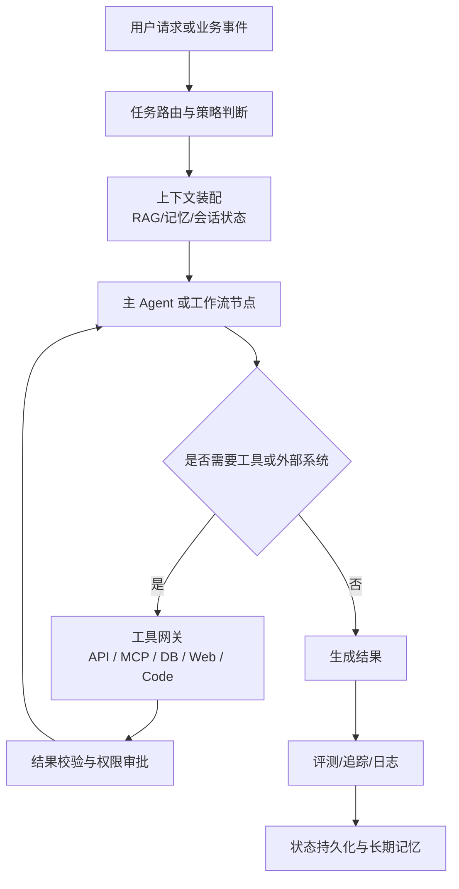
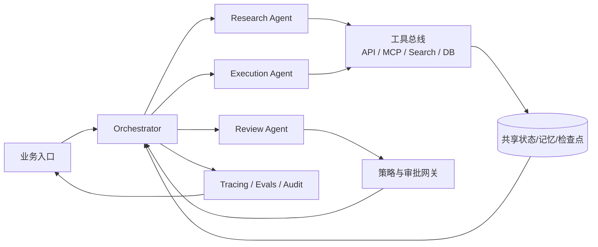

# 当前 AI Agent 开发方向与生态发展分析报告

## 执行摘要

信息范围已按 **2026-05-29** 复核官方文档与行业报告。过去两年，AI agent 开发已从“对话机器人 + 插件”快速演进为一套完整工程体系：以**状态化编排**、**工具/数据接入协议**、**多智能体协作**、**评测与可观测性**、**权限与安全治理**为核心。Anthropic 明确把 **workflow** 与 **agent** 区分开来：前者是预定义代码路径上的编排，后者则由模型动态决定流程与工具使用；LangGraph、Microsoft Agent Framework、OpenAI Agents SDK 则分别把持久状态、handoff、审批与 tracing 做成一等能力；Dify、Copilot Studio 则把这些能力进一步平台化、低代码化。与此同时，MCP 正把“工具接入”从厂商私有接口推向协议化生态。

企业态度明显从“好奇试点”转向“谨慎放量”。世界经济论坛 2025 年报告称，**82% 的高管计划在未来一到三年采用 agent**；McKinsey 2025 调查显示，**88%** 受访组织已在至少一个业务职能中常态化使用 AI，但真正把 AI agent 扩到企业级规模的只有 **23%**，另有 **39%** 仍处于实验阶段；Deloitte 回顾 2024 的企业生成式 AI 实践时指出，**监管与风险**已成为部署的头号障碍，并且在一年中继续上升。中国信通院的 2025 年产业报告也把“智能体与生产生活各领域结合成为应用重要形态”作为年度判断。 

对技术决策者而言，当前最有效的路线不是“一上来就做全自治超级 agent”，而是：先把高价值流程拆成**可验证的工作流节点**，再在局部引入 agent；把**审批、观测、评测、权限、沙箱**与**成本预算**一并设计进去；优先选择支持 **MCP/A2A** 等开放协议、可跨模型供应商迁移的框架。对于生产系统，真正的分水岭已不再是“能不能调工具”，而是“能否被审计、回放、插断、限制权限并持续优化”。 

## 定义与范畴

从技术架构上看，当前 agent 系统可分为四层：**模型层**、**编排运行时层**、**工具与上下文接入层**、**治理运维层**。Anthropic 将 agentic systems 分为 workflow 与 agent 两类：workflow 更强调确定性、可预测性与固定子任务拆解；agent 更强调由模型动态决定下一步、工具与执行路径。WEF 进一步把 agent 的成熟度与治理重点放在角色、自治程度、可预测性与上下文边界上；中国信通院则在政务场景中把智能体定义为能够自主感知、独立决策、调用工具并执行任务的系统。三者共同表明：agent 不应只被理解为“会调函数的 LLM”，而应被理解为“可在约束下完成任务闭环的软件系统”。 

典型生产型 agent 的边界也比 2023 年的“插件机器人”宽得多。它通常至少包含：任务路由、上下文装配、工具选择、结果校验、状态持久化、人工审批、追踪评估与权限隔离。LangGraph 的 checkpoint/thread 模型、Microsoft Agent Framework 的 session/persistence、OpenAI Agents SDK 的 history/session/server-managed continuation，以及 Dify 的 workflow/agent 节点，本质上都在回答同一个问题：**如何把一次性的模型调用，变成可恢复、可审计、可扩展的任务执行系统**。 

上图反映了当前主流实现的共同骨架：Anthropic 的“augmented LLM + workflow/agent”模式、LangGraph 的 stateful graph runtime、OpenAI 的 tools/handoffs/traces、Microsoft 的 workflow orchestration 与审批式工具、以及 Dify 的工具节点/Agent 节点，都是这一范式的不同产品化表达。 

## 研究热点与生态演进

近两年的研究和行业热点，集中在五个方向。第一，**真实世界工具使用与 computer use**：从网页浏览扩展到桌面 GUI、代码执行与跨系统工作流；第二，**长期任务与软件工程 agent**：编码、测试、修复、PR 生成成为最先被规模验证的场景；第三，**多智能体协作与 orchestration pattern**：顺序、并发、handoff、group chat、manager-worker 成为标准编排语汇；第四，**评测、可观测与治理**：trace、eval、policy gate、approval、cost profiling 从“附属工具”变成生产必需；第五，**协议化连接**：MCP、A2A、连接器生态把外部工具接入从手工适配推向标准化。 

值得注意的是，**研究热度上升并不等于问题已被解决**。GAIA 作为通用 AI 助手基准，早期结果显示人类可达 **92%**，而带插件的 GPT-4 仅 **15%**；OSWorld 显示人类在真实计算机任务上可完成 **72.36%**，最佳模型仅 **12.24%**；TheAgentCompany 中最强基线 agent 的自主完成率也只有 **30%**。这些结果说明，agent 的最大短板不在“会不会说”，而在**跨工具推理、GUI grounding、长程规划、错误恢复和环境鲁棒性**。也正因为如此，Anthropic 强调“先做最简单可用方案”，以及“复杂度只有在显著改善效果时才值得引入”。 

| 公开可量化指标 | 数值或估算 | 解读 |
|---|---:|---|
| GAIA 基准 | 人类 92%，GPT-4+plugins 15% | 通用助手在多模态、网页、工具使用上的差距仍大 |
| OSWorld | 人类 72.36%，最佳模型 12.24% | GUI agent 仍远未达到可广泛替代人工操作的成熟度 |
| TheAgentCompany | 最强基线自治完成率 30% | 企业数字工位类任务仍需强编排与人机协同 |
| Ask Microsoft 案例 | 延迟最高下降 61%，人工转接最高减少 70% | 专用子 agent + 编排网络在封闭业务域中能显著提升 ROI |
| 成本示例 | 更实用的做法不是记某个瞬时模型价格，而是把**输入 token、输出 token、工具调用次数、重试次数和容器/沙箱运行时间**分开核算。 | 成本主要由模型 token、工具调用次数与运行时环境决定，框架本身通常不是主要成本项；具体价格应以各平台定价页为准。 |

生态层面，2025-2026 的关键变化是**平台收敛与协议外溢**。Microsoft 将 AutoGen 与 Semantic Kernel 的思想收束到 Agent Framework；OpenAI 把 SDK、tracing、sandbox、hosted tools 做成统一开发面；Anthropic 则以工具使用、computer use、MCP 和 Constitution-based safety 栈推进；LangChain 继续向“agent engineering platform”扩展；Dify 与 Copilot Studio 则在低代码和企业治理上形成对位。这意味着框架竞争正从“谁会多 agent”转向“谁能更稳定地把 agent 放进生产”。 

这一多 agent 拓扑已经在 Microsoft Agent Framework 的 sequential/concurrent/handoff/group-chat/magentic、LangChain 的 multi-agent/LangGraph、AutoGen 的 group chat 与 Dify 的并行工作流里形成“事实标准”模式库。 

## 主流框架架构与能力对比

下表选取当前最具代表性的代码优先、低代码和模型厂商工具链。需强调：Anthropic 更像“模型 + 工具 + 协议 + 安全栈”，而非单一应用框架；Microsoft 则已形成“开源 SDK + 闭源企业平台”的双层结构。 

| 框架 | 定位 | 工具/插件接入 | 状态管理与协作 | 可观测/安全 | 部署与成本 | 生态与代表企业/项目 |
|---|---|---|---|---|---|---|
| **LangChain / LangGraph** | 代码优先、低层可控，面向长周期、状态化 agent | 函数工具、MCP、A2A、丰富 checkpointer/向量集成 | 原生 checkpoint、thread state、subgraph、多 agent | LangSmith tracing/evals；HITL middleware；guardrails | 框架开源；LangSmith 提供云端、混合与自托管能力，具体商业能力以官方页面为准 | 适合需要长周期状态、复杂审计链路和细粒度编排的团队 |
| **AutoGen** | 开源多 agent 研究/开发框架，长于“对话式协作” | LLM、工具、人类代理；函数调用；代码执行器 | GroupChat、自定义 speaker selection、多 agent 对话；持久化与企业态能力相对分散 | AutoGen Studio 可看运行剖析与成本；runtime logging/MLflow autolog；本地代码执行不宜直接用于生产 | 开源免费，更适合研究验证和原型试错 | 研究社区成熟，适合理解多角色协作模式 |
| **Dify** | 低代码、生产导向的 agentic workflow 平台，RAG+Workflow+Agent 一体化 | 工具插件、模型供应商管理、知识库、外部 API | Workflow 变量、Agent 节点、并行节点；更强调“可控流程 + 局部自治” | 内置监控并可对接 Opik/Langfuse/Phoenix；团队/工作区级配置 | 支持 Cloud 与自托管，适合快速 PoC 与内部应用 | 中文生态强，适合知识库、客服、审批自动化 |
| **AgentGPT** | 浏览器内自治 agent 的早期代表，偏演示/个人试验 | 搜索、Notion/Google Drive 等上下文工具；底层用 LangChain | 基本任务分解与执行；企业级持久状态/治理较弱 | 官方未体现成熟的企业 tracing/权限栈 | 更适合教学、演示和概念验证 | 历史影响大，但不应作为生产首选 |
| **OpenAI Agents SDK** | 官方代码优先 SDK，适合由应用自己掌控编排、状态、审批 | function tools、hosted tools、MCP、handoffs、voice、sandbox agents | history/session/server-managed continuation；specialist handoff；可暂停恢复 | 内置 traces；支持 guardrails/human review；强调先检查 traces 再调 prompt | SDK 本身不额外收费；总体成本取决于所选模型、工具和运行环境，需以官方定价页为准 | 与 ChatGPT、Codex 等生态协同，适合深度定制服务端 agent |
| **Microsoft Agent Framework / Copilot Studio** | 前者是开源企业级 SDK，后者是面向 M365/Power Platform 的闭源低代码平台 | Agent Framework 支持 Providers、A2A、MCP；Copilot Studio 支持 MCP、连接器与 connected agents，多智能体编排 | Agent Framework 提供 session/persistence、graph workflow、顺序/并发/handoff/group chat/magentic；Copilot Studio 支持 connected agents/orchestrator | telemetry、middleware、approval-required tools；Copilot Studio 可通过 Power Platform 管理中心、Purview 等治理与审计 | Agent Framework 开源；Copilot Studio 采用平台计费与治理模型，适合已有微软栈的企业 | 企业集成与 M365 生态优势明显 |
| **Anthropic Claude + MCP / Constitutional 安全栈** | 不是单体框架，而是“模型 + tool use + computer use + MCP + 安全治理”栈 | client tools 与 server tools 并存；支持 web search、web fetch、code execution、bash、computer use、MCP connector | 强调 augmented LLM、简单可组合 workflow；不鼓励无约束复杂化 | Constitutional AI 路线延续到工具与安全实践；computer use 有专门风险提示、确认机制与 ZDR 资格；对 prompt injection 做强化防御 | API 与云市场渠道均可用；成本需以官方定价页和工具费说明为准 | MCP 生态广，适合高质量知识工作与安全敏感场景 |

| 框架 | 主要优势 | 主要短板 | 典型场景 |
|---|---|---|---|
| **LangChain / LangGraph** | 控制粒度最高，状态与审计能力成熟，适合复杂业务编排 | 学习曲线较高，若团队没有 observability/eval 纪律，复杂度会失控 | 金融/客服/研究/编码等需要长期状态和审批插断的任务 |
| **AutoGen** | 多 agent 模式丰富，适合研究快速试错与多角色协作实验 | 生产工程化与治理能力不如“后继者” Agent Framework 聚焦 | 研究、原型、复杂讨论式问题求解 |
| **Dify** | 上手快，中文文档完整，RAG/Workflow/Agent 一体化，适合业务团队 | 深自治、多 agent、细粒度 runtime 控制弱于代码优先框架 | 企业知识库、客服、表单流、审批流、内网助手 |
| **AgentGPT** | 概念直观、历史影响广，适合理解自治 agent 基本形态 | 已归档；企业能力、治理与可持续性不足 | Demo、教学、概念验证 |
| **OpenAI Agents SDK** | hosted tools、sandbox、tracing 与 handoff 集成顺滑；适合深度代码定制 | 生态更偏 OpenAI 产品线，成本高度依赖模型与工具调用设计 | 代码代理、研究代理、需要容器环境的服务端自动化 |
| **Microsoft Agent Framework / Copilot Studio** | 企业权限、审批、M365 集成、低代码与 SDK 双轮驱动，适合组织级推广 | 体系较大，非微软环境下心智负担更高；Credits 模型需精算 | M365 场景、内部流程自动化、客服/运营/企业搜索 |
| **Anthropic 工具链** | 模型质量强、MCP 生态领先、tool use/computer use 路径清晰，安全论述完整 | 更像工具栈而非全栈应用框架，企业仍需自建编排与治理外壳 | 高质量知识工作、浏览器/桌面代理、编码与研究 |

## 企业采用态度与典型案例

总的来看，企业采用 agent 的态度可以概括为：**高意愿、低容错、从窄场景扩张**。McKinsey 发现，agent 最常首先进入 **IT 与知识管理**；按行业看，**科技/媒体/电信与医疗**是当前报告中最活跃的行业。与此同时，接近三分之二的组织尚未在企业范围内完成规模化，说明市场仍处于“从 pilot 走向 operating model”的中段。 

| 行业 | 采用态度 | 主流形态与公开案例 |
|---|---|---|
| **金融** | 需求强，但最强调合规、审计和人工复核 | 从知识检索、投研辅助、客服、财富顾问扩到流程自动化。Morgan Stanley 与 OpenAI 的实践显示，**98% 顾问每天使用**相关系统，文档可达性从 20% 升至 80%；Morningstar 也在用 Copilot/Copilot Studio 做 agentic wealth advisory |
| **互联网/软件** | 最快进入“专用子 agent + orchestration”阶段 | 典型场景是企业搜索、客服、IT 服务台、开发辅助。Microsoft 用 Copilot Studio 重构官网 “Ask Microsoft” 后，**延迟最高下降 61%，人工转接最高减少 70%** |
| **制造** | 强调数据驻留、OT/IT 融合与可靠性，通常先从工业副驾入手 | Siemens 与 Microsoft 在 2024 年把 Siemens Industrial Copilot 推向更大规模工业环境，用 Azure OpenAI 支撑制造与自动化场景 |
| **医疗** | 高价值、高风险，必须把医生/运营人员置于回路中 | 临床副驾、病历总结、运营编排、分诊与患者服务是主流。OpenAI 披露其与 Penda Health 的研究显示，在合适保护与医生监督下，临床 copilot **降低了诊断与治疗错误**；Anthropic 也在 2026 年推出面向医疗的 HIPAA-ready 工具资源 |
| **政务** | 采取“试点验证—审慎扩面”的路线，重治理与统一底座 | 中国信通院与北大发布的 2025 报告指出，政务智能体正从 PoC 走向规模化，并汇集了 **32 个典型案例**，覆盖政务服务、社会治理、机关办公与辅助决策；典型部署模式包括平台服务、API 嵌入和定制化建设 |

从上述行业对比看，ROI 最先显现的不是“全自治决策”，而是**知识工作压缩、流程流转提速、复杂系统间的编排连接**。也因此，领先企业普遍把 agent 放在“高频、可验证、可插断”的任务上，而不是直接让其掌握高权限的端到端业务流程。 

## 主要挑战与风险

当前最大的风险不是模型本身，而是 **agent 获得行动能力之后的攻击面扩张**。OWASP 2025 将提示注入、数据泄露、沙箱不足、未授权代码执行、系统提示泄露、过度自主性等列为 LLM/agent 应用核心风险；NIST 的生成式 AI 风险管理剖面则要求组织把识别、测量、治理与持续监控联动起来，而不是把安全理解为“上线前做一次评审”。 

对 agent 尤其重要的，是 **间接提示注入与工具劫持**。Microsoft 将 indirect prompt injection 视为需要 defense-in-depth 的现实威胁；Anthropic 也明确指出 computer use 在上网时风险更高，并在截图中加入针对 prompt injection 的分类器与用户确认机制，但同时承认这些防线并不能替代人工监督。MCP 生态虽然推动互联互通，但其早期规范也明确说明：**认证与授权尚不是核心规范的一部分**，需要实现方自行设计。换言之，协议开放带来接入便利，也同步放大了权限与信任边界设计的重要性。 

性能与成本方面，agent 的典型风险是**模型调用次数递增、上下文膨胀、工具等待时间累积**。Anthropic 直接提醒，agentic systems 常用“更高延迟和更高成本”换更好的任务表现；Dify 也指出提高最大迭代次数会增加延迟和 token 消耗；Anthropic 的 computer use 还会额外引入 **466–499** 个 system prompt token，以及 **735** 个 tool definition token，并且官方明确表示其当前延迟不适合速度敏感场景。对技术负责人来说，这意味着成本管理应从“看单次对话 token”升级到“看整条执行轨迹的分段成本、失败重试与审批等待成本”。 

最后，可解释性与合规并不会因为 agent 具备“轨迹”就自动解决。真正有用的可解释性，来自可复现的 state、trace、tool result、approval log 和 policy decision；真正可靠的合规，来自**最小权限、数据驻留、跨域边界控制、第三方工具清单与审计责任归属**。Microsoft Agent Framework 已明确提醒，连接第三方系统的风险和数据边界责任由应用方承担；Dify、Copilot Studio 与企业云也都在不断把工作区、计费、治理与监控做成平台特性，反过来说明这些问题已成为生产部署的“硬门槛”。 

## 未来趋势与建议

未来两到三年，最可能成为主流的不是“完全自治的通用超级 agent”，而是**以 workflow 为骨架、以 agent 为局部智能单元**的混合架构。Anthropic 的建议是先从简单开始，只在证明确有收益时才增加复杂度；McKinsey 则把“重构工作流”视为 AI 高绩效组织的重要特征。两者实际上指向同一结论：AI agent 的核心价值，不在于替代所有流程，而在于重写最值得重写的那部分流程。 

第二个确定性趋势是**协议化互联**。MCP 已从 Anthropic 社区协议扩展为被 Claude、ChatGPT、VS Code、Cursor 等广泛支持的开放标准；Microsoft 的 Agent Framework 与 Copilot Studio 正同时拥抱 A2A、MCP 和 connected agents；LangSmith Deployment 也已把 MCP 与 A2A 作为生产运行时能力的一部分。未来工具接入、子 agent 复用、外部 SaaS 协作，都会越来越依赖协议层而非私有 SDK 适配。 

第三个趋势是**企业级治理前移**。Copilot Studio 已把 Credits、连接器、MCP、治理控制与审计纳入同一平台；OpenAI 强化 tracing、sandbox 与 hosted tools；Anthropic 把安全研究直接嵌入 browser/computer-use 路径；Microsoft 还在 2026 年把 Anthropic 模型纳入 Copilot Studio 默认多模型阵容。这意味着大厂竞争焦点正在从“谁的模型更强”转到“谁的 agent 平台更可管、可接、可审”。 

对技术决策者，建议可归纳为四点。**架构上**，优先选择能把审批、回放、状态恢复、trace 和 cost profiling 做成内建能力的方案；**平台上**，如果团队以工程师为主且流程复杂，优先 LangGraph/Agent Framework/OpenAI Agents SDK；如果业务团队参与度高、要快速形成内网应用，优先 Dify 或 Copilot Studio；**治理上**，默认采用最小权限、沙箱执行、审批式工具、高风险场景人机协同；**组织上**，把 eval、prompt/tool 设计、权限策略和成本预算视为同级工程资产，而不是交给单一“提示词专家”临时维护。换言之，生产级 agent 项目最值得投资的不是“再多一个智能体”，而是**把 agent 做成可治理的软件系统**。 

## 官方参考资料

以下入口适合继续核对框架能力和工程细节，已按 **2026-05-29** 做过一轮可访问性检查：

| 类型 | 资源 | 链接 |
| --- | --- | --- |
| 架构方法 | Anthropic: Building effective agents | https://www.anthropic.com/engineering/building-effective-agents |
| OpenAI 工程路径 | OpenAI Building Agents | https://developers.openai.com/tracks/building-agents/ |
| LangGraph | LangGraph Overview | https://docs.langchain.com/oss/python/langgraph/overview |
| 微软生态 | Microsoft Agent Framework | https://learn.microsoft.com/en-us/agent-framework/ |
| 协议层 | Model Context Protocol | https://modelcontextprotocol.io/docs/getting-started/intro |
| 低代码平台 | Dify Documentation | https://docs.dify.ai/ |
| 路线图 | roadmap.sh AI Agents | https://roadmap.sh/ai-agents |
| 评估 | OpenAI Evals Guide | https://developers.openai.com/api/docs/guides/evals |
