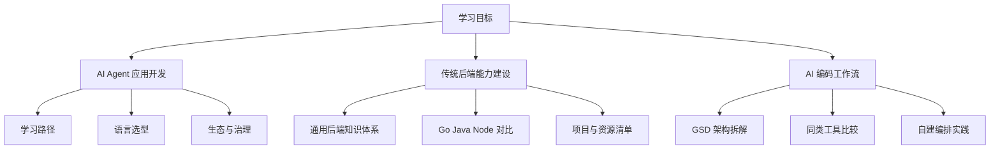

# Dev Study Path

这个目录汇总了三类内容：

1. `AI Agent` 学习路径与技术选型。
2. `传统后端` 学习路径与语言比较。
3. `AI 编码工作流` 工具与方法分析。

如果你是第一次进入这个目录，建议不要按文件名随机阅读，而是按目标走下面这三条路径。

## 推荐阅读顺序

### 路径一：从零搭建 AI Agent 应用能力

1. [AI Agent 应用开发学习历程与知识体系分析](<./AI Agent 应用开发学习历程与知识体系分析.md>)
2. [AI Agent 应用开发学习历程与 Go、Java、Node.js 技术路线比较](<./AI Agent 应用开发学习历程与 Go、Java、Node.js 技术路线比较.md>)
3. [AI Agent 开发方向与生态发展](<./AI Agent 开发方向与生态发展.md>)

适合人群：已经有基础编程能力，想系统进入 Agent 工程与应用开发。

### 路径二：理解基础模型与 Agent 生态演进

1. [基模与 AI Agent 发展方向分析](<./基模与 AI Agent 发展方向分析.md>)
2. [AI Agent 开发方向与生态发展](<./AI Agent 开发方向与生态发展.md>)

适合人群：想先理解模型、平台、协议、产品形态的演化趋势，再决定具体实现路线。

### 路径三：先夯实传统后端，再补 AI 能力

1. [传统后端学习历程与知识体系分析](<./传统后端学习历程与知识体系分析.md>)
2. [传统后端学习历程与 Go Java Node 知识体系深度分析](<./传统后端学习历程与 Go Java Node 知识体系深度分析.md>)
3. [AI Agent 应用开发学习历程与 Go、Java、Node.js 技术路线比较](<./AI Agent 应用开发学习历程与 Go、Java、Node.js 技术路线比较.md>)

适合人群：目标岗位仍以后端工程为主，但希望逐步补齐 Agent、RAG 和工具调用能力。

## 主题地图

## 文件说明

| 文件 | 作用 |
| --- | --- |
| [AI Agent 应用开发学习历程与知识体系分析](<./AI Agent 应用开发学习历程与知识体系分析.md>) | 最适合作为 Agent 学习主线入口。 |
| [AI Agent 应用开发学习历程与 Go、Java、Node.js 技术路线比较](<./AI Agent 应用开发学习历程与 Go、Java、Node.js 技术路线比较.md>) | 适合做语言选型和团队技术路线判断。 |
| [AI Agent 开发方向与生态发展](<./AI Agent 开发方向与生态发展.md>) | 适合看当前主流框架、协议、企业采用和风险。 |
| [基模与 AI Agent 发展方向分析](<./基模与 AI Agent 发展方向分析.md>) | 适合从模型、平台和产品形态层看长期趋势。 |
| [传统后端学习历程与知识体系分析](<./传统后端学习历程与知识体系分析.md>) | 适合补通用后端主干路线。 |
| [传统后端学习历程与 Go Java Node 知识体系深度分析](<./传统后端学习历程与 Go Java Node 知识体系深度分析.md>) | 适合做语言对比、项目规划和资源选择。 |
| [GSD 与同类 AI 编码工作流编排工具分析](<./GSD 与同类 AI 编码工作流编排工具分析.md>) | 适合研究 AI 编码工作流、规范驱动开发和多代理编排。 |

## 使用建议

- 如果你要把这批文档继续演进，优先保持“正文判断稳定、时效信息放到官方资料入口”这条原则。
- 如果你要把它们转成课程或知识库，建议下一步补统一的术语表与跨文档互链。
