# Ecommerce AI System Design Docs Split Implementation Plan

> **For agentic workers:** REQUIRED SUB-SKILL: Use superpowers:subagent-driven-development (recommended) or superpowers:executing-plans to implement this plan task-by-task. Steps use checkbox (`- [ ]`) syntax for tracking.

**Goal:** Split the long ecommerce + cloud conversational AI system design article into a focused directory of smaller chapters, then deepen the MQ-based ReAct Agent Loop, Redis, middleware, sharding, retry, and idempotency sections with diagrams.

**Architecture:** Replace the single 1100+ line article with a directory at `docs/backend-dev/系统设计/电商平台与云端对话 AI 系统设计/`. The directory index becomes the reading map, while each chapter owns one coherent design concern: overview, ReAct loop, data model, MQ/Redis, reliability, scaling, security, and interview summary. The parent `系统设计/index.md` links to the new directory, and the old single-file article becomes a short redirect-style landing note or is removed after links are migrated.

**Tech Stack:** Markdown, MkDocs Material, awesome-nav directory navigation, Mermaid diagrams, existing `pnpm check:mermaid`, existing `uv run mkdocs build`.

---

## File Structure

Create:

- `docs/backend-dev/系统设计/电商平台与云端对话 AI 系统设计/index.md`
  - Directory landing page, reading order, architecture map, and links to all chapters.
- `docs/backend-dev/系统设计/电商平台与云端对话 AI 系统设计/01-需求边界与整体架构.md`
  - Functional and non-functional requirements, assumptions, high-level architecture, service boundaries.
- `docs/backend-dev/系统设计/电商平台与云端对话 AI 系统设计/02-核心链路与 ReAct Agent Loop.md`
  - Chat run creation, SSE subscription, server-side ReAct loop, sync vs async tool execution, run/tool state machines.
- `docs/backend-dev/系统设计/电商平台与云端对话 AI 系统设计/03-接口设计与数据模型.md`
  - Public APIs, internal tool APIs, chat tables, tool call tables, ecommerce domain tables, index choices.
- `docs/backend-dev/系统设计/电商平台与云端对话 AI 系统设计/04-MQ Redis 与缓存一致性.md`
  - MQ selection, event model, Redis usage, price/inventory cache, hot-key protection, Outbox.
- `docs/backend-dev/系统设计/电商平台与云端对话 AI 系统设计/05-重试 幂等与并发控制.md`
  - Retry classification, exponential backoff, dead letter, API/event/tool/cache idempotency, single owner, leases.
- `docs/backend-dev/系统设计/电商平台与云端对话 AI 系统设计/06-分库分表与容量演进.md`
  - Vertical split, horizontal sharding, shard keys, hot tenant migration, read/write separation, archiving.
- `docs/backend-dev/系统设计/电商平台与云端对话 AI 系统设计/07-中间件 设计模式与工程组织.md`
  - Fastify middleware chain, design patterns, tool runtime organization, domain ownership.
- `docs/backend-dev/系统设计/电商平台与云端对话 AI 系统设计/08-安全 可观测性与面试话术.md`
  - Tool permissions, prompt injection, sensitive data, logs/metrics/traces, interview answer and common follow-ups.

Modify:

- `docs/backend-dev/系统设计/index.md`
  - Change the chapter 05 link from the single file to the new directory.
- `docs/backend-dev/系统设计/05-电商平台与云端对话 AI 的系统设计示例.md`
  - Convert to a short compatibility page that points readers to the new directory, or delete it after confirming no local references. Prefer compatibility page to avoid broken external links.

Optional if awesome-nav ordering needs explicit control:

- `docs/backend-dev/系统设计/电商平台与云端对话 AI 系统设计/.pages`
  - Add ordered chapter titles only if local navigation does not preserve filename order.

## Task 1: Create Directory Skeleton and Parent Link

**Files:**

- Create: `docs/backend-dev/系统设计/电商平台与云端对话 AI 系统设计/index.md`
- Modify: `docs/backend-dev/系统设计/index.md`

- [ ] **Step 1: Create the new directory landing page**

Create `docs/backend-dev/系统设计/电商平台与云端对话 AI 系统设计/index.md` with this content:

```markdown
# 电商平台与云端对话 AI 系统设计

这一组文档把“电商平台 + 云端对话 AI”拆成一个完整系统设计案例。

核心场景是：用户在聊天框输入需求，服务端 ReAct Agent Loop 可能多步调用商品、价格、库存、促销、联网查询等内部或外部工具，最后流式返回答案。

## 阅读顺序

1. [需求边界与整体架构](./01-需求边界与整体架构.md)
2. [核心链路与 ReAct Agent Loop](./02-核心链路与%20ReAct%20Agent%20Loop.md)
3. [接口设计与数据模型](./03-接口设计与数据模型.md)
4. [MQ Redis 与缓存一致性](./04-MQ%20Redis%20与缓存一致性.md)
5. [重试 幂等与并发控制](./05-重试%20幂等与并发控制.md)
6. [分库分表与容量演进](./06-分库分表与容量演进.md)
7. [中间件 设计模式与工程组织](./07-中间件%20设计模式与工程组织.md)
8. [安全 可观测性与面试话术](./08-安全%20可观测性与面试话术.md)

## 总览图

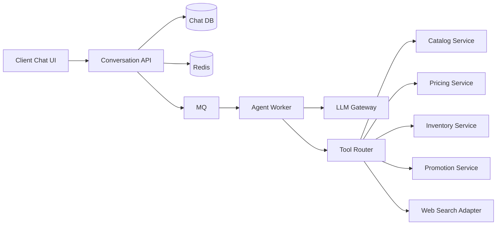

## 这组文档回答的问题

- 聊天请求如何创建 run 并流式返回？
- 为什么 ReAct Agent Loop 应该放在服务端？
- 哪些工具同步调用，哪些工具通过 MQ 异步执行？
- Redis 在幂等、缓存、限流和协调里分别怎么用？
- MQ 如何配合 Outbox、重试、死信和幂等消费？
- 商品、价格、库存、消息和工具调用如何建模？
- 分库分表应该从哪里开始，而不是一上来全拆？
- 面试里如何把这套设计讲成一条清晰主线？
```

- [ ] **Step 2: Update parent system design index**

In `docs/backend-dev/系统设计/index.md`, replace:

```markdown
- [05. 电商平台与云端对话 AI 的系统设计示例](./05-电商平台与云端对话%20AI%20的系统设计示例.md)
```

with:

```markdown
- [05. 电商平台与云端对话 AI 系统设计](./电商平台与云端对话%20AI%20系统设计/)
```

- [ ] **Step 3: Verify the landing page Mermaid**

Run:

```bash
rtk pnpm check:mermaid
```

Expected: command exits with status 0 and reports no Mermaid syntax errors.

## Task 2: Split Requirements and Architecture

**Files:**

- Create: `docs/backend-dev/系统设计/电商平台与云端对话 AI 系统设计/01-需求边界与整体架构.md`
- Source: `docs/backend-dev/系统设计/05-电商平台与云端对话 AI 的系统设计示例.md:1`

- [ ] **Step 1: Create chapter content**

Create `01-需求边界与整体架构.md` with these sections:

```markdown
# 01. 需求边界与整体架构

## 一句话项目题

设计一个“电商平台 + 云端对话 AI”系统。

用户可以在聊天框里输入需求，例如：

- 帮我找 300 元以内的机械键盘
- 比较一下这三款耳机的价格和评价
- 帮我查当前促销并推荐一套搭配

系统背后不是一次模型调用就结束，而是一个服务端 ReAct Agent Loop：模型理解意图，决定是否调用内部工具，多步查询商品、库存、价格、优惠、物流和外部公开信息，再汇总成最终回答。

## 功能目标

- 用户可以在 Web/App 聊天框发消息。
- 系统支持 SSE 或 WebSocket 流式返回回答。
- Agent 可以调用商品搜索、商品详情、价格、库存、营销活动和联网查询工具。
- Agent 允许多步推理，直到拿到足够信息或达到停止条件。
- 系统保存会话、消息、工具调用、任务状态和审计日志。

## 非功能目标

- 聊天入口高可用，不能被单个慢工具拖垮。
- 价格、库存等关键读请求延迟低。
- 对话请求、工具执行、异步事件可重试且不重复生效。
- 系统接受最终一致，但核心状态不能写乱。
- 架构能从中小规模平滑演进到高并发。

## 规模假设

- 日活 100 万。
- 聊天峰值请求 QPS 3000。
- 商品详情、价格查询峰值 QPS 2 万以上。
- 一个 Agent run 平均触发 1 到 5 次工具调用。
- 价格和库存变化频繁，商品基础信息变化相对慢。

## 整体架构

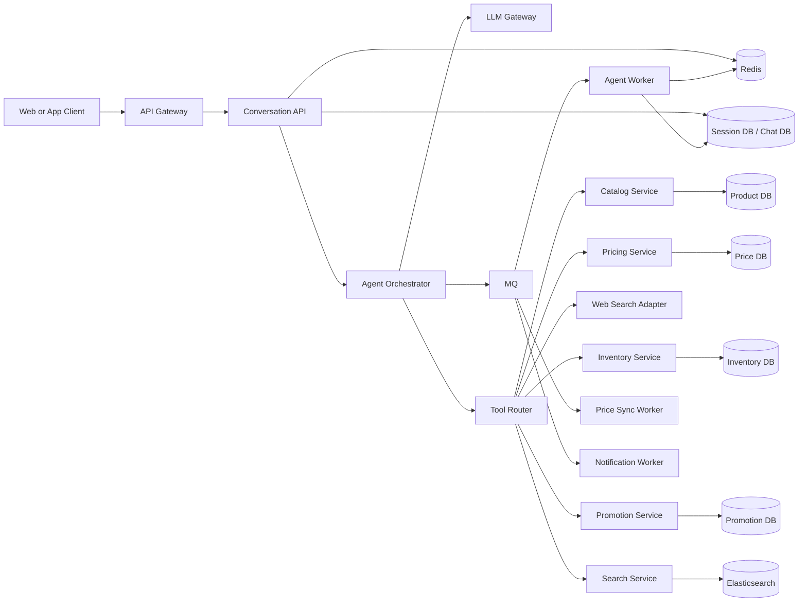

## 服务边界

| 模块 | 职责 |
|---|---|
| Conversation API | 鉴权、会话入口、幂等、SSE/WebSocket 推流 |
| Agent Orchestrator | 创建 run、维护 loop 状态、控制最大步数和超时预算 |
| Agent Worker | 执行 ReAct loop，调用模型和工具，写回状态 |
| Tool Router | 工具注册、权限校验、超时、重试、结果标准化 |
| Catalog Service | 商品 SPU/SKU、类目、属性、上下架 |
| Pricing Service | 当前价、活动价、价格历史、价格缓存失效 |
| Inventory Service | 库存查询、库存预占、库存扣减主链路 |
| Promotion Service | 优惠券、满减、促销规则计算 |
```

- [ ] **Step 2: Run Mermaid check**

Run:

```bash
rtk pnpm check:mermaid
```

Expected: PASS.

## Task 3: Split Core Chat Flow and ReAct Loop

**Files:**

- Create: `docs/backend-dev/系统设计/电商平台与云端对话 AI 系统设计/02-核心链路与 ReAct Agent Loop.md`

- [ ] **Step 1: Create chapter content**

Create `02-核心链路与 ReAct Agent Loop.md` with these sections:

```markdown
# 02. 核心链路与 ReAct Agent Loop

## 用户发起一次聊天

1. 客户端调用 `POST /api/chat/runs`，带 `Idempotency-Key`。
2. `Conversation API` 做鉴权、限流、参数校验。
3. API 查询 Redis 幂等键，避免重复创建 run。
4. 数据库事务写入 `run`、用户消息和初始上下文快照。
5. 同一事务写入 `outbox_events`。
6. API 返回 `run_id`。
7. 客户端通过 `GET /api/chat/runs/{runId}/events` 建立 SSE 订阅。

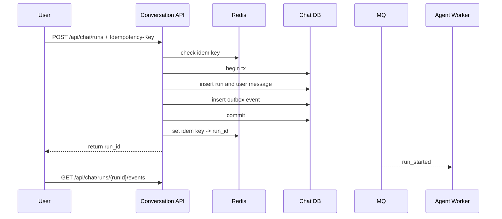

## 服务端 ReAct Agent Loop

1. `Agent Worker` 消费 `run_started`。
2. 读取会话历史、用户画像、候选商品上下文。
3. 调用模型获取结构化输出：`thought`、`tool_call` 或 `final_answer`。
4. 如果需要工具，写入 `tool_call` 记录并执行工具。
5. 工具结果落库并回写到 loop state。
6. Worker 继续下一轮模型调用。
7. 达到停止条件后写最终消息并发布 `run_completed`。

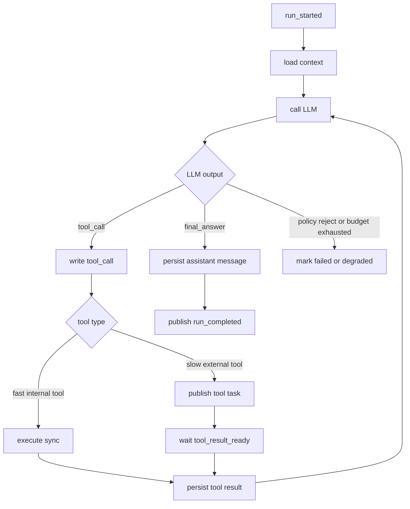

## run 状态机

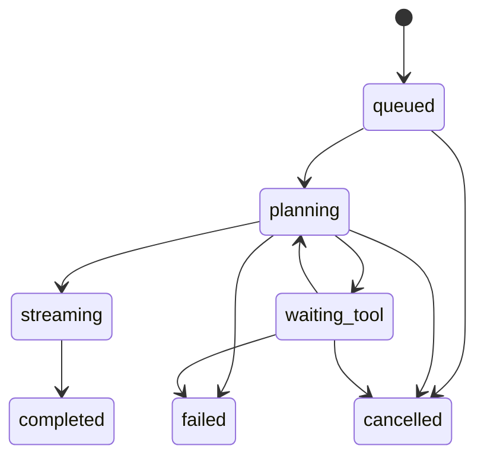

## tool_call 状态机

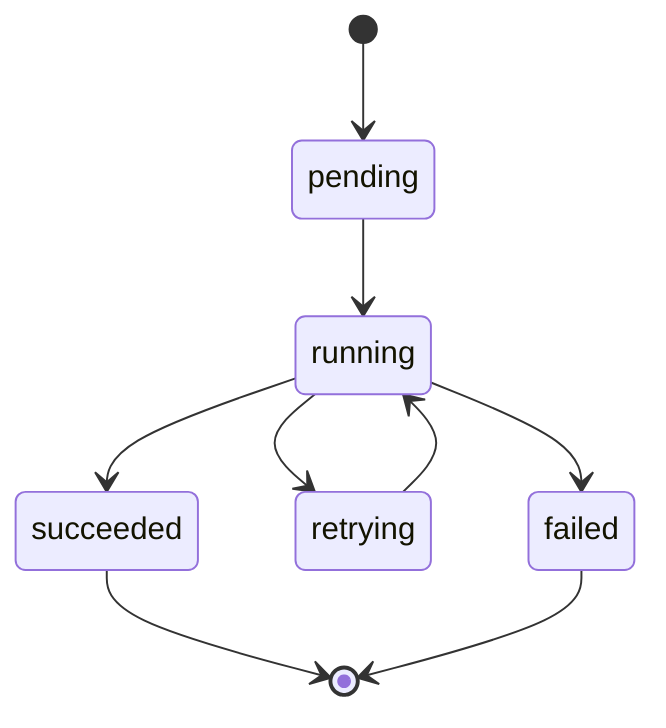

## 停止条件

- 模型返回 `final_answer`。
- 达到最大步数，例如 8 步。
- 达到总超时预算，例如 15 秒。
- 命中风控或工具权限拒绝。
- 工具连续失败达到阈值。

## 为什么 ReAct Loop 要放服务端

- 工具权限不暴露给客户端。
- 多步状态可以持久化、恢复和审计。
- 工具重试、超时和并发控制可以统一治理。
- SSE 断开后可以用 `run_id` 重新订阅，而不是丢失运行状态。
```

- [ ] **Step 2: Run Mermaid check**

Run:

```bash
rtk pnpm check:mermaid
```

Expected: PASS.

## Task 4: Split APIs and Data Model

**Files:**

- Create: `docs/backend-dev/系统设计/电商平台与云端对话 AI 系统设计/03-接口设计与数据模型.md`

- [ ] **Step 1: Create chapter content**

Create `03-接口设计与数据模型.md` with sections for public APIs, internal tool APIs, and database tables:

```markdown
# 03. 接口设计与数据模型

## 对话接口

| 接口 | 作用 | 幂等要求 |
|---|---|---|
| `POST /api/chat/runs` | 创建 run | 必须带 `Idempotency-Key` |
| `GET /api/chat/runs/{runId}` | 查询 run 状态 | 读接口天然幂等 |
| `GET /api/chat/runs/{runId}/events` | SSE 订阅事件流 | 支持断线重连 |
| `POST /api/chat/runs/{runId}/cancel` | 取消运行中的 run | 重复取消返回当前状态 |

## 内部工具接口

| 接口 | 作用 | 同步性 |
|---|---|---|
| `POST /internal/tools/catalog/search` | 商品搜索 | 同步 |
| `POST /internal/tools/pricing/get` | 当前价格查询 | 同步 |
| `POST /internal/tools/inventory/get` | 库存快照查询 | 同步 |
| `POST /internal/tools/promotion/query` | 促销规则查询 | 同步或异步 |
| `POST /internal/tools/web-search/query` | 联网查询 | 异步优先 |

## 会话与 Agent 表

### `conversations`

| 字段 | 说明 |
|---|---|
| `id` | 会话 ID |
| `user_id` | 用户 ID |
| `tenant_id` | 租户 ID |
| `status` | 会话状态 |
| `created_at` | 创建时间 |

索引：`(user_id, created_at desc)`。

### `messages`

| 字段 | 说明 |
|---|---|
| `id` | 消息 ID |
| `conversation_id` | 会话 ID |
| `run_id` | 所属 run |
| `role` | user / assistant / tool |
| `content` | 内容 |
| `tokens` | token 数 |
| `created_at` | 创建时间 |

索引：`(conversation_id, created_at)`。

### `runs`

| 字段 | 说明 |
|---|---|
| `id` | run ID |
| `conversation_id` | 会话 ID |
| `user_id` | 用户 ID |
| `tenant_id` | 租户 ID |
| `status` | run 状态 |
| `current_step` | 当前步骤 |
| `max_steps` | 最大步骤 |
| `deadline_at` | 超时截止时间 |
| `idempotency_key` | 请求幂等键 |
| `error_code` | 错误码 |
| `created_at` | 创建时间 |
| `updated_at` | 更新时间 |

索引：

- `UNIQUE (user_id, idempotency_key)`
- `(conversation_id, created_at desc)`
- `(status, created_at)`

### `tool_calls`

| 字段 | 说明 |
|---|---|
| `id` | 工具调用 ID |
| `run_id` | 所属 run |
| `step_no` | ReAct 步骤号 |
| `tool_name` | 工具名 |
| `tool_dedup_key` | 工具幂等键 |
| `status` | 状态 |
| `request_json` | 标准化请求 |
| `response_json` | 标准化响应 |
| `attempt_count` | 尝试次数 |
| `started_at` | 开始时间 |
| `finished_at` | 结束时间 |

索引：

- `UNIQUE (run_id, step_no)`
- `UNIQUE (tool_dedup_key)`
- `(status, started_at)`

## 电商领域表

| 领域 | 核心表 | 说明 |
|---|---|---|
| 商品中心 | `products`, `skus`, `categories`, `product_attributes` | 商品基础信息 |
| 价格中心 | `sku_prices`, `price_history` | 当前价和价格历史 |
| 库存中心 | `inventory_snapshots`, `inventory_reservations` | 库存快照和预占 |
| 营销中心 | `promotions`, `coupons`, `promotion_rules` | 促销规则 |
| 订单中心 | `orders`, `order_items`, `payments` | 真正交易主链路 |

## 数据所有权边界

聊天 Agent 可以读取商品、价格、库存和促销信息，但不能直接扣库存、改订单、发优惠券。所有有副作用的交易动作必须进入对应领域服务的主链路。
```

- [ ] **Step 2: Verify links and formatting**

Run:

```bash
rtk uv run mkdocs build
```

Expected: build succeeds without broken Markdown or navigation errors.

## Task 5: Split MQ, Redis, Cache Consistency, and Outbox

**Files:**

- Create: `docs/backend-dev/系统设计/电商平台与云端对话 AI 系统设计/04-MQ Redis 与缓存一致性.md`

- [ ] **Step 1: Create chapter content**

Create `04-MQ Redis 与缓存一致性.md` with sections:

```markdown
# 04. MQ Redis 与缓存一致性

## MQ 负责什么

MQ 主要解决两类问题：

- 解耦
- 可靠异步

适合投递的事件：

- `run_started`
- `tool_call_dispatch`
- `tool_result_ready`
- `price_changed`
- `inventory_changed`
- `promotion_updated`
- `conversation_summary_requested`
- `audit_log_flush`

## MQ 选型

| 中间件 | 适合场景 |
|---|---|
| RabbitMQ / RocketMQ | Agent 工具调度、异步任务、补偿任务、死信队列 |
| Kafka | 价格变更流、行为日志、审计事件、高吞吐可回放事件 |

务实选型：中早期可以先用 RabbitMQ 或 RocketMQ 统一承载业务任务；当价格流、审计流、行为日志规模变大，再引入 Kafka。

## Redis 负责什么

| 用途 | 示例 key |
|---|---|
| API 幂等 | `idem:chat-run:{userId}:{idempotencyKey}` |
| 工具幂等 | `idem:tool-call:{toolDedupKey}` |
| 商品缓存 | `product:detail:{productId}` |
| 价格缓存 | `price:sku:{skuId}` |
| 库存缓存 | `inventory:sku:{skuId}` |
| 限流计数 | `rate:{tenantId}:{window}` |
| 运行态 | `run:cursor:{runId}` |
| 取消信号 | `run:cancel:{runId}` |

## Outbox 投递流程

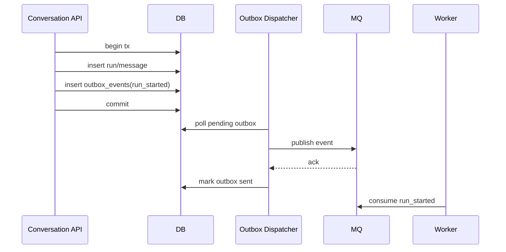

## 慢工具异步恢复执行

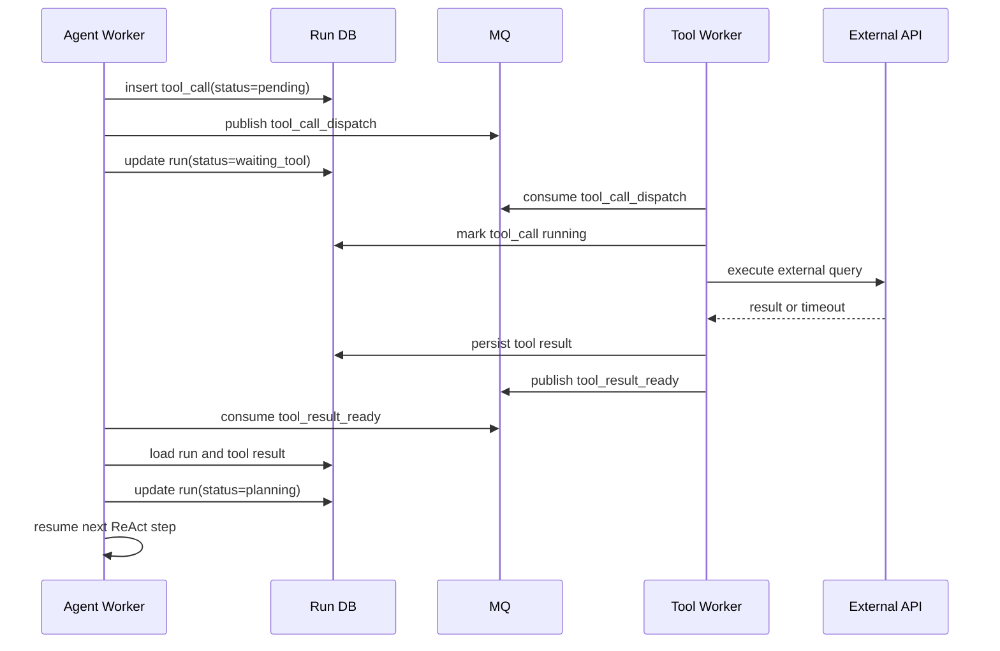

## 价格缓存更新链路

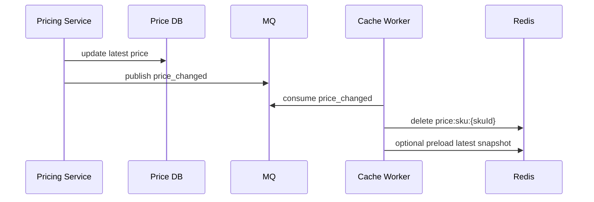

## 热点缓存回源保护

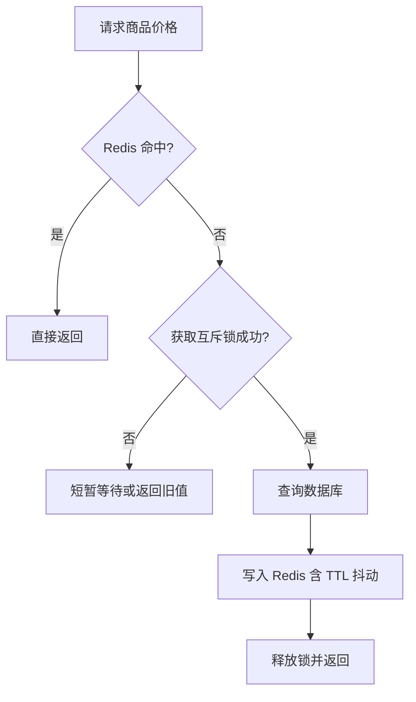

## 缓存一致性原则

- 商品详情长 TTL + 主动失效。
- 价格和库存短 TTL + 变更消息删除缓存。
- 热点 SKU 用逻辑过期 + 后台刷新。
- Redis 故障时允许部分链路回源数据库，但必须限流。
```

- [ ] **Step 2: Run Mermaid check**

Run:

```bash
rtk pnpm check:mermaid
```

Expected: PASS.

## Task 6: Split Retry, Idempotency, and Concurrency Control

**Files:**

- Create: `docs/backend-dev/系统设计/电商平台与云端对话 AI 系统设计/05-重试 幂等与并发控制.md`

- [ ] **Step 1: Create chapter content**

Create `05-重试 幂等与并发控制.md` with sections:

```markdown
# 05. 重试 幂等与并发控制

## 重试分类

可以重试：

- 网络抖动
- 下游 502/503
- 短时超时
- MQ 消费者临时失败
- Redis 短暂不可用

不应该重试：

- 参数错误
- 权限不足
- 库存明确不足
- 商品不存在
- 风控明确拒绝

## 重试决策流程

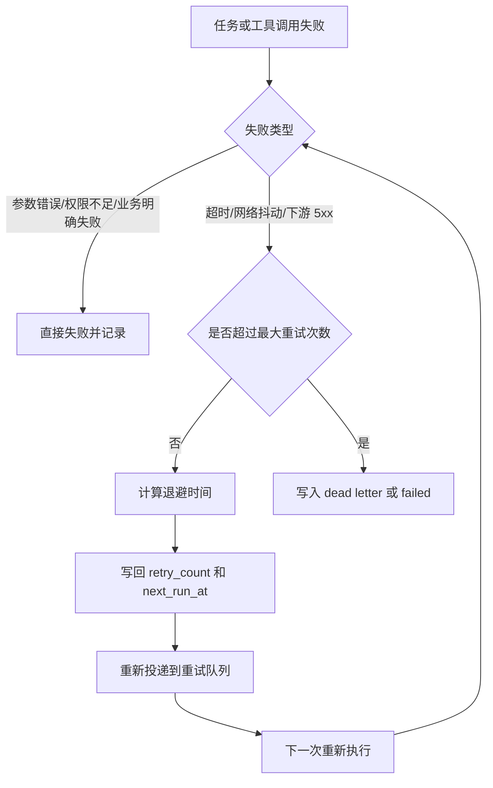

## 退避策略

| 次数 | 延迟 |
|---|---|
| 第 1 次 | 1 秒 |
| 第 2 次 | 5 秒 |
| 第 3 次 | 30 秒 |
| 第 4 次 | 5 分钟 |

同步请求内最多重试 1 到 2 次，MQ 消费重试使用指数退避，达到上限后进入死信队列。

## 四层幂等

| 层级 | 问题 | 方案 |
|---|---|---|
| API 请求幂等 | 用户重复点击发送 | `Idempotency-Key` + Redis + DB 唯一约束 |
| 事件投递幂等 | `run_started` 重复发送 | `event_id` + Outbox + 消费去重 |
| 工具执行幂等 | 工具子任务重复消费 | `tool_dedup_key` + 状态机 |
| 缓存失效幂等 | 重复删除缓存 | 删除操作天然可重复 |

## 幂等控制全景图


## 单 owner 推进 run

同一个 run 只能有一个 worker 推进，否则 ReAct loop 会出现重复工具调用或状态覆盖。

可选方案：

- `runs` 表状态更新带版本号。
- Redis lease。
- 数据库 `SELECT ... FOR UPDATE`。

## 工具并发预算

工具并发控制至少分三层：

- 用户级并发。
- 租户级并发。
- 工具级全局并发。

联网搜索、价格聚合、模型调用这类高成本工具必须有预算控制。
```

- [ ] **Step 2: Run Mermaid check**

Run:

```bash
rtk pnpm check:mermaid
```

Expected: PASS.

## Task 7: Split Sharding and Capacity Evolution

**Files:**

- Create: `docs/backend-dev/系统设计/电商平台与云端对话 AI 系统设计/06-分库分表与容量演进.md`

- [ ] **Step 1: Create chapter content**

Create `06-分库分表与容量演进.md` with sections:

```markdown
# 06. 分库分表与容量演进

## 先垂直拆，再水平拆

不要一开始就全量分库分表。更稳妥的路线是：

1. 单库 + 规范索引。
2. 商品域、会话域垂直拆库。
3. `messages`、`tool_calls`、`price_history` 水平分表。
4. 热点租户独立迁移，配合路由层。

## 分库分表演进图

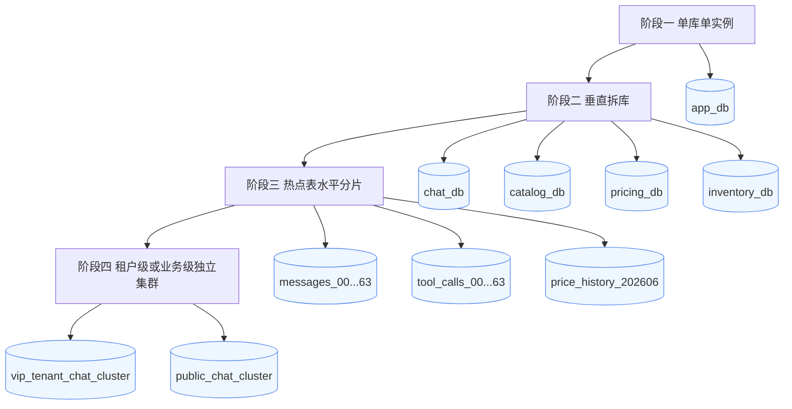

## 哪些表优先拆

| 表 | 原因 | 拆分方式 |
|---|---|---|
| `messages` | 消息量增长快 | `conversation_id hash` 或 `tenant_id` |
| `tool_calls` | 工具追踪和审计量大 | `run_id hash` 或时间分表 |
| `price_history` | 写多读少，历史数据大 | 按月或按天分表 |
| `audit_logs` | 只追加，保留周期长 | 时间分区 + 冷归档 |

## 分片键选择

分片键需要同时考虑：

- 查询是否天然带上分片键。
- 热点是否会集中。
- 后续迁移成本是否可控。

常见选择：

- 会话数据按 `tenant_id` 或 `conversation_id hash`。
- 订单数据按 `user_id hash`。
- 商品评论按 `product_id hash`。

## 容量治理

- 最近消息留在线上库，历史消息归档到冷存储。
- 工具调用保留结构化摘要，完整 request/response 按策略压缩或归档。
- 价格历史服务在线查询最近窗口，长期分析走离线数仓。
```

- [ ] **Step 2: Run Mermaid check**

Run:

```bash
rtk pnpm check:mermaid
```

Expected: PASS.

## Task 8: Split Middleware, Design Patterns, and Engineering Organization

**Files:**

- Create: `docs/backend-dev/系统设计/电商平台与云端对话 AI 系统设计/07-中间件 设计模式与工程组织.md`

- [ ] **Step 1: Create chapter content**

Create `07-中间件 设计模式与工程组织.md` with sections:

```markdown
# 07. 中间件 设计模式与工程组织

## 技术栈建议

如果使用 Node.js / TypeScript，一个务实组合是：

- `Fastify`
- `Zod`
- `Prisma` 或 `Drizzle`
- `ioredis`
- `amqplib` / RocketMQ SDK / KafkaJS
- `OpenTelemetry`

## 请求入口中间件链

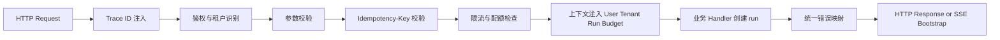

## 设计模式落点

| 模式 | 使用位置 | 价值 |
|---|---|---|
| Strategy | 工具执行策略、模型路由、重试策略 | 按工具和租户切换行为 |
| Factory | 根据 `tool_name` 创建执行器 | 避免业务层写大量条件分支 |
| Template Method | 工具调用骨架 | 固定校验、权限、审计、执行、标准化步骤 |
| State | `run`、`tool_call`、`order` | 控制合法状态流转 |
| Chain of Responsibility | 请求中间件链 | 统一鉴权、限流、trace、错误处理 |
| Observer / Event-driven | run 完成、价格变更、缓存失效 | 解耦副作用 |

## 工具执行骨架

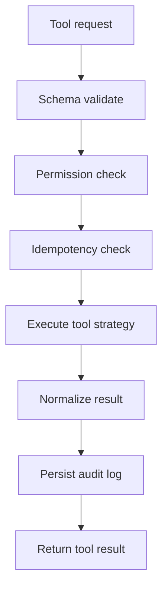

## 工程组织建议

- `conversation` 模块只负责会话入口、run 创建和推流。
- `agent-runtime` 模块负责 ReAct loop 和状态推进。
- `tool-runtime` 模块负责工具注册、权限、策略和执行。
- `ecommerce` 领域服务保持商品、价格、库存、营销边界。
- `infrastructure` 模块封装 Redis、MQ、数据库和 OpenTelemetry。
```

- [ ] **Step 2: Run Mermaid check**

Run:

```bash
rtk pnpm check:mermaid
```

Expected: PASS.

## Task 9: Split Security, Observability, and Interview Answer

**Files:**

- Create: `docs/backend-dev/系统设计/电商平台与云端对话 AI 系统设计/08-安全 可观测性与面试话术.md`

- [ ] **Step 1: Create chapter content**

Create `08-安全 可观测性与面试话术.md` with sections:

```markdown
# 08. 安全 可观测性与面试话术

## 安全边界

### 工具权限

工具权限必须是服务端策略：

- 哪些租户能调用联网查询。
- 哪些用户能查询订单。
- 哪些工具能返回敏感字段。
- 哪些工具只能读，不能写。

### Prompt 注入与工具注入

用户输入可能诱导模型越权查内部数据、绕过价格策略或连续触发高成本工具。

防护手段：

- 工具白名单。
- 参数 schema 校验。
- 高风险工具二次确认。
- 工具结果最小化返回。
- 系统提示词里明确权限边界，但不只依赖提示词。

### 敏感数据

需要脱敏、分级授权和审计的数据：

- 手机号。
- 收货地址。
- 订单金额。
- 内部采购价。
- 用户画像标签。

## 可观测性

至少要有：

- 请求日志。
- run 事件日志。
- tool_call 审计日志。
- MQ 堆积监控。
- Redis 命中率。
- 数据库慢查询。
- LLM 调用耗时、token、错误率。

## 核心指标

| 指标 | 含义 |
|---|---|
| `run_create_qps` | run 创建吞吐 |
| `run_success_rate` | run 成功率 |
| `run_p95_latency` | 端到端延迟 |
| `tool_call_timeout_rate` | 工具超时率 |
| `mq_lag` | MQ 积压 |
| `redis_hit_ratio` | 缓存命中率 |
| `pricing_cache_rebuild_qps` | 价格缓存重建压力 |
| `duplicate_event_drop_count` | 重复事件丢弃量 |

## 可直接讲的面试回答

> 我会把这个系统拆成会话入口、Agent 编排层、工具路由层和电商领域服务几部分。聊天入口负责鉴权、限流、幂等和 SSE 推流，收到请求后先把 run 和 message 落到会话库，再通过 Outbox + MQ 触发服务端 ReAct Agent Loop。
>
> Agent Worker 作为 loop 的唯一 owner，负责多步调用模型和工具。快工具如商品详情、价格、库存可以同步调用，慢工具如联网搜索、聚合报价通过 MQ 子任务异步执行，结果再回写 loop 状态继续推进。
>
> 数据层面会把会话域和商品域先垂直拆开，商品、价格、库存、营销分别独立服务；消息量大的 `messages`、`tool_calls`、`price_history` 后续再按租户、会话或时间做水平分表。
>
> Redis 主要做幂等键、热点缓存、限流和轻量协调，MQ 负责异步重试、削峰和最终一致。整体上接受至少一次投递，通过请求幂等、事件幂等、工具幂等和状态机校验来消化重复。再配合指数退避、死信队列、Outbox、Trace 和审计日志，保证系统在高并发和下游抖动下仍然可控。

## 高频追问

- 为什么 ReAct loop 要服务端化？
- 哪些工具同步，哪些工具异步？
- 为什么需要 Outbox？
- Redis 和数据库谁是准？
- MQ 重复消费怎么处理？
- 分库分表从哪里先下手？
- 库存和价格缓存怎么保证新鲜度？
- SSE 断开后怎么恢复？
```

- [ ] **Step 2: Run docs build**

Run:

```bash
rtk uv run mkdocs build
```

Expected: build succeeds.

## Task 10: Convert Old Article to Compatibility Page

**Files:**

- Modify: `docs/backend-dev/系统设计/05-电商平台与云端对话 AI 的系统设计示例.md`

- [ ] **Step 1: Replace old long article with a compatibility page**

Replace the old content with:

```markdown
# 05. 电商平台与云端对话 AI 的系统设计示例

这篇长文已经拆成一组更细的章节，便于按系统设计主题逐步阅读。

请从这里开始：

- [电商平台与云端对话 AI 系统设计](./电商平台与云端对话%20AI%20系统设计/)

拆分后的章节包括：

- 需求边界与整体架构
- 核心链路与 ReAct Agent Loop
- 接口设计与数据模型
- MQ Redis 与缓存一致性
- 重试 幂等与并发控制
- 分库分表与容量演进
- 中间件 设计模式与工程组织
- 安全 可观测性与面试话术
```

- [ ] **Step 2: Search for old links**

Run:

```bash
rtk rg "05-电商平台与云端对话 AI 的系统设计示例|电商平台与云端对话%20AI%20的系统设计示例" docs mkdocs.yml
```

Expected: only the compatibility page itself appears, or update any old references to the new directory.

## Task 11: Final Validation

**Files:**

- Validate: all files under `docs/backend-dev/系统设计/电商平台与云端对话 AI 系统设计/`
- Validate: `docs/backend-dev/系统设计/index.md`
- Validate: `docs/backend-dev/系统设计/05-电商平台与云端对话 AI 的系统设计示例.md`

- [ ] **Step 1: Run Mermaid validation**

Run:

```bash
rtk pnpm check:mermaid
```

Expected: PASS.

- [ ] **Step 2: Run MkDocs build**

Run:

```bash
rtk uv run mkdocs build
```

Expected: PASS.

- [ ] **Step 3: Inspect git diff**

Run:

```bash
rtk git diff -- docs/backend-dev/系统设计 docs/superpowers/plans/2026-06-10-ecommerce-ai-system-design-doc-split.md
```

Expected:

- New directory with 8 focused chapters.
- Parent system design index points to the new directory.
- Old single-file article is a compatibility page.
- No unrelated files changed.

## Self-Review

Spec coverage:

- User asked for a plan: this file is a concrete implementation plan.
- User asked to split the document into a directory: Tasks 1 and 10 cover the structural migration.
- User asked to continue deepening content: Tasks 2 through 9 split and deepen the current article by topic.
- User previously asked to use Mermaid for complex flows: Tasks 1, 2, 3, 5, 6, 7, and 8 require Mermaid diagrams.

Placeholder scan:

- No `TBD`, `TODO`, `fill in details`, or unspecified implementation steps are left.

Consistency check:

- Directory name is consistently `电商平台与云端对话 AI 系统设计`.
- Chapter numbers and links match created filenames.
- Validation commands use existing repo scripts found in `package.json` and CI workflow.
