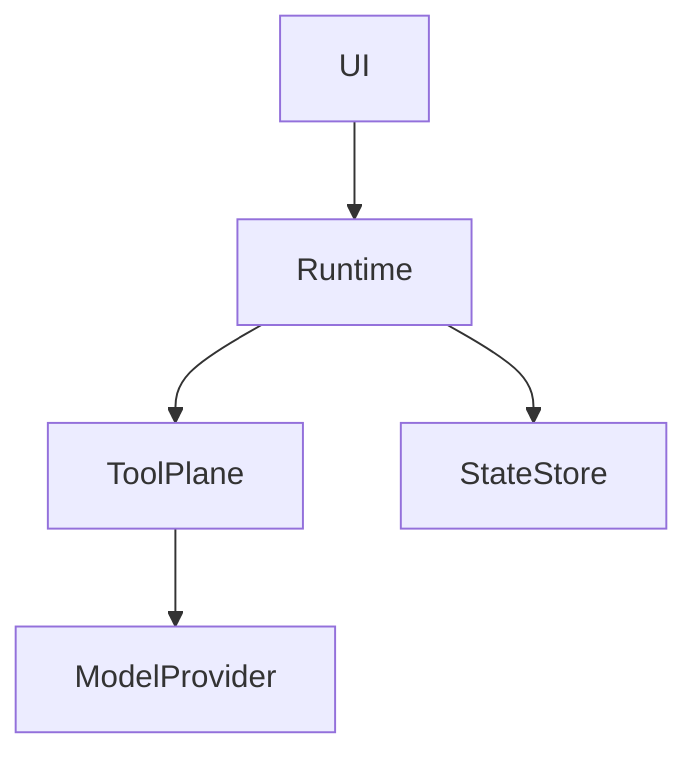
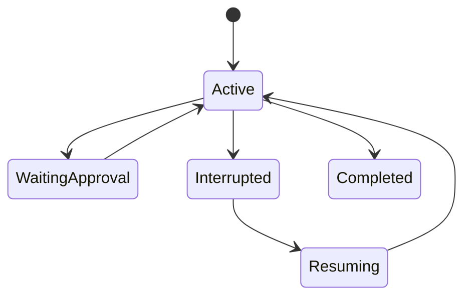
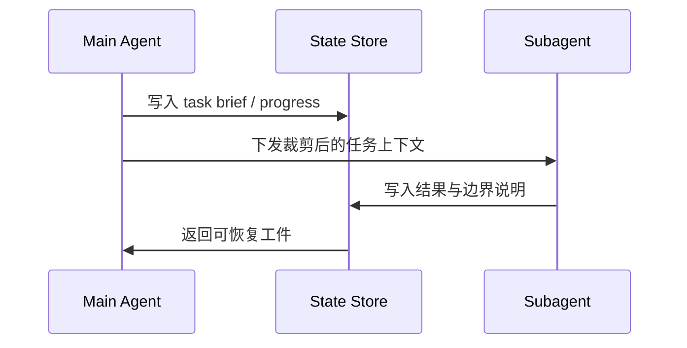

# AI Coding Agent 设计原则文档扩充 Implementation Plan

> **For agentic workers:** REQUIRED SUB-SKILL: Use superpowers:subagent-driven-development (recommended) or superpowers:executing-plans to implement this plan task-by-task. Steps use checkbox (`- [ ]`) syntax for tracking.

**Goal:** 将 `docs/ai-coding/coding-agents/` 扩展为一套以设计原则为中心、基于 `Claude Code`、`OpenCode`、`Codex` 源码与公开资料的系统学习文档。

**Architecture:** 文档主线按机制专题而不是按工具分组，先解释每个机制解决的问题，再横向比较三套系统的设计、边界、失效模式与可复用原则。现有文档会被保留并重构为“阅读入口 + 证据索引 + 新专题簇”的结构，同时引入统一的 Mermaid 图规范来解释复杂逻辑。

**Tech Stack:** MkDocs Material、awesome-nav、Markdown、Mermaid、Git、本地源码仓库、官方文档与公开 issue 资料

## Global Constraints

- 文档必须使用简体中文。
- 复杂逻辑必须使用 Mermaid 图表解释，优先使用 `flowchart`、`sequenceDiagram`、`stateDiagram-v2`。
- 主叙事必须是设计原则型，而不是单纯源码导读型。
- 每篇专题文档都要同时覆盖 `Claude Code`、`OpenCode`、`Codex`。
- 每个关键结论都要标明证据类型：本地源码、官方文档、公开 issue / discussion、或明确标注为推断。
- 不把三套系统错误地写成同一种架构，必须明确差异和 trade-off。
- 导航结构必须通过 `docs/ai-coding/coding-agents/.pages` 统一维护。
- 尽量复用现有文档内容，但要重构为更清晰的专题结构，避免重复叙述。

---

### Task 1: 搭建专题目录、导航与阅读入口

**Files:**
- Create: `docs/ai-coding/coding-agents/design-principles/index.md`
- Create: `docs/ai-coding/coding-agents/overview-and-reading-map.md`
- Create: `docs/ai-coding/coding-agents/comparative/index.md`
- Create: `docs/ai-coding/coding-agents/evidence/index.md`
- Modify: `docs/ai-coding/coding-agents/.pages`
- Modify: `docs/ai-coding/coding-agents/index.md`

**Interfaces:**
- Consumes: 现有 `docs/ai-coding/coding-agents/` 页面与当前 `.pages` 导航
- Produces: 统一后的专题入口结构，供后续专题页挂载

- [ ] **Step 1: 设计新的专题导航结构**

```text
coding-agents/
  index.md
  overview-and-reading-map.md
  design-principles/
  comparative/
  evidence/
```

- [ ] **Step 2: 更新 `coding-agents/.pages` 以反映新导航**

Run: `sed -n '1,120p' docs/ai-coding/coding-agents/.pages`
Expected: 能看到新的 `nav` 结构包含 `overview-and-reading-map.md`、`design-principles`、`comparative`、`evidence`

- [ ] **Step 3: 改写 `coding-agents/index.md` 为新总览入口**

```md
# AI 编码 Agent 机制总览

这一组文档改为“设计原则主线 + 证据索引支撑”的结构。
```

- [ ] **Step 4: 创建阅读地图页与各分区索引页**

```md
# 阅读地图

按“先总览、再专题、后证据”的顺序组织阅读。
```

- [ ] **Step 5: 自检导航与链接关系**

Run: `rg -n "overview-and-reading-map|design-principles|comparative|evidence" docs/ai-coding/coding-agents`
Expected: 新入口文件与导航项均已落地


### Task 2: 撰写“解耦、控制面、事件与可追溯”专题

**Files:**
- Create: `docs/ai-coding/coding-agents/design-principles/ui-runtime-decoupling.md`
- Create: `docs/ai-coding/coding-agents/design-principles/tool-protocol-and-control-plane.md`
- Create: `docs/ai-coding/coding-agents/design-principles/event-log-state-and-auditability.md`
- Create: `docs/ai-coding/coding-agents/vendor-notes/claude-code-source-map.md`
- Create: `docs/ai-coding/coding-agents/vendor-notes/opencode-source-map.md`
- Create: `docs/ai-coding/coding-agents/vendor-notes/codex-source-map.md`

**Interfaces:**
- Consumes: 本地源码目录 `claude-code-src/`、`opencode/`、`codex/`
- Produces: 第一组核心专题页与源码地图页

- [ ] **Step 1: 提炼三家在 UI、runtime、protocol、state 上的分层边界**

```md
## 这个机制解决什么问题
## 三家怎么拆 UI 与 runtime
## 为什么 control plane 比 prompt 更关键
```

- [ ] **Step 2: 为每篇专题加入至少一张 Mermaid 图**



- [ ] **Step 3: 写源码地图页，列出每家与该专题直接相关的模块**

Run: `rg --files <repo> | rg '(tool|protocol|state|event|session|thread|goal|ui|tui|app-server)'`
Expected: 每家文档都能给出清晰的模块入口

- [ ] **Step 4: 自检是否避免写成“只是 prompt 工程”**

Run: `rg -n "prompt.*获胜|只是 prompt|单靠 prompt" docs/ai-coding/coding-agents/design-principles`
Expected: 没有把系统能力错误简化为纯提示词工程


### Task 3: 撰写“中断恢复、权限审批、沙箱隔离”专题

**Files:**
- Create: `docs/ai-coding/coding-agents/design-principles/interrupt-resume-and-traceability.md`
- Create: `docs/ai-coding/coding-agents/design-principles/permission-approval-and-human-override.md`
- Create: `docs/ai-coding/coding-agents/design-principles/sandbox-and-execution-isolation.md`

**Interfaces:**
- Consumes: 现有 `agent-task-and-goal-strategies.md`、`source-evidence-and-code-index.md`、公开 issue 与官方文档
- Produces: 第二组核心专题页

- [ ] **Step 1: 明确区分中断、暂停、恢复、续跑、可追溯**

```md
中断是当前回合被打断，恢复是从保存状态继续，续跑是系统主动开启下一轮，可追溯是事后能回放执行依据。
```

- [ ] **Step 2: 用 Mermaid 画状态流或时序图**



- [ ] **Step 3: 写清楚 approval policy、human override、sandbox scope 的差别**

Run: `rg -n "approval|permission|sandbox|escalation|goal|resume" docs/ai-coding/coding-agents/design-principles`
Expected: 三个概念有清晰边界，没有混写

- [ ] **Step 4: 纳入真实公开失效面**

```md
- cancel 后继续跑
- hook 校验失败导致无法正常停止
- 非交互环境与桌面环境的命令边界不同
```


### Task 4: 撰写“上下文、记忆、subagent 与评估”专题

**Files:**
- Create: `docs/ai-coding/coding-agents/design-principles/context-management-and-compaction.md`
- Create: `docs/ai-coding/coding-agents/design-principles/memory-rules-and-project-instructions.md`
- Create: `docs/ai-coding/coding-agents/design-principles/subagent-handoff-and-orchestration.md`
- Create: `docs/ai-coding/coding-agents/design-principles/evaluation-observability-and-regression.md`
- Create: `docs/ai-coding/coding-agents/design-principles/retry-recovery-and-failure-handling.md`

**Interfaces:**
- Consumes: 本地源码中的 context/session/thread/goal/todo/task 模块，以及公开资料中的经验和问题讨论
- Produces: 第三组核心专题页

- [ ] **Step 1: 写清楚“规则文件、记忆、上下文压缩”三者的边界**

```md
规则文件是高优先级约束，记忆是跨会话或跨线程状态，上下文压缩是 token 预算下的重排与丢弃策略。
```

- [ ] **Step 2: 用 Mermaid 画上下文预算与 subagent handoff 图**



- [ ] **Step 3: 总结 retry 与 recovery 的设计原则**

Run: `rg -n "retry|recover|context|compact|todo|task|goal|subagent" docs/ai-coding/coding-agents/design-principles`
Expected: 能覆盖重试边界、失败分类、恢复证据和子代理交接

- [ ] **Step 4: 写出评估与回归章节**

```md
至少覆盖：恢复后重复执行、压缩后丢目标、审批策略绕过、subagent 漏交接。
```


### Task 5: 收束比较页、证据索引页与外部资料页

**Files:**
- Create: `docs/ai-coding/coding-agents/comparative/key-differences-and-design-choices.md`
- Create: `docs/ai-coding/coding-agents/comparative/what-to-copy-when-building-your-own-agent.md`
- Create: `docs/ai-coding/coding-agents/evidence/external-references-and-public-discussions.md`
- Modify: `docs/ai-coding/coding-agents/source-evidence-and-code-index.md`

**Interfaces:**
- Consumes: 前四个任务产出的专题结论、源码证据、官方文档与公开 issue
- Produces: 最终对比页、外部资料索引、统一证据页

- [ ] **Step 1: 输出一张三家对比总表**

```md
| 机制 | Claude Code | OpenCode | Codex |
|---|---|---|---|
```

- [ ] **Step 2: 写“自建 agent 应该抄什么、不该抄什么”**

```md
不要只抄 prompt；优先抄状态对象、审批边界、日志与恢复设计。
```

- [ ] **Step 3: 升级证据索引与外部资料页**

Run: `rg -n "检索日期|官方文档|issue|discussion|论文|源码" docs/ai-coding/coding-agents`
Expected: 每类证据都有清晰归档位置

- [ ] **Step 4: 最终检查导航、内部链接与重复叙述**

Run: `mkdocs build -f /home/wunai/Disks/Data/my-project/guidebooks/mkdocs.yml`
Expected: build 成功，无断链或明显导航错误
