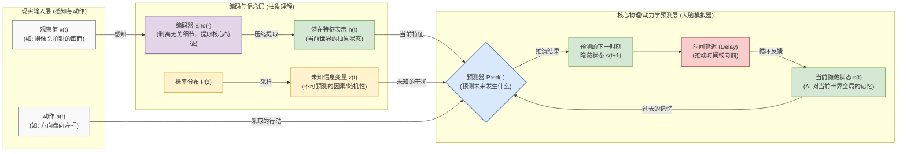

这张图片展示的是人工智能领域当前最前沿的核心概念之一——**世界模型（World Model）**的经典架构图。这个特定的结构很大程度上脱胎于图灵奖得主、Meta 首席 AI 科学家 **Yann LeCun** 所提出的理念（尤其是他在 2022 年发表的《迈向自主机器智能之路》论文中的核心架构 JEPA）。

下面我将结合联网搜索的最新资料，利用 Mermaid 图表为您拆解并详细解释“世界模型”的具体概念。

### 1. 什么是“世界模型”？

在人工智能领域，**世界模型（World Model）**是指**一个能够在其内部模拟、推演现实世界运作规律的 AI 系统**。

传统的大语言模型（LLM，如 ChatGPT）本质上是在玩“文字接龙”，它们通过海量文本统计概率来预测下一个词，但它们并不理解物理规律（比如“水往低处流”、“杯子掉在地上会碎”）。
而**世界模型**则要求 AI 像人类甚至动物一样，构建一个对物理世界、几何空间和因果关系的“内在认知”。当给定一个当前状态和一个动作时，世界模型不仅能“看”到当下，还能在脑海中“预演”未来可能发生的事情，从而帮助 AI（如机器人、自动驾驶汽车）做出正确的规划和决策。

---

### 2. Mermaid 图解世界模型架构

为了让您更直观地理解，我将您提供的图片转化为了一张带有详细中文注释的 Mermaid 流程图，展示了信息是如何在这个系统中流动的：

---

### 3. 图片中核心模块及公式的详细拆解

结合上面的图表和您上传的图片，我们可以把世界模型的工作流程拆解为以下几个核心部分：

#### ① 观察与降维：**$x(t) \rightarrow Enc(\cdot) \rightarrow h(t)$**
*   **$x(t)$ (Observations)**：代表时刻 $t$ 时 AI 观察到的现实世界（比如一张极其复杂的 4K 图像）。
*   **$Enc(\cdot)$ (Encoder)**：编码器。因为现实世界包含太多冗余信息（比如风吹动树叶的像素变化），模型不需要预测这些无用细节。编码器负责过滤噪音，把高维的画面压缩成一个极其精简、只保留核心语义的隐特征 **$h(t)$**。

#### ② 处理不确定性：**$P(z) \rightarrow z(t)$ (Unknown information)**
*   **这是世界模型（尤其是 LeCun 的架构）最精华的一笔。** 现实世界是**不可预测的**。比如你在开车（动作 $a$），你前方有一辆车，它下一秒是变道还是刹车？你无法确定。
*   **$P(z)$** 代表潜在的未知因素分布，**$z(t)$** 就是从中提取的一个“猜测”。通过引入 $z(t)$，模型能够推演出多个可能的、符合物理规律的未来（“如果前车变道会怎样，如果它刹车又会怎样”），而不是死板地只预测出一种模糊的结果。

#### ③ 核心推演引擎：**$Pred(\cdot)$ 预测器**
这是 AI 的“想象力引擎”。它接收四个维度的信息，进行未来的预测：
1.  **$h(t)$**：目前看到了什么。
2.  **$s(t)$**：大脑里保留的过往记忆（Hidden states）。
3.  **$a(t)$**：我决定采取什么动作。
4.  **$z(t)$**：世界可能会发生的未知随机变化。

最终通过公式 **$s_{t+1} = Pred(s_t, a_t, z_t)$**（或包含 $h_t$ 的变体）计算出下一时刻世界的状态 **$s_{t+1}$**。

#### ④ 记忆循环：**Delay (延迟) 与 更新 (Update)**
推演出的未来状态 $s(t+1)$ 会经过一个“延迟（Delay）”模块，变成了下一个时间循环中的“当前状态 $s(t)$”。正如底部的公式 **$s_t = Update(s_{t-1}, a_{t-1}, h_t, z_t)$** 所表达的，AI 的状态记忆是一个不断融合过去的预判和当前最新观察结果的迭代过程。

---

### 4. 总结：世界模型为什么重要？

如果你让现在的大语言模型去控制一台做饭的机器人，它可能会告诉你做饭的完美菜谱，但它不知道“手用力过猛会捏碎鸡蛋”。

**世界模型致力于解决的，正是让 AI 获得常识和物理直觉。** 它的目的是让 AI 在脑海中的“模拟沙盘”里以极低的试错成本进行千万次的推演（“如果我这样做，世界会作何反应？”），找到最优解后，再在现实世界中执行真实的动作（如自动驾驶的避障规划、机器人的灵巧操作）。正因如此，包括 OpenAI (如 Sora 的底层理念)、DeepMind、Meta 在内的顶尖机构，都将“世界模型”视为通向真正**通用人工智能 (AGI)** 的必经之路。
